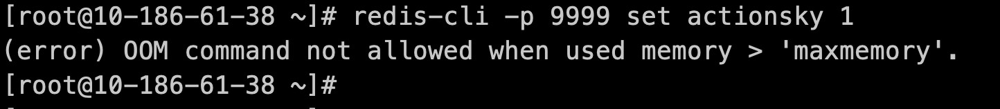
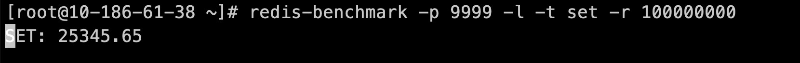
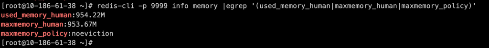

    这是“Redis”系列的第十三篇文章，主要介绍的是Redis“常见面试题？”。

# 一、Redis
<code>Redis（Remote Dictionary Server）</code>是一个开源的内存数据库，遵守 BSD 协议，它提供了一个高性能的键值（key-value）存储系统，常用于缓存、消息队列、会话存储等应用场景。

<!-- more -->

# 二、OOM了怎么办？

你是否有过这种困扰：我的数据量非常小，但还是报 OOM 错误？
```
# ⼀个简单set提示内存不⾜
[root@10-186-61-38 redis]# redis-cli -p 9999 set actionsky 1
(error) OOM command not allowed when used memory > 'maxmemory'.
```
首先我给大家解释下，Redis 的 OOM 分两种。
- ⼀种是因 Redis 使用内存超出 OS 物理内存，OS 将 Redis 进程杀死。
- 另⼀种是 Redis 使用内存超过 maxmemory 参数配置，引发 Redis Server 层 OOM。

OOM 是 Redis 最常见的内存故障，它影响很大：
- **故障发生时，进程并不会退出，能读但无法写入。**
- **配置了 allkeys-lru、allkeys-lfu 等内存淘汰策略场景下，会有大量键失效，导致缓存命中率急剧下降。**

本文中，我会给大家分享下该种内存问题的排查方向及运维命令。

## 2.1、Redis 内存消耗划分

简短介绍下 Redis 内存消耗划分情况，为下文诊断提供思路。上图可以总结 Redis 消耗内存分如下几块：
- 对象内存：理论上占用最大，存储所有业务数据，如字符串类型、哈希类型对象等。
- 客户端内存：包括输入客户端（查询或写入命令）、输出客户端使用的内存，因为不受 maxmemory 参数控制，这块我们需重点排查。
- 复制积压缓冲：replication buffer，所有从库客户端共享、保存固定大小的写入命令用于从库失连后数据补偿。
- Redis 自身内存：存储数据元数据信息、过期键字典等。
- AOF 缓冲区：AOF 持久化、重写缓冲区，⼀般占用很少，基本不需要关注。

## 2.2、内存 OOM 会导致哪些问题？

### 2.2.1、Redis 无法写入，只能读取。


### 2.2.2、Redis 大量键被逐出内存或过期，导致 Redis 查询效率降低（maxmemory-policy 配置为非默认值 noeviction 时）。


## 2.3、OOM排查思路
> 注意：下文不做特别说明的话，我的 maxmemory 设置为 1G，其它任何参数为默认。


### 2.3.1、是否数据量太大？
使用 redis-benchmark 持续灌入数据，

检查内存使用情况，发生 OOM 状态时 used_memory ⼀定会大于 maxmemory。

检查数据对象内存和其它内存使用情况如下图：

这里有必要说明下 overhead.total，它包括除数据外 Redis 消耗的所有内存，比如前面提到的复制缓冲区、客户端输入输出缓冲区等，另外还包括⼀些元数据如 overhead.hashtable，它是数据库中元数据消耗的内存大小，包括以下三项：
- 整个数据库是⼀种 hash 表，首先就是这张 hash 表使用的内存。
- 每⼀个 key-value 对都有⼀个 dictEntry 来记录他们的关系，元信息便包含该 db 中所有 dictEntry 使用的内存。
- redis 使用 redisObject 来描述 value 所对应的不同数据类型（string、list、hash、set、zset），那么 redisObject 占用的空间也计算在元数据。

大家对这个现象可能有点疑惑，为啥我明明设置 maxmemory 为 1G，你 Redis 只给我存了 990 多 M 数据就满了？

很好理解，根据上面测试可知数据达到⼀定规模后，因需消耗额外的元数据、缓存内存，Redis 最终将超过 maxmemory 而 OOM。


### 2.3.2、是否客户端输入缓冲区有问题？
制造输入缓冲区压力（防止干扰，先清空数据再压测）

```
# 关键参数解释
-d 表示每个set值的大小，单位为字节
-c 启多少个连接
```
压测几秒钟后，触发 OOM，

检查输入缓冲区内存消耗，能看到客户端输入缓冲区消耗总量为 2.4G左右，远远超过 maxmemory 参数设置。

那我如何找到消耗内存量最大的那个连接呢？

可通过运行上述检查命令，定位到各客户端输入缓冲区的内存消耗（由大到小排序）。

⼀般如果定位到有连接异常，可以使用如下命令杀掉。
```
# 例如杀掉上图中 id=51421 的连接
127.0.0.1:9999> CLIENT KILL ID 51421
(integer) 1
```

### 2.3.3、是否复制积压缓冲区有问题？
为测试方便，我直接把复制积压缓冲区配置为 800M。

开启 redis-benchmark 压测进程，

检查复制积压缓冲区内存消耗，可以看到因为缓冲区设置过大，数据量才存储 190 多 M，Redis 就无法写入了。


# 三、慢查询
慢查询日志操作
```
slowlog get、slowlog len、slowlog reset。
```
设置
```
slowlog-log-slower-than
    预设阈值，它的单位是微妙（1秒=1000毫秒=1000000微秒），默认值10000
slowlog-max-len
    Redis使用了一个列表存放慢查询日志，slowlog-max-len就是这个列表的最大长度
```

# 四、数据一致性
```
begin transaction
insert mysql
set  redis
commit transaction
```
以上步骤，有哪些步骤会出现数据不一致情况

## 4.1、insert mysql 步骤
- 数据库操作失败
如果在向 MySQL 插入数据时，由于网络故障、数据库锁冲突、磁盘空间不足等原因导致插入操作失败，而后续的 set redis 操作在未感知到 MySQL 插入失败的情况下继续执行，就会造成 Redis 中存在一个在 MySQL 里并不存在的数据。例如，当数据库表达到最大行数限制或者插入的数据违反了唯一约束时，插入操作会失败，但 Redis 写入仍可能成功。
- 部分写入成功
在分布式事务场景下，如果涉及多个 MySQL 节点或者分库分表操作，可能会出现部分节点写入成功，部分节点写入失败的情况。此时如果 set redis 操作基于部分成功的写入结果进行，就会导致 Redis 中的数据与 MySQL 整体的数据状态不一致。

## 4.2、set redis 步骤
- Redis 操作失败
当向 Redis 设置数据时，可能因为 Redis 服务不可用（如 Redis 节点崩溃、网络连接中断）、Redis 内存不足等原因导致 set 操作失败。但此时 MySQL 中的插入操作已经成功，就会造成 MySQL 中有新数据而 Redis 中没有对应的缓存数据，后续读取操作可能会因为缓存未命中而频繁访问 MySQL，增加数据库压力，并且在缓存重建之前，不同客户端读取到的数据可能不一致。
- 并发问题导致的数据覆盖
在高并发场景下，如果多个客户端同时进行类似的插入和缓存设置操作，可能会出现数据覆盖问题。例如，客户端 A 和客户端 B 同时执行插入操作，客户端 A 先完成 insert mysql 和 set redis，但客户端 B 在客户端 A 设置 Redis 之后才完成自己的 set redis 操作，可能会将客户端 A 插入的数据对应的缓存覆盖掉，导致 Redis 缓存与 MySQL 数据不一致。

## 4.3、commit transaction 步骤
-事务提交失败
在提交 MySQL 事务时，如果出现错误（如事务日志写入失败、数据库崩溃等），MySQL 会进行回滚操作，撤销之前的插入操作。但此时 Redis 中的数据已经设置成功，无法自动回滚，就会导致 Redis 中存在一个 MySQL 已经撤销插入的数据，造成数据不一致。

# 五、Redis实现定时任务

## 5.1、任务存储
数据结构
- 使用zset

有序集合（Sorted Set）中的每个元素都有一个分数（score），可以根据分数对元素进行排序。我们可以将任务的执行时间作为分数，任务的标识作为元素，通过定时扫描有序集合，找出分数小于等于当前时间的元素，执行相应的任务。

### 5.1.1、添加任务到有序集合
使用 ZADD 命令把任务添加到有序集合。此命令会将一个或多个成员及其分数添加到有序集合中。
```
ZADD scheduled_tasks <execute_time> <task_id>
```
示例：假设现在时间戳是 1695014400，要让一个任务在 60 秒后执行，可使用以下命令：
```
ZADD scheduled_tasks 1695014460 task:id:1
```


## 5.2、任务执行

### 5.2.1、任务获取
定时扫描有序集合：编写一个定时任务，每隔一段时间扫描有序集合，找出分数小于等于当前时间的元素，执行相应的任务，并从有序集合中移除这些元素。示例代码如下：

```
ZRANGEBYSCORE scheduled_tasks 0 <current_time>
```
- scheduled_tasks：有序集合的名称。
- 0：分数的下限。
- <current_time>：当前时间的时间戳。

示例：假设当前时间戳是 1695014460，执行以下命令获取需要执行的任务：
```
ZRANGEBYSCORE scheduled_tasks 0 1695014460
```

### 5.2.2、执行任务并移除已执行的任务
在获取到需要执行的任务后，执行相应的任务逻辑，然后使用 ZREM 命令将这些任务从有序集合中移除。
```
ZREM scheduled_tasks <task_id>
```
- scheduled_tasks：有序集合的名称。
- <task_id>：任务的唯一标识。

示例：移除 task:id:1 这个任务：
```
ZREM scheduled_tasks task:id:1
```

参考文章：
[故障分析](https://opensource.actionsky.com/20210415-redis/)

