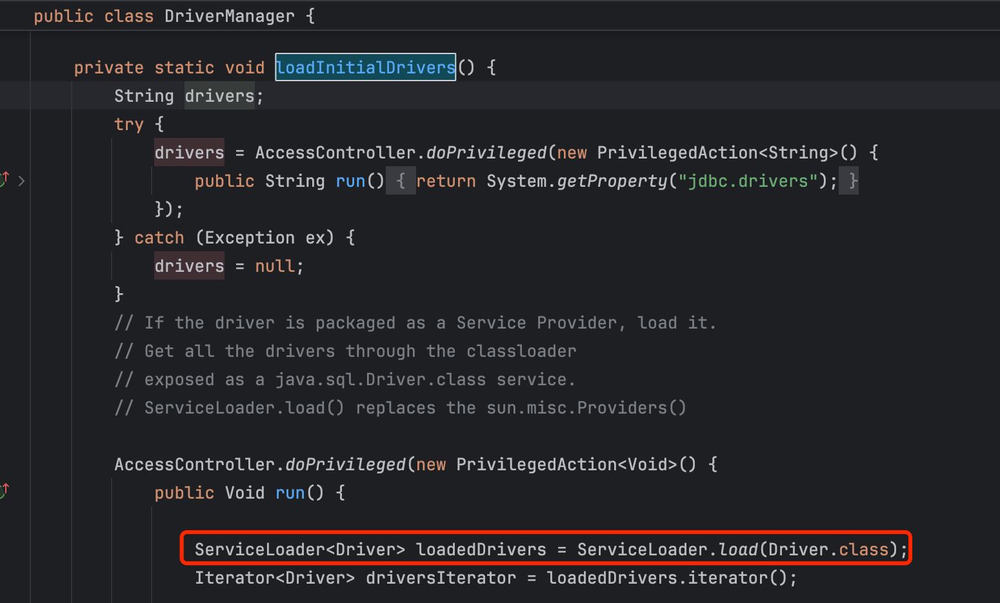

# 一、数据库连接的重要概念和组件
在 Java 里，数据库连接是与数据库进行交互的基础，涉及到众多重要的概念和组件，以下是详细介绍：

<!-- more -->

# 二、JDBC（Java Database Connectivity）
- **概念**：JDBC 是 Java 提供的一套用于**执行 SQL 语句的标准 API**，它为多种关系型数据库提供了统一的访问方式。通过 JDBC，Java 程序可以与不同的数据库进行通信，执行诸如查询、插入、更新和删除等操作。
- **作用**：作为 Java 程序和数据库之间的桥梁，屏蔽了不同数据库之间的差异，使得开发者可以使用统一的 Java 代码来操作各种数据库，如 MySQL、Oracle、SQL Server 等。

> Driver 接口
**位置**：java.sql.Driver
**作用**：这是所有 JDBC 驱动程序必须实现的接口。数据库厂商根据该接口提供具体的实现，用于建立与数据库的连接。在程序中，一般通过 DriverManager 来管理和使用这些驱动。

> DriverManager 类（虽然不是严格意义的接口，但与接口紧密相关）
**位置**：java.sql.DriverManager
**作用**：管理 JDBC 驱动程序，负责获取与数据库的连接。它通过 getConnection 方法，根据传入的数据库 URL、用户名和密码，选择合适的驱动程序并建立连接。

> Connection 接口
**位置**：java.sql.Connection
**作用**：表示与数据库的连接，是执行 SQL 语句和管理事务的基础。通过 Connection 对象可以创建 Statement、PreparedStatement 和 CallableStatement 对象，还能设置事务的属性（如自动提交、提交和回滚事务）。

> Statement 接口
**位置**：java.sql.Statement
**作用**：用于执行静态 SQL 语句。它提供了 execute、executeQuery 和 executeUpdate 等方法，分别用于执行任意 SQL 语句、查询语句和更新语句（如插入、更新、删除）。


> PreparedStatement 接口
**位置**：java.sql.PreparedStatement
**作用**：PreparedStatement 是 Statement 的子接口，用于执行预编译的 SQL 语句。预编译的 SQL 语句可以提高执行效率，并且可以防止 SQL 注入攻击。它通过 ? 占位符来表示参数，使用 setXxx 方法设置参数值。


# 三、Database Driver（数据库驱动）
- **概念**：数据库驱动是 JDBC 的具体实现，它是一组实现了 JDBC 接口的类，用于连接特定类型的数据库。不同的数据库需要不同的驱动程序，例如 MySQL 的驱动类是 <code>com.mysql.cj.jdbc.Driver</code> ，Oracle 的驱动类是 <code>oracle.jdbc.OracleDriver</code>。
  - 其中用了Java SPI机制。（相关内容，请参考之前的java SPI 文章）
- **作用**：负责与数据库建立物理连接，将 Java 程序中的 SQL 语句发送到数据库服务器，并将数据库的响应结果返回给 Java 程序。


# 四、DriverManager（数据库驱动管理器）
**概念**：DriverManager 是 Java 提供的一个管理 JDBC 驱动程序的类，位于 java.sql 包中。它的主要作用是加载数据库驱动，并根据给定的数据库 URL、用户名和密码建立与数据库的连接。

示例代码：
```
import java.sql.Connection;
import java.sql.DriverManager;
import java.sql.SQLException;

public class DriverManagerExample {
    public static void main(String[] args) {
        String url = "jdbc:mysql://localhost:3306/mydb";
        String user = "root";
        String password = "password";
        try {
            // 加载 MySQL 驱动
            Class.forName("com.mysql.cj.jdbc.Driver");
            // 获取数据库连接
            Connection connection = DriverManager.getConnection(url, user, password);
            System.out.println("Connected to the database!");
            // 关闭连接
            connection.close();
        } catch (ClassNotFoundException | SQLException e) {
            e.printStackTrace();
        }
    }
}
```

## 4.1、DriverManager执行
JVM在加载<code>DriverManager</code>类时，加载过程中<code>DriverManager</code>的静态代码块被执行。而 <code>DriverManager</code>的静态代码块中调用了<code>loadInitialDrivers</code>方法
```java
public class DriverManager {
    static {
        loadInitialDrivers();
        println("JDBC DriverManager initialized");
    }
}
```

- 首先获取 jdbc.drivers 系统属性，该属性可以包含用冒号分隔的驱动类名列表。
- 使用 ServiceLoader 来尝试加载 Driver 实现类。ServiceLoader 会扫描 META-INF/services/java.sql.Driver 文件来查找驱动类。
- 如果 jdbc.drivers 系统属性不为空，还会通过 Class.forName() 方法根据属性中指定的驱动类名来加载驱动类。

ServiceLoader的load()方法
```java
public static <S> ServiceLoader<S> load(Class<S> service) {
        ClassLoader cl = Thread.currentThread().getContextClassLoader();
        return ServiceLoader.load(service, cl);
    }
```
SPI机制使用Thread.currentThread().getContextClassLoader()来获取类加载器，而扩展点实现类通过Class<?> c = Class.forName(cn, false, loader)来获取。


# 五、DataSource（数据源）
**概念**：DataSource 是 Java 提供的一个用于**获取数据库连接的标准接口**，位于 javax.sql 包中。它通常由应用服务器或第三方库提供实现，如 Apache DBCP、C3P0、HikariCP 等。DataSource 可以管理数据库连接池，提高数据库连接的性能和效率。
示例代码（使用 DruidDataSource）
```java
import com.zaxxer.hikari.HikariConfig;
import com.zaxxer.hikari.HikariDataSource;
import java.sql.Connection;
import java.sql.SQLException;

public class DataSourceExample {
    public static void main(String[] args) {
		// 创建DruidDataSource对象
		DruidDataSource dataSource = new DruidDataSource();
		// 配置数据源参数
		dataSource.setUrl("jdbc:mysql://localhost:3306/mydatabase");
		dataSource.setUsername("username");
		dataSource.setPassword("password");
		// 其他性能优化配置
		dataSource.setInitialSize(5);
		dataSource.setMinIdle(5);
		dataSource.setMaxActive(20);
		// 启动连接池
		dataSource.init();
		// 获取数据库连接
		Connection connection = dataSource.getConnection();
		System.out.println("成功获取数据库连接！");
		// 使用完毕后关闭连接
		connection.close();
		// 应用停止时关闭连接池
		dataSource.close();
    }
}
```

# 六、Connection
**概念**：Connection 是 Java 中**表示与数据库建立的连接的接口**，位于 java.sql 包中。它代表了应用程序与数据库之间的一条物理连接通道，通过 Connection 对象可以执行 SQL 语句、管理事务等。
示例代码
```java
import java.sql.Connection;
import java.sql.DriverManager;
import java.sql.ResultSet;
import java.sql.Statement;
import java.sql.SQLException;

public class ConnectionExample {
    public static void main(String[] args) {
        String url = "jdbc:mysql://localhost:3306/mydb";
        String user = "root";
        String password = "password";
        try (Connection connection = DriverManager.getConnection(url, user, password);
             Statement statement = connection.createStatement();
             ResultSet resultSet = statement.executeQuery("SELECT * FROM users")) {
            while (resultSet.next()) {
                System.out.println(resultSet.getString("username"));
            }
        } catch (SQLException e) {
            e.printStackTrace();
        }
    }
}
```

# 七、Statement、PreparedStatement 和 CallableStatement
概念
**Statement**：用于执行静态 SQL 语句，每次执行 SQL 语句时，都会将 SQL 语句发送到数据库服务器进行编译和执行。
**PreparedStatement**：是 Statement 的子接口，用于执行预编译的 SQL 语句。预编译的 SQL 语句可以提高执行效率，并且可以防止 SQL 注入攻击。
**CallableStatement**：用于执行数据库中的存储过程。

示例代码（PreparedStatement）
```java
import java.sql.Connection;
import java.sql.DriverManager;
import java.sql.PreparedStatement;
import java.sql.ResultSet;
import java.sql.SQLException;

public class PreparedStatementExample {
    public static void main(String[] args) {
        String url = "jdbc:mysql://localhost:3306/mydb";
        String user = "root";
        String password = "password";
        String sql = "SELECT * FROM users WHERE age > ?";
        try (Connection connection = DriverManager.getConnection(url, user, password);
             PreparedStatement preparedStatement = connection.prepareStatement(sql)) {
            preparedStatement.setInt(1, 18);
            ResultSet resultSet = preparedStatement.executeQuery();
            while (resultSet.next()) {
                System.out.println(resultSet.getString("username"));
            }
        } catch (SQLException e) {
            e.printStackTrace();
        }
    }
}
```

# 八、ResultSet
**概念**：ResultSet 是 Java 中**用于存储 SQL 查询结果的接口**，位于 java.sql 包中。它可以看作是一个二维表格，包含了查询结果的所有行和列。通过 ResultSet 对象可以遍历查询结果，获取每一行的数据。
示例代码
```java
import java.sql.Connection;
import java.sql.DriverManager;
import java.sql.ResultSet;
import java.sql.Statement;
import java.sql.SQLException;

public class ResultSetExample {
    public static void main(String[] args) {
        String url = "jdbc:mysql://localhost:3306/mydb";
        String user = "root";
        String password = "password";
        try (Connection connection = DriverManager.getConnection(url, user, password);
             Statement statement = connection.createStatement();
             ResultSet resultSet = statement.executeQuery("SELECT * FROM users")) {
            while (resultSet.next()) {
                String username = resultSet.getString("username");
                int age = resultSet.getInt("age");
                System.out.println("Username: " + username + ", Age: " + age);
            }
        } catch (SQLException e) {
            e.printStackTrace();
        }
    }
}
```

# 九、事务管理
概念：在 Java 中，通过 Connection 对象可以进行事务管理。事务是一组不可分割的 SQL 操作序列，这些操作要么全部执行成功，要么全部不执行。Java 提供了 setAutoCommit()、commit() 和 rollback() 等方法来管理事务。
示例代码
```java
import java.sql.Connection;
import java.sql.DriverManager;
import java.sql.SQLException;
import java.sql.Statement;

public class TransactionExample {
    public static void main(String[] args) {
        String url = "jdbc:mysql://localhost:3306/mydb";
        String user = "root";
        String password = "password";
        try (Connection connection = DriverManager.getConnection(url, user, password)) {
            // 关闭自动提交
            connection.setAutoCommit(false);
            try (Statement statement = connection.createStatement()) {
                statement.executeUpdate("INSERT INTO users (username, age) VALUES ('John', 25)");
                statement.executeUpdate("UPDATE users SET age = 26 WHERE username = 'John'");
                // 提交事务
                connection.commit();
                System.out.println("Transaction committed successfully!");
            } catch (SQLException e) {
                // 回滚事务
                connection.rollback();
                System.out.println("Transaction rolled back!");
                e.printStackTrace();
            }
        } catch (SQLException e) {
            e.printStackTrace();
        }
    }
}
```

# 十、DriverManager和DataSource
都是在 Java 中用于管理数据库连接的机制
	
## 10.1、DriverManager
特点
1. 是比较传统的获取数据库连接的方式。
2. 相对简单直接，但在连接管理的灵活性和性能优化方面可能不如 DataSource。
3. 一般不具备连接池的特性，每次获取连接可能都涉及到驱动的初始化等操作。

## 10.2、DataSource
特点
1. 通常与连接池结合使用，可以更好地管理和复用数据库连接，提高性能和效率。
2. 提供了更灵活的配置和管理方式，比如可以设置连接的一些属性、池的相关参数等。
3. 对应用程序来说是一个相对独立和可配置的数据源对象。

是一个更高级的连接管理接口，提供了更多的功能和灵活性
