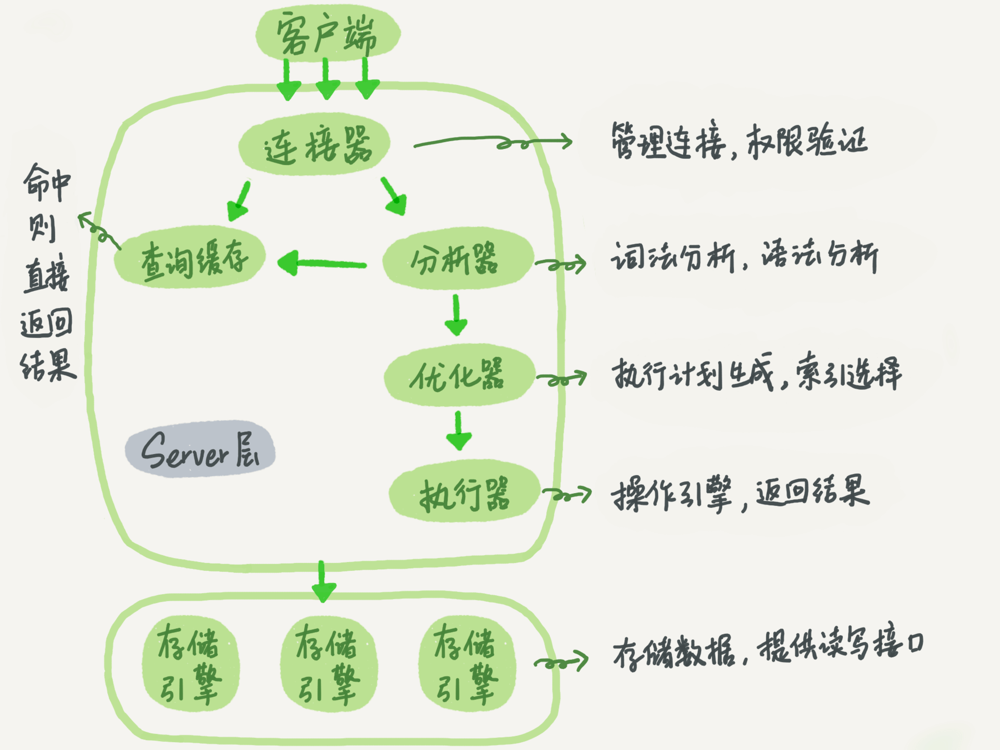
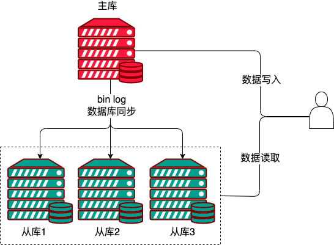
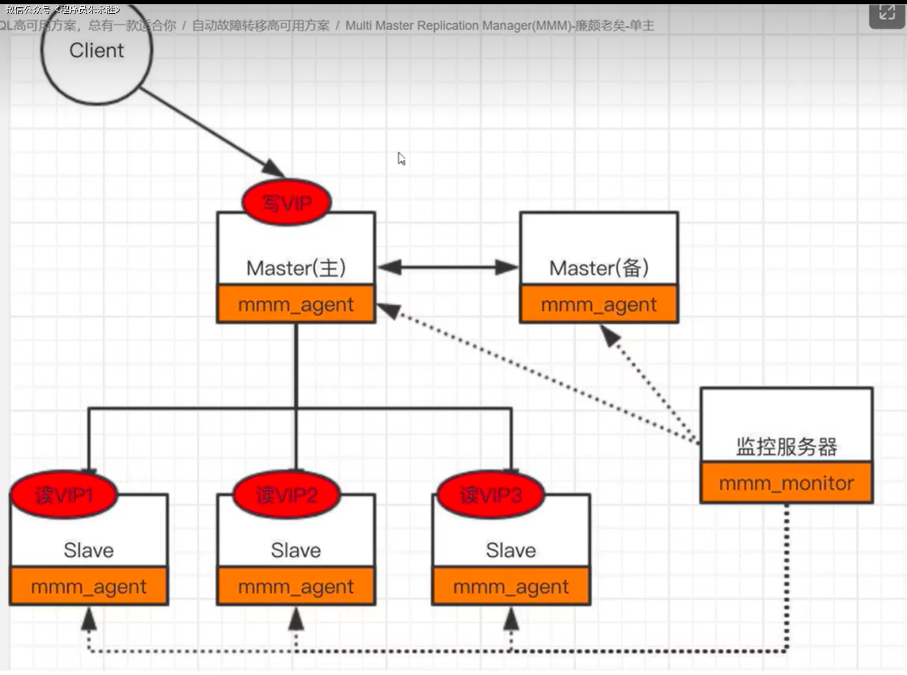
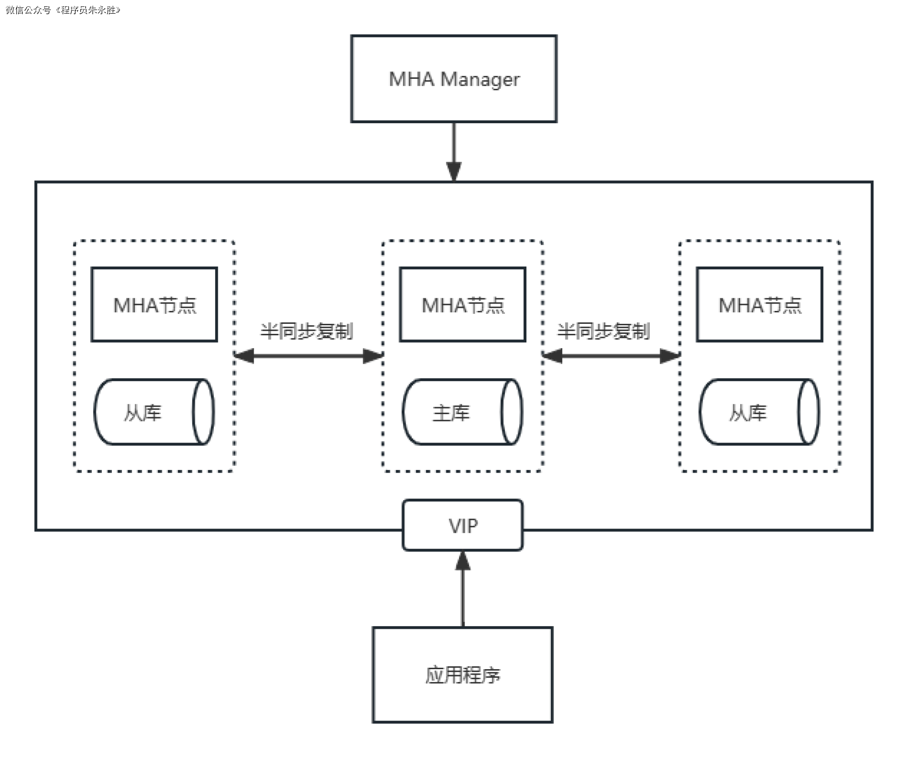
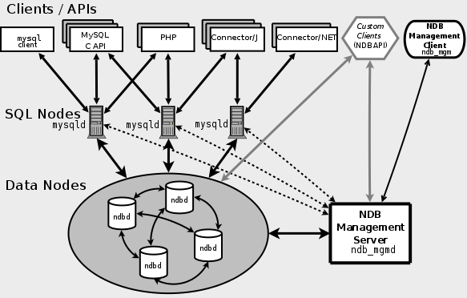
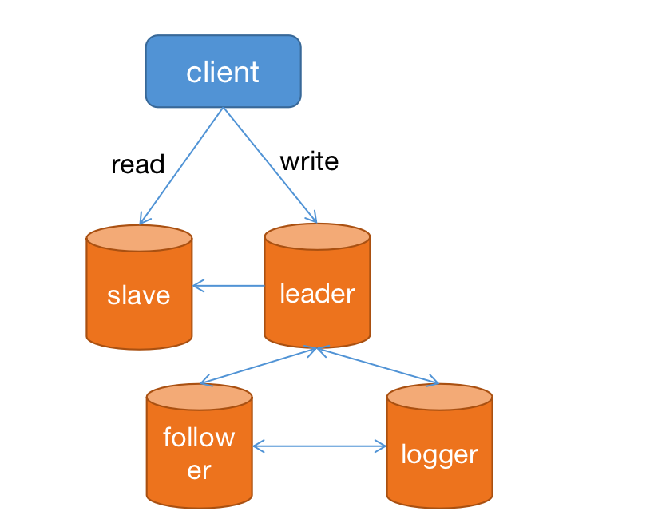

    这是“mysql”系列的第一篇文章，主要介绍的是mysql的架构，作为高可用的一部分。

# 一、mysql
<code>MySQL</code> 是一种广泛使用的开源关系型数据库管理系统（RDBMS--Relational Database Management System）

<!-- more -->

**主要功能:**
- **SQL**：<code>Structured Query Language</code>，结构化查询语言
- **数据定义**：使用 SQL 的数据定义语言（<code>DDL--Data Definition Language</code>），如 <code>CREATE、ALTER、DROP</code> 等语句，创建、修改和删除数据库对象，如表、视图、索引等。
- **数据操作**：通过 SQL 的数据操纵语言（<code>DML--Data Manipulation Language</code>），如 <code>INSERT、UPDATE、DELETE、SELECT</code> 等语句，实现数据的插入、更新、删除和查询操作。
- **数据控制**：利用 SQL 的数据控制语言（<code>DCL--Data Control Language</code>），如 <code>GRANT、REVOKE</code> 等语句，对用户的数据库访问权限进行管理和控制。
- **事务管理**：支持事务的开始、提交和回滚操作，确保数据的一致性和完整性。例如，在银行转账业务中，通过事务保证资金的正确转移。

# 二、基本结构

## 2.1、连接器【server层】
连接管理，权限验证

## 2.2、分析器【server层】
词法分析，语法分析

## 2.3、优化器【server层】
**执行计划**生成，索引选择

## 2.4、执行器【server层】

### 2.4.1、作用
负责将优化器生成的查询执行计划转换为具体的操作，对数据进行最终的过滤操作。

### 2.4.2、主要功能
- 查询解析和预处理
执行器首先对查询语句进行解析，识别查询类型、表名、列名等元素，并对其中的占位符进行替换。然后，执行器会进行查询预处理，检查和验证查询语句的语法和语义是否正确。
- 权限验证
在执行查询之前，执行器会进行权限验证，检查当前用户是否具有执行查询所需的权限。它会检查用户是否具有访问特定数据库、表或列的权限，以及执行特定操作（如 SELECT、INSERT、UPDATE、DELETE）的权限。
- 查询执行
执行器会根据优化器生成的查询执行计划，执行具体的操作。它会根据查询的类型（如 SELECT、INSERT、UPDATE、DELETE）和所需的操作，进行表的扫描、索引的搜索、数据的读取、修改等操作。
- 数据传输和结果返回
在执行查询操作时，执行器会从磁盘或内存中读取数据，并将结果传输给客户端。它负责处理查询结果的封装和传输，以及处理数据的排序、分页等需求。
- 事务管理
执行器还负责事务的管理，包括事务的启动、提交、回滚等操作。它会根据查询操作的需要，自动开始、提交或回滚事务，并确保查询的一致性和隔离性。

### 2.4.3、执行器工作流程
操作存储引擎，结果返回

执行器的工作流程：
1. **查询解析**
对输入的查询语句进行语法分析和语义理解。
3. **获取数据**
根据执行计划，从存储引擎中获取所需的数据。
4. **处理数据**
进行过滤、排序、分组等操作。
5. **应用条件判断**
根据查询中的条件语句进行数据筛选。
6. **计算聚合函数**
对符合条件的数据进行汇总计算。
7. **处理连接操作**
如果涉及多个表的连接，执行相应的连接操作。
8. **管理事务**
确保事务的原子性、一致性、隔离性和持久性。
9. **处理错误**
在执行过程中检测和处理错误。
10. **返回结果**
将处理后的数据返回给客户端。

## 2.5、存储引擎
存储数据，提供读写接口

# 三、高可用架构

## 3.1、主从
MySQL 主从架构是一种常见的数据库架构模式，用于实现数据的复制、读写分离和高可用性。

**架构原理**
MySQL 主从架构主要由**一个主服务器（Master）**和**多个从服务器（Slave）**组成，其核心原理基于二进制日志（Binary Log）实现数据复制。
- **主服务器（Master）**：负责处理所有的写操作（如 INSERT、UPDATE、DELETE 等）。当主服务器执行这些写操作时，会将这些操作记录到二进制日志中。二进制日志是一种顺序记录数据库更改的文件，它包含了主服务器上所有对数据的修改信息。
- **从服务器（Slave）**：从服务器会从主服务器上获取二进制日志，并将其复制到自己的中继日志（Relay Log）中。然后，从服务器的 SQL 线程会读取中继日志中的内容，并在本地重新执行这些操作，从而实现与主服务器的数据同步。从服务器主要负责处理读操作，通过分担主服务器的读压力，提高整个系统的性能和可用性。

### 3.1.1、主从复制过程【传统的单线程复制】

1. 主库db的更新事件(<code>update、insert、delete</code>)被写到<code>binlog</code>
2. 从库发起连接，连接到主库
3. 此时主库创建一个<code>binlog dump thread</code>，把<code>binlog</code>的内容发送到从库
4. 从库启动之后，创建一个I/O线程，读取主库传过来的<code>binlog</code>内容并写入到<code>relay log</code>
5. 还会创建一个SQL线程，从<code>relay log</code>里面读取内容，从<code>Exec_Master_Log_Pos</code>位置开始执行读取到的更新事件，将更新内容写入到slave的db

**传统的单线程复制，即从库的sql线程**：SQL单线程来执行relay log中的日志信息重放主库提交得事务

### 3.1.2、并发复制【传统单线程复制的优化】
MySQL 5.6改进
> MySQL 5.6版本引入并发复制（schema级别），基于schema级别的并发复制核心思想：“不同schema下的表并发提交时的数据不会相互影响，即slave节点可以用对relay log中不同的schema各分配一个类似SQL功能的线程，来重放relay log中主库已经提交的事务，保持数据与主库一致”。可见MySQL5.6版本的并发复制，一个schema分配一个类似SQL线程的功能。

MySQL 5.7改进
> 引入Enhanced Muti-threaded slaves,当slave配置slave_parallel_workers>0并且global.slave_parallel_type＝‘LOGICAL_CLOCK’,可支持一个schema下，slave_parallel_workers个的worker线程并发执行relay log中主库提交的事务
> - 需要在master机器标记binary log中的提交的事务哪些是可以并发执行
> - slave机器的relay log中last_committed相同的事务（sequence_num不同）可以并发执行

### 3.1.3、主从复制模式
- 异步模式
MySQL默认的模式
- 半同步模式(semi-sync)
主库在执行完客户端提交的事务后不是立刻返回给客户端，而是等待至少一个从库接收到并写到 relay log 中才返回成功信息给客户端（只能保证主库的 Binlog 至少传输到了一个从节点上），否则需要等待直到超时时间然后切换成异步模式再提交。
- 全同步模式
指当主库执行完一个事务，然后所有的从库都复制了该事务并成功执行完才返回成功信息给客户端。因为需要等待所有从库执行完该事务才能返回成功信息，所以全同步复制的性能必然会收到严重的影响。

### 3.1.4、主从延迟
主从延迟是指在 MySQL 主从复制架构中，从服务器的数据与主服务器的数据之间存在时间差，即从服务器上的数据更新落后于主服务器。

#### 3.1.4.1、产生原因

##### 1. 硬件层面
- **磁盘 I/O 性能差异**：如果从服务器的磁盘 I/O 性能较差，在处理大量数据写入或更新时，会导致从服务器应用中继日志（Relay Log）的速度变慢，从而产生主从延迟。例如，主服务器使用的是高性能的 SSD 磁盘，而从服务器使用的是普通的 HDD 磁盘，HDD 的读写速度明显低于 SSD，就容易出现延迟。
- **CPU 处理能力不足**：当从服务器的 CPU 处理能力不足时，无法及时处理从主服务器接收的二进制日志，导致主从延迟。比如，在高并发场景下，从服务器需要处理大量的 SQL 语句，如果 CPU 性能跟不上，就会出现处理延迟。

##### 2. 网络层面
- **网络带宽不足**：主从服务器之间的网络带宽有限，无法满足大量二进制日志数据的快速传输，会导致从服务器接收日志数据的速度变慢，进而产生延迟。例如，主从服务器之间的网络带宽只有 1Mbps，而主服务器产生的二进制日志数据量较大，就会出现传输瓶颈。
- **网络延迟**：网络延迟是指数据在主从服务器之间传输所需的时间。如果网络延迟较高，从服务器接收主服务器发送的二进制日志会有明显的时间滞后，从而造成主从延迟。

##### 3. 数据库层面
- **大事务操作**：主服务器上执行的大事务（包含大量 SQL 语句的事务）会导致二进制日志中记录的操作量较大。从服务器在应用这些操作时需要花费较长时间，从而产生延迟。例如，一个事务中包含了对大量数据的批量更新操作，主服务器可以较快地完成这个事务，但从服务器在应用这些更新时会比较慢。
- **从服务器负载过高**：如果从服务器上除了复制主服务器的数据外，还承担了大量的读操作，会导致从服务器的负载过高，影响其应用中继日志的速度，产生主从延迟。
- **复制模式问题**：不同的复制模式对主从延迟也有影响。例如，基于语句的复制（SBR）在某些情况下可能会导致主从延迟，因为一些 SQL 语句在从服务器上执行的速度可能较慢。

#### 3.1.4.2、解决策略
##### 1. 硬件优化
- **升级硬件配置**：提高从服务器的硬件性能，如使用更快的 CPU、更大容量的内存和高性能的磁盘（如 SSD），可以加快从服务器处理数据的速度，减少主从延迟。
- **优化网络环境**：增加主从服务器之间的网络带宽，优化网络拓扑结构，减少网络延迟，确保二进制日志数据能够快速传输。

##### 2. 数据库优化
- **优化 SQL 语句**：避免在主服务器上执行大事务和复杂的 SQL 语句，尽量将大事务拆分成多个小事务，减少二进制日志中的操作量。同时，对 SQL 语句进行优化，提高其执行效率。
- **调整复制模式**：根据业务需求，选择合适的复制模式。例如，如果对数据一致性要求较高，可以考虑使用基于行的复制（RBR）模式，因为它可以更准确地复制数据，减少因 SQL 语句执行差异导致的延迟。
- **分担从服务器负载**：将从服务器上的读操作分散到多个从服务器上，减轻单个从服务器的负载压力，提高其应用中继日志的速度。

### 3.1.5、主从架构小结
一定程度上提高了MySQL系统的高可用，但是存在 <code>master</code> 单点问题。

## 3.2、MySQL+MMM架构
<code>MMM（master-master replication manager for mysql）</code> 基于 MySQL 的复制机制，通过在多个 MySQL 实例之间进行主从复制，实现了数据的同步和备份。它的主要特点是可以实现多主复制，即多个 MySQL 实例可以同时作为主节点接收写操作，并将这些写操作同步到其他从节点上

### 3.2.1、架构组成
MMM 架构通常由以下几个主要部分组成：
- **主 MySQL 服务器（Master）**：一般有两台主服务器，它们之间进行双向复制（主主复制），即两台主服务器都可以接收写操作，并且会将数据变更同步到对方。这样可以提高系统的写性能和可用性。
- **从 MySQL 服务器（Slave）**：可以有多个从服务器，它们从主服务器复制数据，主要用于分担读压力。从服务器只能进行读操作，不能进行写操作。
- **监控节点（Monitor）**：监控节点是 MMM 架构的核心组件，它负责监控所有 MySQL 服务器的状态，包括主服务器和从服务器。监控节点会定期检查服务器的可用性、复制状态等信息，并根据预设的规则进行故障转移和角色切换。
- **代理节点（Agent）**：每个 MySQL 服务器上都需要安装代理节点，代理节点负责与监控节点进行通信，向监控节点汇报服务器的状态信息，并执行监控节点下达的命令，如切换主从角色、启动或停止复制等。

### 3.2.2、工作原理
- **监控与检测**：监控节点会定期向各个 MySQL 服务器上的代理节点发送心跳检测请求，代理节点接收到请求后会返回服务器的状态信息，如服务器是否存活、复制是否正常等。监控节点根据这些信息判断服务器的健康状况。
- **故障转移**：如果监控节点检测到某个主服务器出现故障（如服务器宕机、复制中断等），它会根据预设的规则进行故障转移。例如，将另一个正常的主服务器提升为唯一的主服务器，并将故障服务器的从服务器切换到新的主服务器进行数据复制。
- **负载均衡**：MMM 可以实现读操作的负载均衡。监控节点会根据从服务器的负载情况，将读请求均匀地分发到各个从服务器上，从而提高系统的读性能。

### 3.2.3、优缺点
优点
- **高可用性**：通过主主复制和故障转移机制，MMM 可以在主服务器出现故障时快速切换到备用主服务器，保证系统的持续运行，减少停机时间。
- **负载均衡**：可以将读请求分发到多个从服务器上，减轻主服务器的读压力，提高系统的整体性能和并发处理能力。
- **易于管理**：MMM 提供了集中的监控和管理功能，通过监控节点可以方便地管理和配置所有 MySQL 服务器，简化了系统的运维工作。

缺点
- **配置复杂**：MMM 的配置相对复杂，需要对 MySQL 主从复制、网络通信等知识有深入的了解，并且需要进行详细的参数配置和测试，增加了系统搭建和维护的难度。
- **数据一致性问题**：在主主复制过程中，可能会出现数据冲突和一致性问题，需要进行额外的处理和配置来保证数据的一致性。
- **单点故障风险**：监控节点是 MMM 架构的核心，如果监控节点出现故障，可能会导致整个系统的管理和故障转移功能失效，存在单点故障风险。

## 3.3、MySQL+MHA架构
<code>MHA（Master High Availability）</code>是一种用于 MySQL 主从复制环境的高可用解决方案，由日本 DeNA 公司开发，能在主服务器发生故障时，实现快速自动的主从切换，保证数据库服务的连续性。

### 3.3.1、架构组成
- **MHA Manager**：即管理节点，是 MHA 架构的核心组件。它负责监控 MySQL 主从服务器的状态，当检测到主服务器出现故障时，会自动执行故障转移操作，将某个从服务器提升为新的主服务器，并调整其他从服务器的复制关系，使其指向新的主服务器。通常运行在独立的服务器上，以避免单点故障影响整个系统。
- **MHA Node**：部署在每个 MySQL 服务器（包括主服务器和从服务器）上，作为代理节点。其主要作用是协助 MHA Manager 完成故障转移过程中的具体操作，如保存二进制日志、应用中继日志、切换复制源等。
- **MySQL 主从服务器**：这是数据存储和处理的核心部分，主服务器负责处理写操作，从服务器从主服务器复制数据，负责处理读操作。

### 3.3.2、工作原理
- **监控阶段**：MHA Manager 会定期向各个 MySQL 服务器上的 MHA Node 发送心跳检测信息，获取服务器的状态，包括服务器的存活状态、复制延迟情况等。同时，MHA Node 会监控本地 MySQL 服务器的二进制日志和中继日志的状态，并将这些信息反馈给 MHA Manager。
- **故障检测**：当 MHA Manager 发现主服务器出现故障（如无法连接、复制中断等）时，会立即进行进一步的检查，确认故障的真实性和严重程度。
- **故障转移**：一旦确认主服务器故障，MHA Manager 会根据预设的规则选择一个最合适的从服务器作为新的主服务器。MHA Node 会协助完成一系列操作，包括保存故障主服务器上未同步的二进制日志，将这些日志应用到候选主服务器上，以保证数据的一致性。然后，MHA Manager 会调整其他从服务器的复制配置，使其指向新的主服务器，完成主从切换。

### 3.3.3、优缺点
优点
- **快速故障转移**：MHA 能够在短时间内（通常在几十秒内）完成主从切换，大大减少了数据库服务的停机时间，提高了系统的可用性。
- **数据一致性保障**：在故障转移过程中，MHA 会尽力保证数据的一致性，通过保存和应用未同步的二进制日志，减少数据丢失的风险。
- **自动化操作**：整个故障转移过程是自动化的，无需人工干预，降低了人为错误的风险，提高了运维效率。
- **支持多种拓扑结构**：可以支持一主多从、多级复制等多种 MySQL 主从复制拓扑结构，具有较好的通用性和灵活性。

缺点
- **配置和维护复杂**：MHA 的配置涉及多个组件和大量参数，需要对 MySQL 主从复制和 MHA 本身有深入的了解，增加了系统搭建和维护的难度。
- **依赖二进制日志**：MHA 的故障转移机制依赖于 MySQL 的二进制日志，如果二进制日志出现问题（如损坏、丢失），可能会影响故障转移的准确性和数据的一致性。
- **单点故障风险**：MHA Manager 是整个架构的核心，如果 MHA Manager 所在的服务器出现故障，可能会导致故障转移功能失效，虽然可以通过部署多个 MHA Manager 并进行切换来降低风险，但会增加系统的复杂性。

## 3.4、MGR架构
<code>MySQL Group Replication（MGR）</code>是 MySQL 官方推出的一种高可用、可扩展的复制解决方案，它基于组复制技术，为 MySQL 数据库提供了自动故障转移和多主写入的能力。以下从多个方面为你详细介绍 MGR：

### 3.4.1、核心概念
- **组（Group）**：由多个 MySQL 服务器实例组成的集合，这些实例通过网络连接在一起，共同维护一份数据副本。组内的每个成员都参与数据的复制和一致性维护。
- **成员（Member）**：组中的每个 MySQL 服务器实例称为一个成员。成员可以分为不同的角色，如主成员（Primary）和从成员（Secondary），在多主模式下，所有成员都可以作为主成员处理写操作。
- **共识协议**：MGR 使用基于 Paxos 算法的共识协议来确保组内成员之间的数据一致性。当一个成员发起一个事务时，该事务需要经过组内多数成员的同意才能被提交，从而保证所有成员的数据状态一致。

## 3.5、Mysql cluster架构
MySQL Cluster 是 MySQL 官方推出的一个高可用、高性能、可扩展的分布式数据库解决方案，它将多个 MySQL 服务器节点组合在一起，形成一个集群，共同处理数据的存储和访问。

### 3.5.1、架构组成
MySQL Cluster 主要由以下几种类型的节点组成：
- **管理节点（Management Node）**
负责管理和配置整个集群，包括节点的添加、删除、配置参数的修改等。它存储着集群的元数据信息，如节点的拓扑结构、数据分布等。管理节点通常是独立部署的，一个集群中可以有多个管理节点以提高可用性，但同一时间只有一个管理节点处于活动状态。
- **数据节点（Data Node）**
是存储实际数据的节点。数据在数据节点之间进行分片和复制，以提高数据的可用性和读写性能。每个数据节点都有自己的内存缓冲区，用于缓存数据和索引，减少磁盘 I/O 操作。数据节点之间通过高速网络进行通信，保证数据的一致性和同步。
- **SQL 节点（SQL Node）**
作为客户端与集群之间的接口，负责接收客户端的 SQL 请求，并将其转发到相应的数据节点进行处理。SQL 节点可以根据数据的分布情况和负载均衡策略，选择最优的数据节点执行查询操作。一个集群中可以有多个 SQL 节点，以提高系统的并发处理能力。
- **存储节点（Optional）**
在某些配置中，还可以有存储节点，用于存储二进制日志和备份数据。

### 3.5.2、工作原理
- **数据分布**：数据在数据节点之间进行水平分片和复制。水平分片是将数据按照一定的规则划分成多个部分，分别存储在不同的数据节点上；复制是将每个分片的数据复制到多个数据节点，以提高数据的可用性和容错性。
- **查询处理**：当客户端发送 SQL 请求到 SQL 节点时，SQL 节点首先解析 SQL 语句，确定需要访问的数据分片和数据节点。然后，SQL 节点将查询请求转发到相应的数据节点进行处理。数据节点执行查询操作，并将结果返回给 SQL 节点，最后 SQL 节点将最终结果返回给客户端。
- **数据同步**：数据节点之间通过同步协议保证数据的一致性。当一个数据节点上的数据发生变化时，该变化会被同步到其他复制该数据分片的节点上。同步过程是异步的，但可以通过配置参数调整同步的频率和方式。

### 3.5.3、优缺点
优点
- **高可用性**：由于数据在多个数据节点之间进行复制，当某个数据节点出现故障时，其他节点可以继续提供服务，保证数据的可用性和系统的连续性。同时，管理节点的冗余部署也提高了整个集群的可用性。
- **高性能**：通过数据分片和并行处理，MySQL Cluster 可以将查询负载分散到多个数据节点上，提高了系统的并发处理能力和查询性能。此外，数据节点的内存缓存机制也减少了磁盘 I/O 操作，进一步提升了性能。
- **可扩展性**：可以通过添加数据节点和 SQL 节点来扩展集群的存储容量和处理能力，以适应不断增长的业务需求。添加节点的过程相对简单，不需要停止整个集群的运行。
- **事务支持**：MySQL Cluster 支持分布式事务，保证在多个数据节点上的操作具有原子性、一致性、隔离性和持久性（ACID 特性），适用于对数据一致性要求较高的业务场景。

缺点
- **配置和管理复杂**：MySQL Cluster 的配置涉及多个节点和大量参数，需要对集群架构和 MySQL 有深入的了解。同时，在运行过程中，需要对节点的状态、数据同步、负载均衡等进行监控和管理，增加了运维的难度。
- **资源消耗较大**：由于数据在多个节点之间进行复制和同步，以及需要维护集群的元数据信息，MySQL Cluster 会消耗较多的系统资源，包括 CPU、内存和网络带宽。
- **数据一致性开销**：为了保证数据的一致性，数据节点之间需要进行频繁的通信和同步操作，这会带来一定的性能开销。在高并发写入的场景下，数据一致性的维护可能会成为系统的瓶颈。

### 2.5.4、示例说明
假设一个 MySQL Cluster 有 5 个数据节点（DN1、DN2、DN3、DN4、DN5），采用哈希算法对 users 表的数据进行分片，以用户 ID 作为哈希键。当客户端发送上述插入用户信息的请求时：
- SQL 节点接收到请求后，计算用户 ID（值为 1）的哈希值，根据哈希值确定该条数据应该存储在 DN1 节点上（假设哈希值映射到 DN1）。
- SQL 节点将插入请求转发给 DN1 节点，DN1 节点将数据写入内存缓冲区和磁盘日志文件。
- DN1 节点将数据变更信息同步到其他存储该数据分片副本的节点（假设是 DN3 和 DN6）。
- 当 DN3 和 DN6 节点完成数据同步后，DN1 节点将操作结果返回给 SQL 节点，SQL 节点再将结果返回给客户端。

每个数据节点都只存储了部分数据的副本。

## 3.6、阿里巴巴RDS

阿里云上的MySQL提供三种系列的实例：基础版、高可用版和三节点企业版（原金融版）。
- **基础版**：一般用于个人学习或开发测试。目前基础版只提供MySQL 5.7版本，采用单节点部署，性价比非常高。基础版采用计算节点与存储分离的实现方式，当计算节点宕机时MySQL服务不可用，但存储在云盘里的数据不会丢失。基础版的缺陷是可用性不高，适用于相对不重要的场景，所以不建议您在生产环境中使用基础版。
- **高可用版**：高可用版采用一主一备的经典高可用架构，采用基于binlog的数据复制技术维护数据库的可用性和数据一致性。同时，高可用版在配置上采用物理服务器和本地SSD硬盘，提供最佳性能，满足业务生产环境的需求。
- **三节点企业版（原金融版）**：三节点企业版主要应用于金融、证券、保险等行业的核心数据库，这些行业对数据安全性、可用性要求非常高。三节点企业版采用一主两备架构，通过binlog日志多副本多级别复制，确保数据的强一致性，可提供金融级的数据可靠性和跨机房容灾能力。

### 3.6.1、RDS三节点

RDS三节点企业版的核心是X-Paxos一致性协议。
- 阿里自研的X-Paxos不同于原生的Paxos协议，而是在其基础上实现了自动选主、日志同步、数据强一致、在线配置变更等功能。
- 原生的Paxos有三种角色：Proposer、Accepter和Learner。
- 而在X-Paxos中，节点的角色分为四类：Proposer、Accepter、Learner和Logger。

参考文章：
[阿里巴巴高可用数据库解决方案](https://cloud.tencent.com/developer/article/2268576)