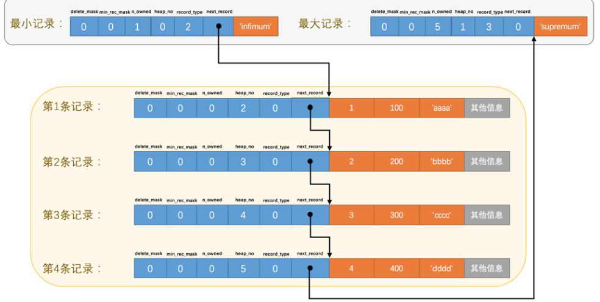

    这是“mysql”系列的第二篇文章，主要介绍的是innodb存储引擎。

# 一、mysql

<code>MySQL</code> 是一种广泛使用的开源关系型数据库管理系统（RDBMS--Relational Database Management System）

<!-- more -->
基本结构：


# 二、mysql存储引擎

MySQL 存储引擎是 MySQL 数据库管理系统中负责数据存储和检索的组件，不同的存储引擎具有不同的特点和适用场景。

<style>
table th:first-of-type {
    width: 12%;
}
table th:nth-of-type(3) {
    width: 40%;
}
table tr td:nth-child(1),
table tr th:nth-child(1) {
    font-weight: bold;
}
</style>

**常见的存储引擎如下：**

| 存储引擎              |                                                            说明 |
|:------------------|--------------------------------------------------------------:|
| InnoDB            |                     5.5版本后MySQL的默认数据库，支持事务和行级锁定，比MyISAM处理速度稍慢 |
| MyISAM            |                                      高速引擎，拥有较高的插入，查询速度，但不支持事务 |
| Memory            | 内存存储引擎，拥有极高的插入，更新和查询效率。但是会占用和数据量成正比的内存空间。只在内存上保存数据，意味着数据可能会丢失 |
| MRG_MyISAM（MERGE） |                                    将多个表联合成一个表使用，在超大规模数据存储时很有用 |
| Falcon            |                               一种新的存储引擎，支持事物处理，传言可能是InnoDB的替代者 |
| Archive           |               将数据压缩后进行存储，非常适合存储大量的独立的，作为历史记录的数据，但是只能进行插入和查询操作 |
| CSVCSV            |                             存储引擎是基于 CSV 格式文件存储数据(应用于跨平台的数据交换) |

**InnoDB和MyISAM存储引擎区别：**

|       | InnoDB                   |                       MyISAM |
|:------|--------------------------|-----------------------------:|
| 存储文件  | .frm 表定义文件.ibd 数据文件和索引文件 | .frm 表定义文件.myd 数据文件.myi 索引文件 |
| 锁     | 表锁、行锁                    |                           表锁 |
| 事务    | 支持                       |                          不支持 |
| CRDU  | 读、写                      |                           读多 |
| count | 扫表                       |                      专门存储的地方 |
| 索引结构  | B+ Tree                  |                      B+ Tree |


# 三、innodb存储引擎
<code>innodb</code>是一个将表中的数据存储到磁盘上的存储引擎，所以即使关机后重启我们的数据还是存在的。

真正处理数据的过程是发生在内存中的，所以需要把磁盘中的数据加载到内存中，如果是处理写入或修改请求的话，还需要把内存中的内容刷新到磁盘上。而我们知道读写磁盘的速度非常慢，和内存读写差几个数量级，所以当我们想从表中获取某些记录时，<code>innodb</code> 存储引擎需要一条一条的把记录从磁盘上读取出来么？

不，那样会慢死，<code>innodb</code>采用的方式是：<font color=green>**将数据划分为若干个页，以页作为磁盘和内存之间交互的基本单位，innodb中页的大小一般为 <code>16KB</code>**</font>。也就是在一般情况下，一次最少从磁盘中读取<code>16KB</code>的内容到内存中，一次最少把内存中的<code>16KB</code>内容刷新到磁盘中。

## 3.1、innodb行格式
我们平常是以记录为单位来向表中插入数据的，这些记录**在磁盘上的存放方式**也被称为 <font color=green>**行格式**</font> 或者 <font color=green>**记录格式**</font>。

innodb存储引擎有4种不同类型的行格式：
- compact
- redundant
- dynamic
- compressed

### 3.1.1、如何设置行格式？
```
CREATE TABLE 表 (
...
)ROW_FORMST=COMPACT
```

### 3.1.2、compact行格式

一条完整的记录，其实可以分为 “记录的额外信息” 和 “记录的真实数据” 两大部分。

#### 3.1.2.1、额外信息
额外信息分为3类：
- 变长字段长度列表
- NULL值列表
- 记录头信息

##### 1. 变长字段长度表
对于像 varchar， varbinary，text，blob，json以及他们的各种类型的可变长度字段【可称为变长字段】，需要将他们到底占用多少字节存储起来，这样就省去了列数据之间的边界定义，MySQL 就可以分清楚哪些数据属于这一列，哪些不属于。

所以这些变长字段占用的存储空间分为两部分：
1. 真正的数据内容。
2. 占用的字节数。

在compact行格式中，把所有变长字段的真实数据占用的字节长度都存放在记录的开头部位，从而形成一个变长字段长度列表，各变长字段数据占用的字节数按照列的顺序<font color=green>**逆序存放**</font>。

示例：
假设

##### 2. NUll值列表
NULL值列表（NULL Value list），这个列表是行记录的一部分，用于优化存储空间和提高查询效率。

作用：
- **标识NULL列**：对于允许 NULL的列，如果某一行的该列值为NULL，则不需要实际存储NULL值，而是通过NULL值列表中的位(bit)来标识。
- **节省空间**：通过位图的方式存储NULL值信息，避免了为每个NULL值分配额外的存储空间。

##### 3. 记录头信息
记录头固定为5字节大小：

```
无用位 2   目前没用到
deleted_flag   1     记录是否被删除
min_rec_flag  1     B+树中非叶子节点最小记录标记
n_owned         4    该记录对应槽所拥有记录数量
heap_no          13   该记录在堆中的序号，也可以理解为在堆中的位置信息
record_type     3    记录类型，普通数据记录为000，节点指针类型为001，伪记录首记录 infimum 行为010，伪记录最后一个记录 supremum 行为011，1xx的为保留的
next_record pointer    16     页中下一条记录的相对位置
```
- delted_flag
被删除的记录还在数据页中，不立即删除是因为移除删除数据后需要对其他在磁盘中的数据重新排列回导致性能消耗，所以只是打了一个删除标记。
所有被删除的记录都会组成一个 垃圾链表，在链表中的记录占用的空间称为“可重用空间”，之后如果有新记录插入到表中的话，可能会将被占用的存储空间覆盖掉。
- record_type
  - 0：普通记录
  - 2：最小记录
  - 3：最大记录 
  - 1：目录项记录（索引）


#### 3.1.2.2、真实数据

##### 1. 隐藏列
mysql会为每个记录默认的添加一些列（也称为 隐藏列），具体的列如下：

- DB_ROW_ID
  - 6字节
  - 主键ID，这个列不一定会生成。优先使用用户自定义主键作为主键，如果用户没有定义主键，则选取一个 Unique 键作为主键，如果表中连 Unique 键都没有定义的话，则会为表默认添加一个名为 DB_ROW_ID 的隐藏列作为主键
- DB_TRX_ID
  - 6字节
  - 产生当前记录项的事务id，每开始一个新的事务时，系统版本号会自动递增，而事务开始时刻的系统版本号会作为事务id，事务 commit 的话，就会更新这里的 DB_TRX_ID
- DB_ROLL_PTR
  - 7字节
  - undo log 指针，指向当前记录项的 undo log，找之前版本的数据需通过此指针。如果事务回滚的话，则从 undo Log 中把原始值读取出来再放到记录中去


#### 3.1.2.3、示例：
```
+-------+------------+------+----------+------------------+
| id    | score      | name | content  | extra            |
+-------+------------+------+----------+------------------+
|     1 |       78.5 | hash | wodetian | nidetiantadetian |
+-------+------------+------+----------+------------------+
```
有两个数据不为NULL的字段
- content：长度分别是 8。转换为 16 进制分别是：0x08
- extra：长度分别是 16，转换为 16 进制分别是：0x10。

倒序的顺序排列就是10 08
```
变长字段长度列表：10 08
Null值列表：00
记录头信息：00 00 10 00 47
隐藏列DB_ROW_ID：00 00 00 00 08 0c
隐藏列DB_TRX_ID：00 00 00 03 c9 4d
隐藏列DB_ROLL_PTR：b9 00 00 01 2d 01 10
列数据id(1)：80 00 00 00 00 00 00 01
列数据score(78.5)：00 00 00 00 00 a0 53 40
列数据name(hash)：68 61 73 68
列数据content(wodetian)：77 6f 64 65 74 69 61 6e
列数据extra(nidetiantadetian)：6e 69 64 65 74 69 61 6e 74 61 64 65 74 69 61 6e
```


### 3.1.3、redundant行格式
这个是最古老的，最简单粗暴的行格式了，现在基本上已经不用了，因为占用空间最多，从而导致内存碎片化最严重，是最低效的行格式了。


## 3.2、innodb数据页结构
<code>页</code>的概念，是innodb管理存储空间的基本单位，一个页的大小一般是 <code>16KB</code>。可以理解是盛放记录的大盒子。

### 3.2.1、页的种类：
innodb为了不同的目的设计了许多不同类型的页，比如
- 存放表空间头部信息的页
- 存放 <code>insert buffer</code> 信息的页
- 存放 <code>INODE</code> 信息的页
- 存放 <code>undo</code> 日志信息的页
- 存放记录的页 （数据页）


### 3.2.2、数据页结构
数据页代表的这块 16KB 大小的存储空间，可以划分为多个部分，不同部分有不同的功能，各个部分如图所示：


#### 3.2.2.1、File header
文件头部，存放页的一些通用信息。

常见的信息如下：
- **FIL_PAGE_OFFSET**
每一个页都有一个单独的页号，InnoDB 通过页号来唯一定位一个页。
- **FIL_PAGE_SPACE_OR_CHKSUM**
这个代表当前页面的校验和（checksum），每当一个页面在内存中修改了，在同步之前就要把它的校验和算出来。在一个页面被刷到磁盘的时候，首先被写入磁盘的就是这个 checksum。
- **FIL_PAGE_PREV 和 FIL_PAGE_NEXT**
通过 FIL_PAGE_PREV 和 FIL_PAGE_NEXT 将上一页和下一页连起来，就形成了一个双向链表。这样就通过一个双向链表把许许多多的页就都串联起来了，而无需这些页在物理上真正连着。
- **FIL_PAGE_TYPE**
这个代表当前页的类型，InnoDB 为了不同的目的而设计了许多种不同类型的页。
  - **数据页（Data Page）**：用于存储实际的数据行。
  - **索引页（Index Page）**：用于存储索引信息，如主键索引或二级索引。
  - **系统页（System Page）**：包含系统表空间的一些元数据信息。
  - **事务数据页（Transaction Data Page）**：与事务处理相关的页。
  - **插入缓冲页（Insert Buffer Page）**：用于合并非聚集索引的插入操作。


如图所示：数据页是有FIL_PAGE_PREV和FIL_PAGE_NEXT着两个属性的，所以所有的数据页其实是一个双向链表。

#### 3.2.2.2、Page Header
为了得到一个数据页中存储的记录的状态信息，比如本页中已经存储了多少条记录，第一条记录的地址是什么，页目录中存储了多少个槽等等，特意在页中定义了一个叫 Page Header的部分，是页的第二部分，占用固定的 56 个字节，专门存储各种状态信息。

数据页专有的一些信息
- **PAGE_LEVEL**
当前页在索引树中的位置，Ox00代表叶节点，叶节点总是在第0层
- **PAGE_N_HEAP**
本页中的记录的数量，包括最小记录（Infimum）和最大记录（Supremum）以及标记为删除（delete_mask=1）的记录

#### 3.2.2.3、Infimum + supermum
最小记录和最大记录：两个虚拟的行记录
- 最大记录是这个数据页中逻辑上最大的记录，所有用户的记录都小于它。
- 最小记录是数据页上最小的记录，所有用户记录都大于它。

他们在数据页被创建的时候创建，而且不能被删除。引入他们主要是方便页内操作。

#### 3.2.2.4、user records + Free space
存储的记录会按照我们指定的 行格式 存储到 <code>User Records</code> 区域。

但是在一开始生成页的时候，其实并没有 <code>User Records</code>区域，每当我们插入一条记录，都会从 <code>Free Space</code>（也就是尚未使用的存储空间）中申请一个记录大小的空间划分到<code>User Records</code>。

当所有的 <code>Free Space</code> 使用完后，意味着这个页使用完了，如果插入新的数据，则需要去申请新的页了。

##### 1. 如何管理 <code>User Records</code>中的记录
之前的innodb行格式章节中介绍了行记录的记录头信息，如下图：

###### delete_mask
- 这个属性标记着当前记录是否被删除，占用1个二进制位，值为 0 的时候代表记录并没有被删除，为 1 的时候代表记录被删除掉了。
- 啥？被删除的记录还在 页 中么？是的，摆在台面上的和背地里做的可能大相径庭，你以为它删除了，可它还在真实的磁盘上。这些被删除的记录之所以不立即从磁盘上移除，是因为移除它们之后把其他的记录在磁盘上重新排列需要性能消耗，所以只是打一个删除标记而已，所有被删除掉的记录都会组成一个所谓的 垃圾链表，在这个链表中的记录占用的空间称之为 “可重用空间”，之后如果有新记录插入到表中的话，可能把这些被删除的记录占用的存储空间覆盖掉。

###### min_rec_mask
B+树的每层非叶子节点中最小记录都会添加该标记

###### heap_no
这个属性表示当前记录在本页中的位置。

###### next_record
非常重要，表示从当前记录的真实数据到下一条记录的真实数据的地址偏移量。比方说第一条记录的next_record值为32，意味着从第一条记录的真实数据的地址处向后找32字节便是下一条记录的真实数据。

从图中可以看到，记录按照主键从小到大的顺序形成了一个单链表。最大记录的next_record=0，也就是说没有下一条记录了。

> tips：会不会觉得next_record这个指针有点儿怪，为啥要指向记录头信息和真实数据之间的位置呢？为啥不干脆指向整条记录的开头位置？也就是记录的额外信息开头的位置呢？
> 因为这个位置刚刚好，向左读取就是记录头信息，向右读取就是真实数据。可能会提高高速缓存的命中率。

#### 3.2.2.5、Page Directory【页目录】

##### 1. 定义
页目录, 用来辅助进行数据查找和定位的一种结构。

从<code>3.2.2.4</code>章节中我们了解了记录在页中按照主键值由小到大顺序串联成了一个单链表，那如果我们想根据主键值查找页中的某条记录该咋办呢？

比如查询语句 <code>select * from table where c1 = 3;</code>
最笨的方法：从 Infimum 记录（最小记录）开始，沿着链表一直往后找，总有一天会找到。这个方法在页中存储的记录数量比较少的情况没啥问题，但是如果一个页中存储了非常多的记录，那么性能有损耗。

优化：
平常我们想从一本书中查找某个内容，一般会先看目录，找对需要查找的内容对应的页码，然后到对应的页码查看内容。优化方向就是制作一个类似的目录。

##### 1. 工作原理
槽（Slot）划分

Page Directory将数据页中的记录划分为若干个槽。每个槽（Slot）对应着页中的一组记录
- 可以看到，页中的数据经过分组后在 Page Directory 中就形成了一个目录槽，每个槽就指向了分组中的最大记录，最大记录的记录头中的 n_owned 就记录了这个组中的记录数。
- 有了目录槽之后，InnoDB就会利用二叉查找迅速确定记录所在的槽，并找到该槽所在分组中主键值最小的那条记录，再通过最小记录的 next_record 遍历记录，就能快速定位到匹配的那条记录了。

##### 2. 查找过程
现在来看怎么从这个 “页目录” 中查找记录。

上图中有4个槽，编号分别是0、1、2、3、4。比如说我们想找主键值为6的记录，过程是这样的：
1. 计算中间槽的位置：（0+4）/2=2，所以查找 槽2 对应的主键值为8，又因为 8>6，所以设置 high=2，low保持不变。
2. 重新计算中间槽的位置：(0+2)/2=1，所以查看 槽1 对应的主键值为4， 又因为 4<6，所以设置 low=1，high保持不变。
3. 因为 high-low=1，所以确定主键值为5的记录在 槽2 对应的组中。此刻我们需要找到 槽2 中主键值最小的那条记录，然后沿着单向链表遍历 槽2 中的记录。


#### 3.2.2.6、数据页小结
1. 每个数据页的File Header 部分都有上一个和下一个页的编号，所以所有的数据页会组成一个**双向链表**。
2. 每个记录的头信息中都有一个next_record属性，从而使页中的所有记录串联成一个 **单链表**。
   1. 为了提高单链表的查询效率，页中引入了 “page dictory（页目录）”，通过二分查找提高查询效率。
4. 


#### 3.2.2.7、多个数据页如何查询
示例如下：B+树的叶子节点，组成一个双向链表

如果我们要查找 ID=32 的这行数据，那流程是怎么样的呢？
> 具体流程，查看后面的文章。
