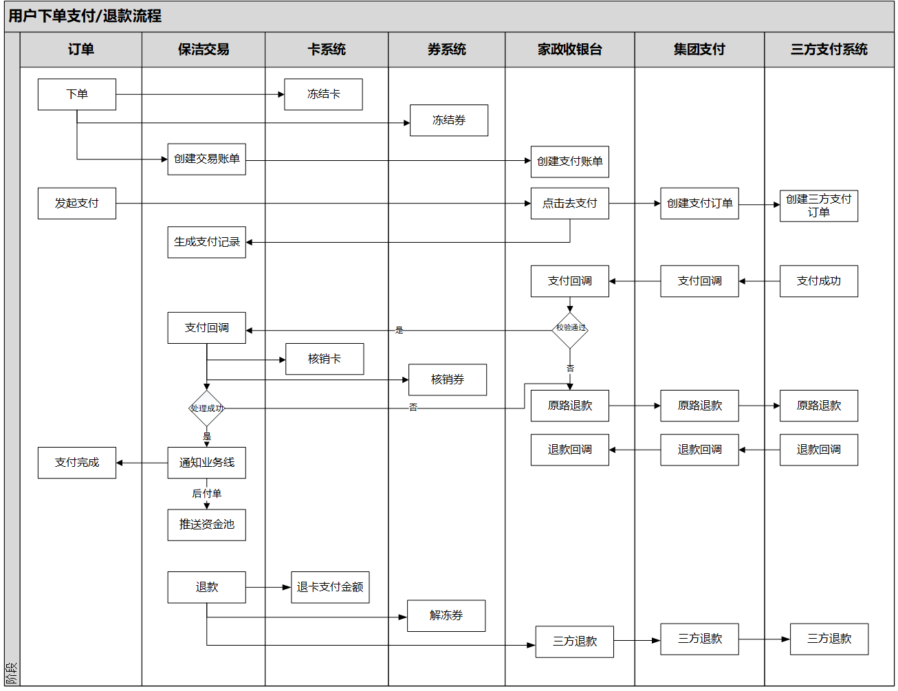
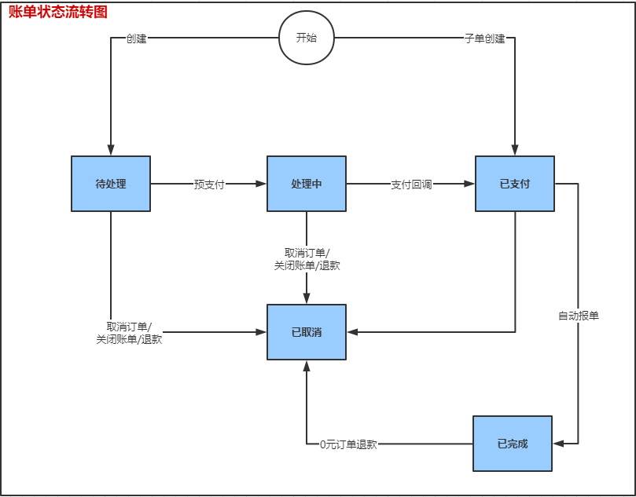

# 一、项目描述

保洁交易，承担着家政侧保洁所有业务。记录着订单的正向交易流程和退款逆向流程。

<!--more-->  

# 二、整体架构


> * 保洁交易，记录着订单所有的支付方式，如券支付、卡支付、三方支付。
> * 当三方支付金额大于0时，去收银台创建收银台账单。
> * 支付成功回调时，保洁交易去核销卡、核销券、通知业务线、推送资金池。
> * 退款时，先进行退卡、退券，然后再退三方。


# 三、业务模式


> * 1、预付单，需要预先进行支付（预付分成预付周期单和预付普通单）
> * 2、周期单，分成套餐母单和预付周期单（套餐母单不需要进行支付，预付周期单需要进行支付）。
> * 3、预付周期单子单，保洁交易需要根据预付周期单进行拆分（子单不需要再进行支付，但是要生成支付记录，对母单进行金额拆分）。
> * 4、后付，为子单补充账单（保洁业务会出现预付订单服务时间不够的情况，创建后付账单需要用户再次支付）。
> * 5、退款，按订单进行退款，需要获取该订单下的预付+后付账单+已退款+罚款进行金额校验计算。


# 四、表结构


**说明**：一个订单对应一个交易trade，一个交易trade对应多个账单，一个账单对应多个账单历史（bill_history 记录账单状态和核心字段变化），一个账单对应多个账单项bill_item(账单由哪些子项组成)，一个账单对应一个支付记录，一个账单对应多个退款记录（一个账单分多次退），一个支付记录对应多个支付详情，一个退款记录对应多个退款详情。


# 五、状态流转图




# 六、数据幂等处理
方式：采用Redis分布式锁，对订单进行加锁，防止并发操作导致的数据的幂等问题。

1、创建账单：为防止订单账单的多次创建，添加对订单的锁。
```
String key = Constants.CREATE_BILL_KEY_PREFIX + tradeParam.getOrderId();
String value = UUID.randomUUID().toString();
if (!RedisLock.lock(key, value, Constants.EXPIRE_TIME)) {
    throw new GeneralException(ErrorCodeEnum.REPEATED_REQUESTS);
}    
//内部处理时，去判断该订单的交易账单是否存在，存在就不重复创建。
//以订单为唯一键
tradeService.createTrade(tradeParam);
```
2、支付成功回调。（防止收银台多次调用交易而产生的数据幂等问题）  

    1、账单已关闭，需要原路退款（防止订单超时时取消，支付成功回调才回来）。
    2、重复调用：账单已支付，比对三方支付流水号，如果相等，则为重复调用，此时不做其他处理。【唯一键：三方支付流水号】
    3、重复支付：账单已支付，比对收银台账单号，如果不相等为重复支付，需要做三方退款处理。（收银台已过滤重复支付场景，到交易侧发生概率极低）
```
--支付回调
String key = Constants.UPDATE_TRADE_KEY_PREFIX + payNotifyParam.getOrderId();
String value = UUID.randomUUID().toString();
if (!RedisLock.lock(key, value, Constants.EXPIRE_TIME)) {
    throw new GeneralException(ErrorCodeEnum.REPEATED_REQUESTS);
}
tradeService.payNotify(payNotifyParam);
```
3、退款处理：对订单加锁，防止一个订单产生多次退款记录。
```
String lockKey = Constants.TRADE_REFUND_KEY_PREFIX + refundDto.getOrderId();
//判断是否重复退款
getTradeRefundService().checkRepeatRefund(refundDto);
```

# 七、数据一致性
订单下单的一个整体流程涉及的业务系统多，相互之间都易产生数据一致性问题，系统未采用分布式事务如2PC、3PC、TCC等，采用最终一致性方案达到数据的一致性。 
 
1、订单&交易  
**交易支付完成时，需要同步订单支付完成状态，交易是如何做的呢？**
- 1、交易收到收银台的支付成功回调，交易进行内部逻辑数据处理，例如核销券、扣减卡。
- 2、当上面的操作完成时，对订单进行状态同步。
- 3、同步机制：（重试+MQ）
    - 3.1、通过HTTP通知订单，重试3次，若重试3次失败时，将发送订单支付完成MQ消息。
    - 3.2、交易自发自收MQ消息，这种方式能够保证业务解耦，不需要再关注MQ消息，并且通过MQ的持久化机制防止状态同步消息丢失。
    - 3.3、若订单超时时间仍未完成支付，订单将调用交易的关闭账单接口，此时需要交易关注支付回调和关闭账单之间的数据状态扭转问题。

2、交易&券  
当收银台支付成功回调回来时，交易需要进行券的核销，此时认为三方支付完成，即使券的核销操作异常，也不进行退款，需要券保障核销接口的一定成功，若券服务宕机这种问题，需要采用另外方式保障通知券系统进行券的核销。
- 方案：也是通过MQ的方式。


3、交易&收银台  
收银台支付完成后，需要同步交易账单支付状态，收银台内部使用方式也为**重试+MQ**方式，保证最后能够调用交易的RPC接口。


4、交易  
更新交易账单：与支付成功回调接口使用同一把锁，防止并发操作导致的数据一致性问题。
```
--关闭交易和账单
String key = Constants.UPDATE_TRADE_KEY_PREFIX + orderId;
String value = UUID.randomUUID().toString();
if (!RedisLock.lock(key, value, Constants.EXPIRE_TIME)) {
    throw new GeneralException(ErrorCodeEnum.REPEATED_REQUESTS);
}
tradeService.closeTrade(orderId);
```
