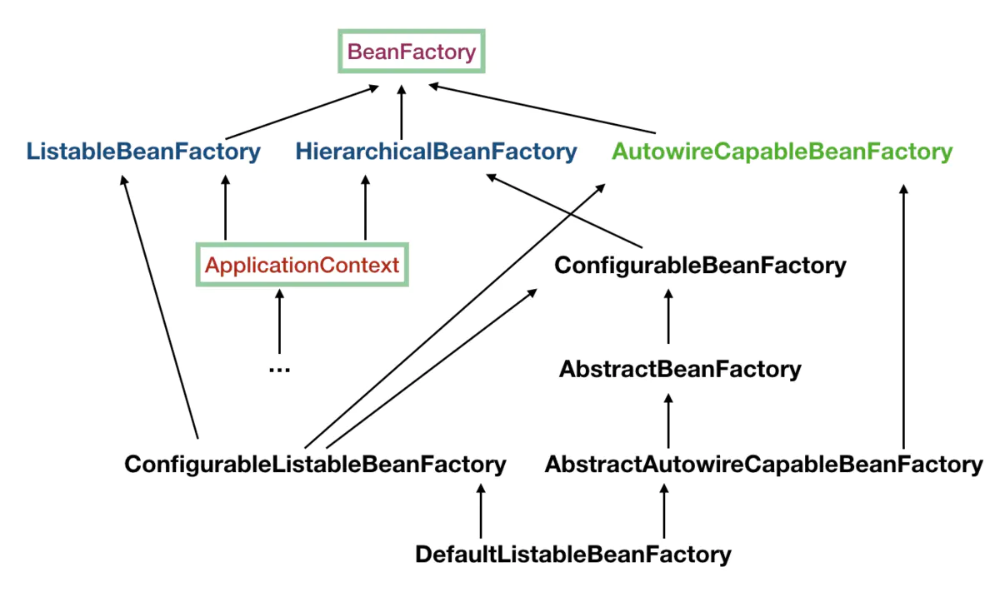

# 一、核心
spring两大核心，IOC依赖注入和AOP面向切面编程。

# 二、容器
想要启动spring，需要创建一个ApplicationContext容器，该容器是spring的核心。

ApplicationContext类组织结构：


<!--more-->    

ApplicationContext实质上也是BeanFactory工厂。
* 几种实现方式
    * ConfigurableApplicationContext：是比较上层的一个接口，该接口也是比较重要的一个接口，几乎所有的应用上下文都实现了该接口。该接口在ApplicationContext的基础上提供了配置应用上下文的能力，此外提供了生命周期的控制能力
    * ClassPathXmlApplicationContext：它是从类的根路径下加载配置文件
    * FileSystemXmlApplicationContext： 它是从磁盘路径上加载配置文件，配置文件可以在磁盘的任意位置。
    * AnnotationConfigApplicationContext: 当我们使用注解配置容器对象时，需要使用此类来创建 spring 容器。它用来读取注解

# 三、容器启动过程
> 方式1：通过反射方式
```
Class<?> applicationContextClass = classLoader.loadClass("org.springframework.context.support.ClassPathXmlApplicationContext");
Constructor<?> constructor = applicationContextClass.getConstructor(String[].class);
Object springContext = constructor.newInstance(new Object[] { springConfigPathArray });
```

> 方式2：new
```
ApplicationContext context = new ClassPathXmlApplicationContext("classpath:applicationfile.xml");
```

## 3.1、容器创建过程
用ClassPathXmlApplicationContext解析，在实例化过程中，会调用refresh()方法，进行容器的创建及一系列操作。
```
public ClassPathXmlApplicationContext(String[] configLocations, boolean refresh, ApplicationContext parent) throws BeansException {
    super(parent);
    // 解析xml配置文件列表
    setConfigLocations(configLocations);
    if (refresh) {
        //核心方法
        refresh();
    }
}
```
### 1. refresh()方法
```
public void refresh() throws BeansException, IllegalStateException {
    synchronized (this.startupShutdownMonitor) {
        // 准备工作，记录下容器的启动时间、标记已启动状态、处理配置文件中的占位符
        prepareRefresh();
        
        /** 这步完成后，配置文件就会解析成一个个BeanDefinition，注册到BeanFactory 中，
          * 当然，这里说的 Bean 还没有初始化，只是配置信息都提取出来了，
          * 注册也只是将这些信息都保存到了注册中心(说到底核心是一个beanName->beanDefinition的map)
        */
        ConfigurableListableBeanFactory beanFactory = obtainFreshBeanFactory();
        
        // 设置BeanFactory的类加载器，添加几个 BeanPostProcessor，手动注册几个特殊的 bean
        prepareBeanFactory(beanFactory);
        try {
            /**【这里需要知道BeanFactoryPostProcessor这个知识点，Bean如果实现了此接口，
              * 那么在容器初始化以后，Spring会负责调用里面的postProcessBeanFactory 方法。】
              * 这里是提供给子类的扩展点，到这里的时候，所有的Bean都加载、注册完成了，但是都还没有初始化
              * 具体的子类可以在这步的时候添加一些特殊的 BeanFactoryPostProcessor 的实现类或做点什么事
            */
            postProcessBeanFactory(beanFactory);

            // 调用BeanFactoryPostProcessor各个实现类的 postProcessBeanFactory(factory) 方法
            invokeBeanFactoryPostProcessors(beanFactory);

            /** 注册 BeanPostProcessor 的实现类，注意看和 BeanFactoryPostProcessor 的区别
              * 此接口两个方法: postProcessBeforeInitialization 和 postProcessAfterInitialization
              * 两个方法分别在 Bean 初始化之前和初始化之后得到执行。注意，到这里 Bean 还没初始化
            */
            registerBeanPostProcessors(beanFactory);

            // Initialize message source for this context.
            initMessageSource();

            // 初始化当前 ApplicationContext 的事件广播器
            initApplicationEventMulticaster();

            /** 从方法名就可以知道，典型的模板方法(钩子方法)，
              * 具体的子类可以在这里初始化一些特殊的 Bean（在初始化 singleton beans 之前）
            */
            onRefresh();

            // 注册事件监听器，监听器需要实现 ApplicationListener 接口
            registerListeners();

            // 重点，重点，重点
            // 初始化所有的  singleton beans
            //（lazy-init 的除外）
            /** <bean id="testBean" class="cn.itcast.test.TestBean" />
              * 该bean默认的设置为:
              * <bean id="testBean" calss="cn.itcast.test.TestBean" lazy-init="false" />
              * lazy-init="false"
              * 立即加载，表示在spring启动时，立刻进行实例化。
            */
            finishBeanFactoryInitialization(beanFactory);

            // 最后，广播事件，ApplicationContext 初始化完成
            finishRefresh();
        }

        catch (BeansException ex) {
            logger.warn("Exception encountered during context initialization - cancelling refresh attempt", ex);

            // 销毁已经初始化的 singleton 的 Beans，以免有些 bean 会一直占用资源
            destroyBeans();

            // Reset 'active' flag.
            cancelRefresh(ex);

            // 把异常往外抛
            throw ex;
        }
    }
}
```

### 2. 注册BeanDefinition

1. 注册BeanDefinition方法：ConfigurableListableBeanFactory beanFactory = obtainFreshBeanFactory();
2. 需要被描述为 bean definitions 的配置对象主要分为如下几大类，
    * xml-based，解析 xml beans 的情况；
    * 使用 @Autowired、@Required 注解注入 beans 的解析情况；
        * 需要特殊处理并解析的元素 <context:annotation-config/>
    * 使用 @Component、@Service、@Repository，@Beans 注解注入 beans 的解析情况；
        * 需要特殊处理并解析的元素 <context:annotation-scan/>
        * 解析当前的 .class 字节码，解析出对应的 annotation，比如 @Service，然后生成beanDefinition
        * 还需为注解类生成beanName
    * @Controller注解，内部有@Component
    
#### 2.1、xml-based类型配置的注册
处理<bean>标签
```
<bean id="threadPool" class="org.springframework.scheduling.concurrent.ThreadPoolTaskExecutor">
```
1. 解析bean标签入口DefaultBeanDefinitionDocumentReader#processBeanDefinition
2. 实际实现由XmlBeanDefinitionReader去解析XML文件
3. BeanDefinitionParserDelegate解析Bean标签，创建beanDefinition,解析bean标签属性及子标签设置到beanDefinition中
4. 最后生成beanDefinitionMap<beanName,beanDefinition>和beanDefinitionNames，然后放入到容器内

    
#### 2.2、@Component等注解的注册
1. 需要配置：<context:component-scan
2. component-scan标签的前缀是context,这种带有前缀的标签叫做自定义标签，自定义标签的解析流程如下：
    * 首先找到自定义标签的前缀对应的namespaceUri --> xmlns:context="http://www.springframework.org/schema/context"
    * 在META-INF文件夹内的spring.handlers文件中配置有该namespaceUri对应的处理类 --> http\://www.springframework.org/schema/context=org.springframework.context.config.ContextNamespaceHandler
    * DefaultBeanDefinitionDocumentReader#parseBeanDefinitions  --> delegate.parseCustomElement(ele)
    * component-scan元素的处理类为ComponentScanBeanDefinitionParser
    *  
    
通过 @Component、@Service 注解的方式注入的 bean 往往没有配置 bean name，所以往往需要通过程序的方式自行生成相应的 bean name，看看内部的源码，如何生成 bean name 的，
```
/**
 * 因为通过 @Component、@Serivce 等注解的方式不会像 xml-based 配置那样提供了一个 name 的标签，可以指定 bean name；所以，这里需要去单独为其生成一个；
 */
@Override
public String generateBeanName(BeanDefinition definition, BeanDefinitionRegistry registry) {
   if (definition instanceof AnnotatedBeanDefinition) {
      String beanName = determineBeanNameFromAnnotation((AnnotatedBeanDefinition) definition); // 处理诸如 @Service("dogService") 的情况
      if (StringUtils.hasText(beanName)) {
         // Explicit bean name found.
         return beanName;
      }
   }
   // Fallback: generate a unique default bean name. 里面的实现逻辑就是通过将 Class Name 的首字母大写编程小写，然后返回；
   return buildDefaultBeanName(definition, registry);
}
```
* ComponentScanBeanDefinitionParser.parse()
* 

#### 2.3、BeanDefinition包含属性
```
<bean id="abstractDataSource" name="aliasName"class="com.alibaba.druid.pool.DruidDataSource" init-method="init" destroy-method="close" abstract="true"  lazy-init="true">
    <!-- 配置初始化大小、最小、最大 -->
    <property name="initialSize" value="2" />
    <property name="minIdle" value="2" />
    <property name="maxActive" value="5" />	
</bean>
```
以上面代码为例：id, class名称，property属性, init-method, 别名, 是否懒加载
* init-method：初始化方法名，
* name：别名，spring通过一个map保存BeanDefinition信息，key=beanName，value=BeanDefinition； -> beanDefinitionMap
spring有一个别名映射map，例如beanName=张三，aliasName=小三，那么在aliasMap中添加一个键值对，key=张三，value=小三
通过别名获取时，需要重定向一次。

[参考](https://www.shangyang.me/2017/04/07/spring-core-container-sourcecode-analysis-register-bean-definitions/)

#### 2.4、 解析自定义标签
1. 生成标签解析器handler(在init方法中添加parser类)
2. 在spring.handlers文件配置
3. 创建对应标签的parser解析器


### 3. prepareBeanFactory
* 为工厂设置类的加载器、表达式解析器、属性编辑器注册器等
* 为工厂添加后处理器、要忽略的依赖接口
* 在工厂中注册可解析的依赖
* 在工厂中提前注册一些单例Bean

### 4. beanFactory后置处理器
spring的一个重要扩展点：例如可以手动注册一下BeanDefinition，修改或者是移除一些BeanDefinition
```
//实例化并调用所有已注册的 BeanFactoryPostProcessor
//调用BeanFactoryPostProcessor各个实现类的 postProcessBeanFactory(factory) 方法
invokeBeanFactoryPostProcessors(beanFactory);
```
* 实例化 + 调用执行
* BeanFactoryPostProcessor：主要的操作对象是beanFactory
* BeanFactoryRegistryPostProcessor：主要的操作对象是BeanDefinition


### 5. bean后置处理器
```
//注册
1. registerBeanPostProcessors(beanFactory);
//从bean工厂中找到所有实现BeanPostProcessor接口的类
2. String[] postProcessorNames = beanFactory.getBeanNamesForType(BeanPostProcessor.class, true, false);
//实例化
3. BeanPostProcessor pp = beanFactory.getBean(ppName, BeanPostProcessor.class);
```
1. 实例化并注册BeanPostProcessors
    * 注册AutowiredAnnotationBeanPostProcessor
    * 注册CommonAnnotationBeanPostProcessor
2. 注意：BeanPostProcessor此时未执行，执行时间是在bean初始化时，初始化之前调用postProcessBeforeInitialization，
    初始化之后postProcessAfterInitialization
         
    

### 6. bean实例化和初始化
0. 有一写bean已经实例化了，例如BFPP, BPP
1. 实例初始化方法：finishBeanFactoryInitialization(beanFactory);
2. 遍历beanDefinitionNames，对beanDefinition进行实例化和初始化；AbstractBeanFactory.doGetBean()
```
beanNames = new ArrayList<String>(this.beanDefinitionNames);
// Trigger initialization of all non-lazy singleton beans...
for (String beanName : beanNames) {
    getBean(beanName);
}
```
> BeanFactory与FactoryBean的区别？
```
1. 两个都可以用来创建对象
2. BeanFactory需要严格遵守SpringBean的生命周期，从实例化、初始化等等，流程复杂
3. 所以引入了FactoryBean，快捷的创建，会创建两个对象，
    1. 一个继承FactoryBean的类，由Spring创建，交给Spring管理，会在一级缓存中管理（singletonObjects)
    2. 另外一个是实际对象，由FactoryBean创建，也交给Spring管理，会在factoryBeanObjectCache缓存中
```


> 实例化阶段

getBean() -> doGetBean()
* Object sharedInstance = getSingleton(beanName);
    * 首先从缓存中获取（三级缓存）
* 缓存不存在，如果原型模式下存在循环依赖，抛出异常
* 进入创建环节
```
sharedInstance = getSingleton(beanName, new ObjectFactory<Object>() {
    @Override
    public Object getObject() throws BeansException {
        try {
            //函数式
            return createBean(beanName, mbd, args);
        } catch (BeansException ex) {
        }
    }
});
标记
getSingleton() -> beforeSingletonCreation() -> this.singletonsCurrentlyInCreation.add(beanName)，将当前bean加入到正在创建的map内

```
* createBean()创建环节
```
createBean(){
    1. mbd.prepareMethodOverrides()；//lookup-method重写，cglib生成代理对象
    //Give BeanPostProcessors a chance to return a proxy instead of the target bean instance.
    //给BeanPostProcessors一个机会来返回代理来替代真正的实例，AOP
    2. resolveBeforeInstantiation() {
        //调用BeanPostProcessor的postProcessBeforeInstantiation方法，进行
        for (BeanPostProcessor bp : getBeanPostProcessors()) {
            ibp.postProcessBeforeInstantiation()
        }
    }
    3. doCreateBean() {
        //instanceWrapper，bean实例的一个封装对象
        if (instanceWrapper == null) {
            //根据执行bean使用对应的策略创建新的实例，如：工厂方法，构造函数主动注入，简单实例化
            instanceWrapper = createBeanInstance(beanName, mbd, args);
            createBeanInstance() {
                Class<?> beanClass = resolveBeanClass(mbd, beanName);
                if (mbd.getFactoryMethodName() != null)  {
                    //自定义bean工厂方式生成bean实例
                    return instantiateUsingFactoryMethod(beanName, mbd, args);
                }
                //选择构造器，@Autowired注解，可以在构造器、方法、字段上注入
            }
        }
        //bean创建后，BeanPostProcessor后置处理
        applyMergedBeanDefinitionPostProcessors(mbd, beanType, beanName);
        //早期暴露，解决循环依赖
        boolean earlySingletonExposure = (mbd.isSingleton() && this.allowCircularReferences && isSingletonCurrentlyInCreation(beanName));
        if (earlySingletonExposure) {
            if (logger.isDebugEnabled()) {
                logger.debug("Eagerly caching bean '" + beanName +
                        "' to allow for resolving potential circular references");
            }
            //初始化之前将创建实例的objectFactory添加到工厂中，解决后期代理问题
            addSingletonFactory(beanName, new ObjectFactory<Object>() {
                @Override
                public Object getObject() throws BeansException {
                    return getEarlyBeanReference(beanName, mbd, bean);
                }
            });
        }
    }
}
```


* 单例bean引用原型bean，通过 lookup-method 解决
    * 原型：scope="prototype"，每次请求都会创建新的bean

* 创建bean方式
    * factory-method="create"，配置工厂（静态或者是实例，静态static）
    * factoryBean
    * BeanFactory
    * 反射

> 填充阶段

* @Autowired和@Inject都是按照类型注入，使用后置处理器进行实例化注入（AutowiredAnnotationBeanPostProcessor）、
* @Resource按名称注入


> 初始化阶段

1. 执行Aware接口对应的方法
2. 执行BPP的before的初始化方法
3. 调用执行init-method方法
    1. 实现了InitializingBean接口之后调用afterPropertiesSet方法
    2. 调用执行用户自定义初始化方法：init-method方法
4. 执行BPP的after的初始化方法，实际进行**AOP代理**

> InitializingBean接口

spring的加载bean的源码类(AbstractAutowireCapableBeanFactory)可以看到
```
protected void invokeInitMethods(String beanName, final Object bean, RootBeanDefinition mbd)
            throws Throwable {
//判断该bean是否实现了实现了InitializingBean接口，如果实现了InitializingBean接口，则调用bean的afterPropertiesSet方法
        boolean isInitializingBean = (bean instanceof InitializingBean);
        if (isInitializingBean && (mbd == null || !mbd.isExternallyManagedInitMethod("afterPropertiesSet"))) {
            if (logger.isDebugEnabled()) {
                logger.debug("Invoking afterPropertiesSet() on bean with name '" + beanName + "'");
            }
            if (System.getSecurityManager() != null) {
                try {
                    AccessController.doPrivileged(new PrivilegedExceptionAction<Object>() {
                        public Object run() throws Exception {
                            //调用afterPropertiesSet
                            ((InitializingBean) bean).afterPropertiesSet();
                            return null;
                        }
                    }, getAccessControlContext());
                }
                catch (PrivilegedActionException pae) {
                    throw pae.getException();
                }
            }
            else {
                //调用afterPropertiesSet
                ((InitializingBean) bean).afterPropertiesSet();
            }
        }
        if (mbd != null) {            //判断是否指定了init-method方法，如果指定了init-method方法，则再调用制定的init-method
            String initMethodName = mbd.getInitMethodName();
            if (initMethodName != null && !(isInitializingBean && "afterPropertiesSet".equals(initMethodName)) &&
                    !mbd.isExternallyManagedInitMethod(initMethodName)) {
                //反射调用init-method方法
                invokeCustomInitMethod(beanName, bean, mbd);
            }
        }
    }
```
* 1：spring为bean提供了两种初始化bean的方式，实现InitializingBean接口，实现afterPropertiesSet方法，或者在配置文件中同过init-method指定，两种方式可以同时使用
* 2：实现InitializingBean接口是直接调用afterPropertiesSet方法，比通过反射调用init-method指定的方法效率相对来说要高点。但是init-method方式消除了对spring的依赖
* 3：如果调用afterPropertiesSet方法时出错，则不调用init-method指定的方法。

> 循环依赖

A-B;B->A
1. 一级缓存：singletonObjects
    * 步骤3：将B放入一级缓存，将A放入一级缓存，清除三级
2. 二级缓存：earlySingletonObjects
    * 步骤2：发现循环依赖时，将A放入二级缓存，清除三级
3. 三级缓存：singletonFactories
    * 步骤1：存入时机：实例化后，将ObjectFactory放入三级缓存
    * 在获取具体对象的时候，直接生成代理对象，在获取的时候通过lambda表达式中动态生成
如果没有代理，只需要二级缓存就可以，所以需要三级缓存。在整个三级缓存中，对象仅能存在一份。


# 四、bean的生命周期
1. 读取配置，生成beanDefinition，放入beanDefinitionMap
    * AOP对象的beanDefinition也会此时生成，AspectjAwareAdvisorAutoProxyCreator
2. 实例化和执行BeanFactoryPostProcessor(BFPP)，可以修改或者引入其他的beanDefinition，BFPP操作的对象是BeanFactory.
    * ConfigurationClassPostProcessor：用来对相关注解的解析工作
3. registerBeanPostProcessor，注册BeanPostProcess并且实例化，用于实例化时调用before和after接口
4. 实例化对象，createBeanInstance
    * 在一个对象创建之前，必须先把AOP需要的对象提前准备好，因为无法预估哪些对象需要动态代理
    * 实例化之前：
        * 哪个步骤可以提前实例化并且生成对应的对象，resolveBeforeInstantiation() -> BPP.before()
        * AOP的相关对象创建好
    * 创建方式
        * factoryMethod，通过工厂方法
        * 通过反射创建
        * 代理方式
    * 实例化之后
5. 填充属性，populateBean
    * 会创建依赖的对象
6. 初始化
    *. 执行Aware接口对应的方法
    *. 执行BPP的before的初始化方法
    *. 调用执行init-method方法
        1. 实现了InitializingBean接口之后调用afterPropertiesSet方法
        2. 调用执行用户自定义初始化方法：init-method方法
    *. 执行after的初始化方法，AOP
            
            
# 五、import标签
* Spring IOC容器初使化的时候会调用AbstractApplicationContext 的refresh方法
* 在refresh里会调用各种BeanFactoryPostProcessor， 其中就包括我们需要关注的ConfigurationClassPostProcessor。
* ConfigurationClassPostProcessor 不但用于处理@Configuration注解，里面也有处理@Import注解。
* 最终的处理是通过 ConfigurationClassParser 这个类完成对Import各种情况的处理
            
