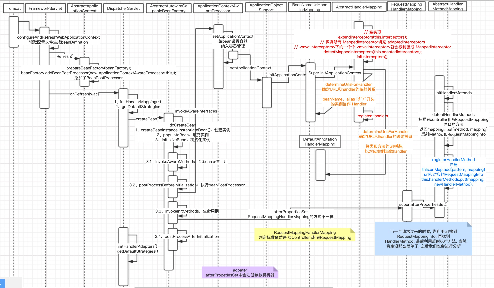

#  一、HandlerMapping映射过程


<!--more-->  

## 1、Dispatcher在初始化的过程中，会初始化HandlerMapping，HandlerAdapter
## 2、初始化HandlerMapping，
* 首先会获取容器中所有的beanName
* 遍历beanName，判断beanName对应**类的类型**是否是Controller或者是RequestMapping
* 然后反射获取类的所有方法，对方法生成RequestMappingInfo对象，并且和类的RequestMappingInfo对象合并。
* 最终生成了一个**map<标注了的方法，整合后的标记对象>，** key=method, value=RequestMappingInfo
* 然后遍历这个map，完成三者关系的映射（路径，方法，mappingInfo对象）
* **map<路径，mappingInfo对象>**，key=路径，value=mappingInfo对象
* **map<mappingInfo对象, handlerMethod>**，key=mappingInfo对象，value=handlerMethod
* 三大集合到此完成。

```
map<标注了的方法，整合后的标记对象>，key=method, value=RequestMappingInfo
map<路径，mappingInfo对象>，key=路径，value=mappingInfo对象
map<mappingInfo对象, handlerMethod>，key=mappingInfo对象，value=handlerMethod
```

## 3、初始化HandlerAdapter，注入默认的参数解析器（多个）和默认的
26个
## 4、请求执行过程
* Dispatch.doService()方法，根据URL获取到HandlerMethod，并将hendlerMehtod和interceptor拦截器封装成HandlerExecutionChain。
* 然后根据HandlerExecutionChain.handler找到相应的HandlerAdapter
* mappedHandler.applyPreHandle(processedRequest, response)，首先会执行interceptor拦截器，所有拦截器通过，继续往下执行
* HandlerAdapter执行（方法执行准备）
    * adapter.invokeHandelMethod() -> modelFactory.initModel()
        * 获取注释了@ModelAttribute的方法
        * 执行方法，将返回值设置到model内
    * **model**：进行方法调用时的方法传递
* 继续执行（实际方法调用）
    *  Object[] args = getMethodArgumentValues(request, mavContainer, providedArgs);，获取方法的所有参数
    * 遍历参数集合，获取参数对应的参数解析器HandlerMethodArgumentResolver
    * 然后参数解析，argmentResolvers.resolveArgument()
    * 具体解析如下：
        * 获取参数类型
        * 获取参数值
        * 进行参数封装
        * 最后可以调用DataBinder，进行数据绑定、数据格式化、数据验证
* > 自定义一个参数解析器需要实现HandlerMethodArgumentResolver接口，重写supportsParameter和resolveArgument方法，配置文件中加入resolver配置
参数解析完成后，进行方法调用，获取返回值
returnValue
* 再调用returnValueHandler进行返回值解析
* 生成modelAndView
    * ModelMap model = mavContainer.getModel();
    * ModelAndView mav = new ModelAndView(mavContainer.getViewName(), model);
* 视图解析器：viewResolver
    * processDispatchResult(processedRequest, response, mappedHandler, mv, dispatchException);

# 二、整体流程

