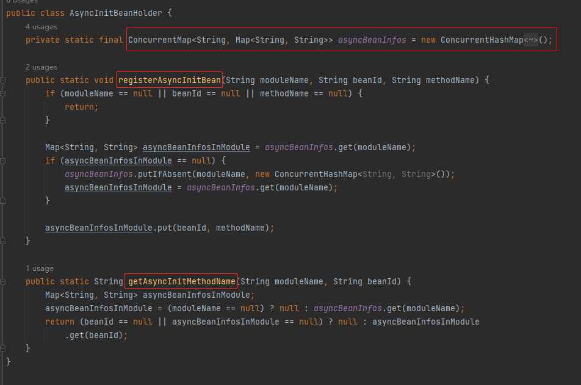
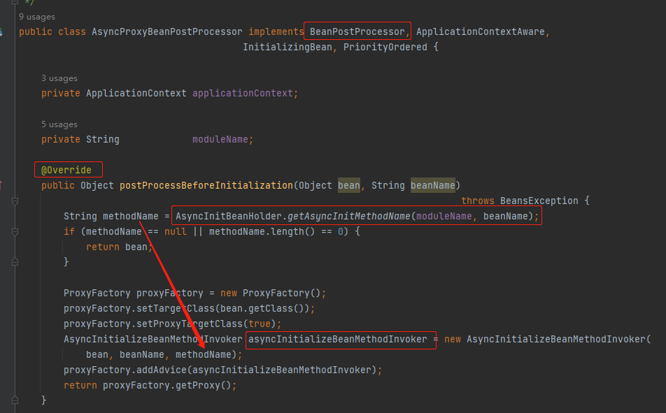
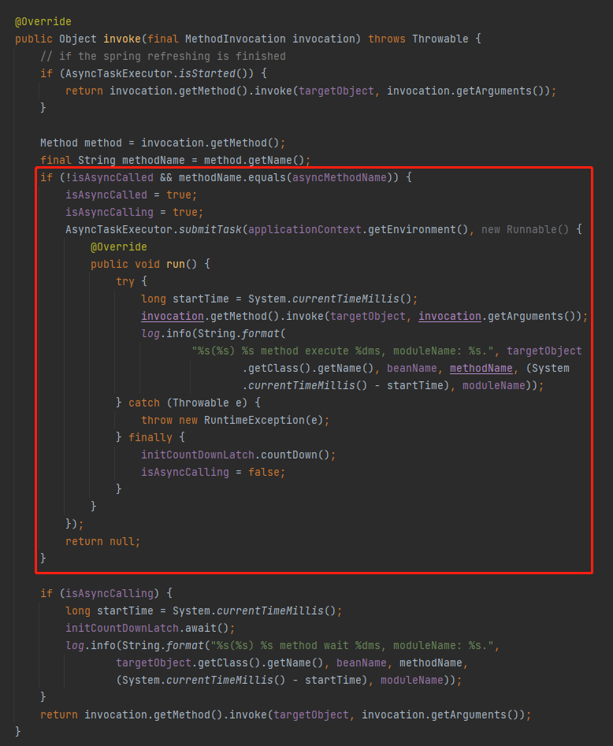
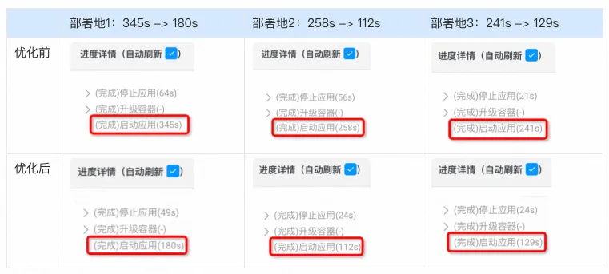

    这是性能优化系列的第一篇文章，主要介绍的是系统的启动优化。

### 一、背景
在阿里巴巴内部经过多年的实践，1-5-10 早已成为各个业务稳定性、基础设施稳定性以及大促保障的重要牵引指标。
    
    1分钟发现：做到故障的一分钟发现，首先需要有完善的监控/告警体系，其次需要有明确的故障结构化定义
    5分钟响应：做到故障的 5 分钟响应，首先需要有一套标准的应急响应流程，其次需要能够快速定位问题，作出恢复决策
    10分钟快恢：1-5-10 场景的核心是快恢，发现体系和响应体系建设都是为了快速的恢复故障。要建设快恢体系首先需要建立起快恢能力，其次要针对故障特征合理使用快恢能力。
```dtd
⭐️ 快恢手段：手段有很多，比如应用重启，系统回滚，机器下线，重新发布，扩容限流等等，本篇文章主要介绍应用重启。
```
为了满足系统稳定性、高可用的建设，达成1-5-10对于故障处理的时效性目标，对商品发布应用进行启动优化（满足10分钟快恢）。

<!-- more -->

### 二、现状

**优化前：** 应用从构建、部署，整体耗时12分钟。

### 三、优化手段
优化手段也非常多项，包括容器优化、构建优化、编译优化，本文对阿里内部组件的优化不做过多解释，应用启动的主要瓶颈在于bean的初始化过程，因此本篇文章主要讲解spring bean异步化优化。

[阿里内部组件优化](https://markdown.com.cn/basic-syntax/links.html "阿里内部组件优化")

#### ⭐️ spring bean异步化优化
应用启动速度主要的瓶颈在于bean的初始化过程（init，afterPropertiesSet方法的耗时），很多中间件bean的初始化逻辑涉及到网络io，且在没有相互依赖的情况下串行执行。将这一部分中间件bean进行异步加载，是提升启动速度的一个探索方向。

解决方案：   
```dtd
1、自动扫描可批量异步的中间件bean，而后，在bean的初始化阶段利用线程池并行执行其初始化逻辑。  
2、允许使用方自行配置耗时bean以享受异步加速能力。(需使用方自行确认依赖关系满足异步条件)
```

### 四、使用示例
主要针对中间件。
#### A.解决方案1：  
自定义注解，例如@SofaAsyncInit。（注：此注解为SOFABoot项目的注解）


#### B.解决方案2：
```dtd
手动指定要异步初始化的bean，格式为bean名称列表：如****.async-init=tairClient,mqclient。
```
当时所在团队使用的这种方案。

### 五、原理
#### A:首先需要知道spring的bean初始化流程。
我们先知道afterPropertiesSet()和Init()方法的执行时机，因为Bean初始化耗时主要是这2个方法。

步骤1：遍历beanDefinitionNames集合     
步骤2：检查缓存中或者实例工厂中是否有对应的实例    
步骤3：创建bean实例    
    bean初始化时，会执行AbstractAutowireCapableBeanFactory#invokeInitMethods的方法，方法内部会执行2个方法：afterPropertiesSet()方法 & invokeCustomInitMethod()。
```dtd
1. afterPropertiesSet()方法：需要类实现InitializingBean接口。
2. invokeCustomInitMethod()方法：会执行自定义的init()方法。
```
#### B:实现异步加载
既然知道了afterPropertiesSet()和init()2个方法的执行时机和流程，那么接下来就是设法实现异步加载执行了。

***⭐️ 基于注解的实现方式：***    
**1. 首先解析注解，收集信息**    
通过实现BeanFactoryPostProcessor接口（bean工厂的后置处理器，可以获取bean的示例或定义等。同时可以修改bean的属性），来进行注解的解析。
```dtd
com.alipay.sofa.runtime.spring.AsyncInitBeanFactoryPostProcessor#registerAsyncInitBean
```
实现BeanFactoryPostProcessor接口：


***收集Bean信息：***
registerAsyncInitBean 方法，把可以异步执行的 init 方法的 Bean 收集起来，用 Map 来进行的存储。


**2. 然后异步化处理**  
实现BeanPostProcessor接口（bean的后置处理器）
```dtd
com.alipay.sofa.runtime.spring.AsyncProxyBeanPostProcessor#postProcessBeforeInitialization
```

关键点，就在 AsyncInitializeBeanMethodInvoker 里面，因为这个里面有真正判断是否要进行异步初始化的逻辑，主要解读一下这个类。  
首先，关注一下它的这三个参数：
```dtd
initCountDownLatch：是 CountDownLatch 对象，其中 count 初始化为 1
isAsyncCalling：表示是否正在异步执行 init 方法。
isAsyncCalled：表示是否已经异步执行过 init 方法。
```
通过这三个字段，就可以感知到一个 Bean 是否已经或者正在异步执行其 init 方法。    

核心逻辑就是通过AsyncTaskExecutor.submitTask()把init()扔到线程池里面去执行。

[SOFABoot](https://www.cnblogs.com/thisiswhy/p/17457499.html,"SOFABoot")    
[参考文章1](https://developer.aliyun.com/article/1239199, "Bean异步初始化，让你的应用启动飞起来")   
[spring异步化](https://mp.weixin.qq.com/s/-qzXuiE7fcGS7JXxFbu6jg?poc_token=HHhxD2ejr-ur6eD3TaHJ2lUVP5m4UbF5awelDrdo, "")

### 六、成果
下图只是展示了长啥样，不是真实数据：

```dtd
优化前：12分    
优化后：7分30s
```