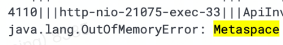

    这是性能优化系列的第四篇文章，主要介绍的是jvm相关优化。

### 一、背景
在做商品相关业务时，需要将A系统的部分功能迁移到商品系统，过程中遇到多个jvm的问题。
- metaspace oom问题。
- YGC频繁问题。

<!-- more -->

JVM配置如下：
```
JDK1.8
-Xms8g
-Xmx8g
-Xmn4g
-XX:MetaspaceSize=512M
-XX:+UseConcMarkSweepGC
```

### 二、metaspace oom问题

#### 问题表现
应用在主预发环境部署后，经过一段时间，业务方寻找过来，说明主预发环境无法提供服务的问题。

##### 1 初步分析
应用无法提供响应，首先去Sunfire查看应用的基础监控项和业务监控项，如下为基础监控项：

*图片为网络图片，当时的图片未留存（错误类似）   
> 分析结果：当时的第一感觉是metaspace基础监控项有问题，占用内存一直增加，可能是metaspace oom导致的应用崩溃。

##### 2 查看错误日志
查看错误日志，明显报出了java.lang.OutOfMemoryError: Metaspace。从这里就能够确定问题了。

*图片为网络图片，当时的图片未留存（错误类似）

> 分析结果：确定为 metaspace oom
##### 3 GC 日志分析
选择一台主机，查看 GC 日志，直接定位 Full GC 关键字。

*图片为网络图片，当时的图片未留存（错误类似）

> 分析结果：Full GC (Metadata GC Threshold) 说明此次全量垃圾回收是由于元数据空间达到了垃圾回收的阈值而触发的

##### 4 metaspace oom分析
metaspace主要存储类的元数据，比如我们加载了一个类，那么这个类的信息就会按照一定的数据结构存储在Metaspace中。Metaspace的大小和加载类的数目有很大关系，加载的类越多，Metaspace占用内存也就越大。
那接下来就应该dump heap，分析类的加载情况。

##### 5 检查jvm类加载器及加载的类
使用Arthas，检查当前jvm中的类加载器及加载的类，查询classloader中加载的类数量和列表。

*图片为网络图片，当时的图片未留存

>分析结果：当时未成功分析出结果。

##### 6 Dump heap
使用的是阿里内部的grace，获取dump文件，然后进行分析。考虑到 metaspace 区是用来存储 class 元信息，因此如果要爆掉 metaspace 区，必然是加载了大量 class。直接定位到类标签上，

*图片为网络图片，当时的图片未留存 （数据类似）  
然后查看内存泄露报表，报表中提示了DivisionCache缓存类（占内存的45%）存在泄露问题。
> 分析结果：大量的加载了地址库DivisionCache缓存类（好像是长这样，忘了）

##### 7 结论
业务功能迁移，需要引入地址库的jar包，因为地址库缓存信息庞大，造成了应用metaspace oom。

##### 8 优化
增加metaspace的内存空间占比，从512M提升到了716M。【需要保障应用占用的内存不超过整个物理内存的80%，因为有一些其他程序在运行，例如监控、日志收集等】

```
-XX:MetaspaceSize=716M  //从512M提升到了716M
```

### 三、YGC频繁问题

#### 问题表现
在解决metaspace oom问题后，在程序启动时，又出现了YGC频繁的问题，应用部署完成后，YGC频率降低至正常情况。

##### 1 查看基础监控
查看基础监控，参考如下图：频率每分钟80次

##### 2 分析
通常情况下，由于新生代空间较小，Eden区很快被填满，就会导致频繁YGC，因此可以通过增大新生代空间来降低YGC的频率。

##### 3 优化
```
-Xmn4860m //由4g调整到4860m
```
> 调大新生代空间后，应用启动YGC频繁问题得到解决。


### 四、总结
JVM调优的步骤总结
- 1、事前：建立完善的基础监控，能够通过大盘快速定位问题。
- 2、事中：保留现场，分析应用错误日志 & GC日志，充分利用各种可视化工具，提升排查效率。
- 3、事后：根据具体情况进行针对性的优化。


More info: [从实际案例聊聊Java应用的GC优化](https://tech.meituan.com/2017/12/29/jvm-optimize.html)