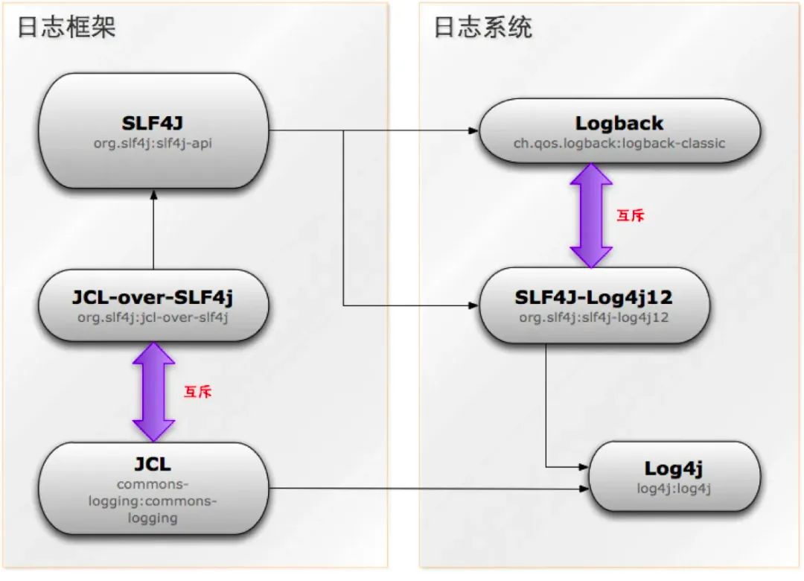
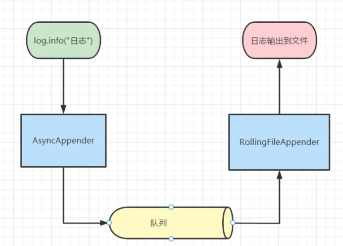
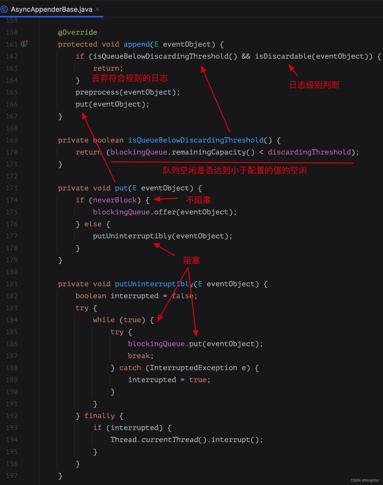

    这是性能优化系列的第六篇文章，主要介绍的是日志原理分析及优化。

### 一、背景
团队内部推动使用异步打印日志的优化工作，及日日常工作中遇到的日志问题，因此做一个总结。

<!-- more -->

### 二、日志原理

#### 1 日志框架介绍

* 日志框架  
标准接口类型，也叫作 Facade ，也就是只提供接口，没有具体实现。开发者可以基于日志标准接口提供的规范自己实现一套。
> JCL：Apache基金会所属的项目，是一套Java日志接口，之前叫Jakarta Commons Logging，后更名为Commons Logging
> SLF4J:  是一套简易Java日志Facade，本身并无日志的实现。（Simple Logging Facade for Java，缩写Slf4j）

* 日志系统      
这一类框架主要基于日志的标准接口规范实现或者就是单纯的实现不依赖任何标准。
> Log4j/Log4j2、Logback、JUL 这四个实现是比较常用的日志实现。

#### 2 日志使用
##### ⭐️ Slf4j+Logback入门实践  
* maven配置
```dtd
<!--日志框架接口-->
<dependency>
    <groupId>org.slf4j</groupId>
    <artifactId>slf4j-api</artifactId>
</dependency>
<!--日志框架接口实现-->
<dependency>
    <groupId>ch.qos.logback</groupId>
    <artifactId>logback-classic</artifactId>
</dependency>
<!--日志框架核心组件-->
<dependency>
    <groupId>ch.qos.logback</groupId>
    <artifactId>logback-core</artifactId>
</dependency>
```
* 配置文件  
logback.xml
```dtd
<?xml version="1.0" encoding="UTF-8"?>
<configuration>
    <!--默认日志配置-->
    <include resource="org/springframework/boot/logging/logback/defaults.xml"/>
    <!-- 控制台日志 -->
    <appender name="CONSOLE" class="ch.qos.logback.core.ConsoleAppender">
        <encoder charset="UTF-8">
            <pattern>${CONSOLE_LOG_PATTERN}</pattern>
        </encoder>
    </appender>
    <!-- Info日志 -->
    <appender name="FILE-INFO" class="ch.qos.logback.core.rolling.RollingFileAppender">
        <file>${LOG_PATH}/${LOG_FILE}-info.log</file>
        <append>true</append>
        <filter class="ch.qos.logback.classic.filter.LevelFilter">
            <level>INFO</level>
            <onMatch>ACCEPT</onMatch>
            <onMismatch>NEUTRAL</onMismatch>
        </filter>
        <rollingPolicy class="ch.qos.logback.core.rolling.TimeBasedRollingPolicy">
            <fileNamePattern>${LOG_PATH}/${LOG_FILE}-info-%d{yyyy-MM-dd}.%i.log</fileNamePattern> <!-- 日志文件的路径和名称 -->
            <timeBasedFileNamingAndTriggeringPolicy class="ch.qos.logback.core.rolling.SizeAndTimeBasedFNATP">
                <maxFileSize>200MB</maxFileSize> <!-- 单个日志文件的最大大小 -->
            </timeBasedFileNamingAndTriggeringPolicy>
            <maxHistory>15</maxHistory> <!-- 保留的历史日志文件数量 -->
            <totalSizeCap>2GB</totalSizeCap> <!-- 所有日志文件的总大小上限 -->
            <cleanHistoryOnStart>true</cleanHistoryOnStart> <!-- 在启动时清除历史日志文件 -->
        </rollingPolicy>
        <encoder charset="UTF-8">
            <pattern>${FILE_LOG_PATTERN}</pattern>
        </encoder>
    </appender>

    <!-- 异步输出 -->
    <appender name="info-asyn" class="ch.qos.logback.classic.AsyncAppender">
        <appender-ref ref="FILE-INFO"/>
        <queueSize>512</queueSize> <!-- 异步队列的大小 -->
    </appender>
    </appender>
    <!-- 应用日志 -->
    <logger name="com.alibaba.alsc.order" additivity="false">
        <appender-ref ref="CONSOLE"/>
        <appender-ref ref="FILE-INFO"/>
    </logger>
    <!-- 总日志出口 -->
    <root level="${logging.level.root}">
        <appender-ref ref="CONSOLE"/>
        <appender-ref ref="info-asyn"/>
    </root>
</configuration>
```

* 代码示例
```dtd
import org.slf4j.Logger;
import org.slf4j.LoggerFactory;

public class MyClass {
    private static final Logger logger = LoggerFactory.getLogger(MyClass.class);

    public void doSomething() {
        logger.info("doing something");
    }
}
```
在上面的代码中，我们通过LoggerFactory.getLogger()方法获取了一个Logger实例，并使用logger.info()方法记录了一条日志。


#### 3 日志原理
More info: [深入掌握Java日志体系，再也不迷路了](https://juejin.cn/post/6905026199722917902#heading-0)

##### 3.1 异步日志实现
同步输出

(*)-> "业务程序"
-> "日志打印"
-> "业务程序 "
->(*)


异步输出

start
fork
: 业务thread;
fork again
: 日志thread;
end fork
stop


###### ⭐️ 异步日志实现原理AsyncAppender
logback异步输出日志是通过AsyncAppender实现的。AsyncAppender可以异步的记录 ILoggingEvents日志事件。

Logback的异步输出采用生产者消费者的模式，将生成的日志放入消息队列中，并将创建一个线程用于输出日志事件，有效的解决了这个问题，提高了程序的性能。
```dtd
<!-- 文件 异步日志(async) -->
    <appender name="ASYNC_LOG" class="ch.qos.logback.classic.AsyncAppender" >
        <!-- 不丢失日志.默认的256/5,如果队列的80%已满,则会丢弃TRACT、DEBUG、INFO级别的日志 -->
        <discardingThreshold>0</discardingThreshold>
        <!-- 更改默认的队列的长度,默认值为256 -->
        <queueSize>25</queueSize>
        <neverBlock>false</neverBlock>
        <!-- 添加附加的appender,最多只能添加一个 -->
        <appender-ref ref="fileLog" />
    </appender>
```


> 注意：写文件是异步线程，但是写queue是同步的，如果配置出现问题，也会导致工作线程阻塞。

相关源码    
```dtd
logback中的异步输出日志使用了AsyncAppender这个appender，通过看AsyncAppender源码，跟到它的父类AsyncAppenderBase，

可以看到它有几个重要的成员变量：
AppenderAttachableImpl<E> aai = new AppenderAttachableImpl<E>();
BlockingQueue<E> blockingQueue;
AsyncAppenderBase<E>.Worker worker = new AsyncAppenderBase.Worker();
```

### 三、日志配置错误案例
#### 背景
商品分布平台，经常触发磁盘利用率异常告警，错误如下：


需要进入运维平台，手动清空日志，及缩小日志清理的时间。

#### ⭐️ 问题排查
* 为什么打印了这么多日志？  
> 商品结构复杂，每次查询、操作都打印的话，会打印非常多的日志，磁盘占用也高。

* 机器配置
```dtd
CPU=8核
内存=16GB
磁盘=100GB
```
进入机器，查看应用的日志文件，发现应用的历史日志未清除，导致磁盘利用率高。

* 查看logback配置   
示例如下：
```dtd
<configuration>
    <appender name="DAILY_ROLLING_FILE" class="ch.qos.logback.core.rolling.RollingFileAppender">
        <file>application.log</file>
        <rollingPolicy class="ch.qos.logback.core.rolling.TimeBasedRollingPolicy">
            <!-- 按天滚动 -->
            <fileNamePattern>application-%d{yyyy-MM-dd}.log</fileNamePattern>
            <!-- 设置单个日志文件最大大小为 5GB -->
            <maxFileSize>5GB</maxFileSize>
        </rollingPolicy>
        <encoder>
            <pattern>%d{yyyy-MM-dd HH:mm:ss.SSS} [%thread] %-5level %logger{36} - %msg%n</pattern>
        </encoder>
    </appender>

    <root level="INFO">
        <appender-ref ref="DAILY_ROLLING_FILE" />
    </root>
</configuration>
```
> 错误1：单个文件5G，配置不正确。 
> 错误2：没有配置日志保留时间。
> 错误3：未配置总日志文件大小限制。
> 错误4：未配置异步打印。

* 优化
```dtd
<appender name="TRACE_FILE" class="ch.qos.logback.core.rolling.RollingFileAppender">
    <file>${PATH}/trace.log</file>
    <rollingPolicy class="ch.qos.logback.core.rolling.SizeAndTimeBasedRollingPolicy">
        <FileNamePattern>${PATH}/trace.%d{yyyy-MM-dd}.%i.log</FileNamePattern>
        <!--保存多少天的日志-->
        <maxHistory>7</maxHistory>
        <!--自定义日志总大小-->
        <totalSizeCap>30G</totalSizeCap>
        <!--单个文件大小上限-->
        <maxFileSize>300M</maxFileSize>
        <!--在只有设置为true并且 maxHistory 不为零才能起效。-->
        <cleanHistoryOnStart>true</cleanHistoryOnStart>
    </rollingPolicy>
    <!--输出格式-->
    <encoder>
        <pattern>%d{yyyy-MM-dd HH:mm:ss.SSS} %-5level %-50logger{50}:%-4line %green(%-8X{UUID}) %msg%n</pattern>
        <charset>utf8</charset>
    </encoder>
</appender>
```

