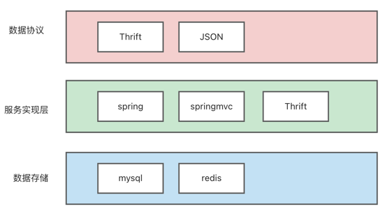
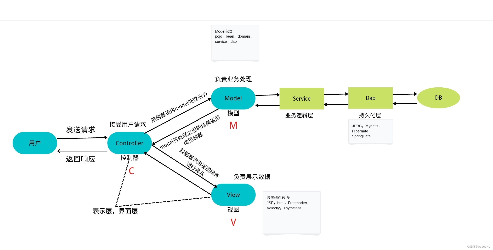

    这是系统重构系列的第一篇文章，主要介绍的是美团资产管理系统的重构及分布式数据库的运用。

### 一、背景
资产管理系统，主要是对充电宝、优选物资、优选低值物资等资产完整生命周期的管理。

- 资产新增、资产调整、资产重建、资产折旧、资产减值等。

<!-- more -->
为什么资产系统需要重新架构呢？
- 产品层面：产品设计问题，导致报账不准确。
- 性能问题：30W资产数据的操作，需要耗时1小时。
- 大事务问题：导致数据库性能问题；数据一致性风险。
- 数据量大：资产数据2KW，折旧数据数十亿，未做好分库分表。

### 二、重构前准备
- 规划阶段
  - 明确目标：解决上面提到的问题。
  - 评估现状：对现有系统进行全面的评估，包括代码质量、架构设计、数据库结构、性能瓶颈、可维护性等方面。了解系统的优势和不足，确定重构的重点和难点。
  - 制定计划：
    - 根据目标和现状评估，制定详细的重构计划。确定重构的范围、步骤、时间表、资源需求等。将重构任务分解为可管理的子任务，分配给相应的团队成员。
    - 考虑到重构可能会对现有业务产生影响，制定合理的风险应对措施和回滚计划。
- 准备阶段
  - 建立测试环境
  - 技术选型
- 实施阶段
  - 代码重构
  - 数据库重构
  - 性能优化
- 测试
- 监控和优化


### 三、重构
> 评估现状：
- 代码质量差，可读性差，维护成本高。
- 数据库结构未满足业务需求，性能差，可用性差。
- 性能差。

> 制定计划：
- 重构范围：产品结构、数据模型。
- 步骤确认：
  - 方案设计：完整的一个详细设计过程。
    - 系统架构：分层结构；技术选型；前后端交互；功能模块确认。
    - 数据模型：实体；库表结构。
    - 性能&稳定性&测试：
  - 拆分任务：
    - 数据库相关：数据库资源申请、库表创建、数据迁移。
    - 编码相关：确定代码结构，设计模式等确认。
    - 稳定性：监控大盘配置；
- 时间规划：
  - 确认任务的优先级，各任务的时长安排，deadline确认。


**本文主要从系统编码重构、性能问题、大事务解决等方面进行讲解。**
#### 系统架构
技术架构简图：
    
内部的业务系统，业务比较简单，传统的MVC三层架构。

##### 1 确定数据存储
数据库性能问题，是需要着重解决的。使用的MySQL，资产存量2KW，其他数据数十亿。为了解决存储瓶颈、性能下降、扩展性等问题，考虑分库分表。  
当时有2种方案：
- MySQL分库分表。
  - 优点：支持事务，性能高，开发人员对MySQL熟悉。
  - 缺点：需要进行数据的迁移，没有现成工具，需要编码调试。
- 使用分布式数据库blade。
  - 优点：
    - 自动扩容，不需要太考虑分库分表的容量问题。
    - 支持事务，操作上和MySQL很相似，无太多学习成本。
    - 丰富的数据结构，完善的数据迁移工具，成本低。
  - 缺点：稳定性和性能上未知，需要测试。（blade团队说稳定性99.95）

从业务特性、系统定位，在对blade进行测试后，性能、稳定性上能够满足要求，所以觉得使用blade分布式数据库。

> 最终的结果是好的，满足了业务要求，节约了成本。使用上的问题在文章后面的章节进行说明。

##### 2 确定代码结构
> 使用传统的MVC三层架构，简单明了，参考下图：



> 大量使用设计模式

策略模式&模板方法：针对资产的功能，创建策略；定义事件抽象类。
```java
//抽象类
public abstract class EventStrategy {
    public String code;
    public abstract void triggerEvent(EventSaveReqs eventSaveReqs);
}
//具体的实现
@Component
public class AssetAddEventStrategy extends EventStrategy {
  @Override
  public void triggerEvent(EventSaveReqs eventSaveReqs) {
    //具体的操作
  }
}
```

工厂模式：EventStrategyFactory
```dtd
//策略工厂
public class EventStrategyFactory {
    private final Map<String, EventStrategy> strategyMap;
    public EventStrategyFactory(List<EventStrategy> strategies) {
        strategyMap = strategies.stream().collect(Collectors.toMap(EventStrategy::getCode, strategy -> strategy));
    }
    EventStrategy getStrategy(String code) {
        return strategyMap.get(code);
    }
}
//使用
EventStrategyFactory.getStrategy(EventLargeCategoryEnum.IMPAIRMENT_ADD.getCode());
//根据事件类型，选择合适的策略。
```

适配器：将资产操作适配成事件；将MQ消息适配成事件。
```java
public class Adapter {
    public EventInfo adapter(EventSaveReqs eventSaveReqs){
        //
    }
}
```

责任链：资产的校验
```java
//定义处理器
public interface Handler {
    void setNextHandler(Handler nextHandler);
    void handleRequest(EventSaveReqs request);
}
//基础信息校验
public class BaseInfoHandlerImpl implements Handler {
  private Handler nextHandler;

  @Override
  public void setNextHandler(Handler nextHandler) {
    this.nextHandler = nextHandler;
  }
  @Override
  public void handleRequest(EventSaveReqs request) {
    if (request.getType().equals("type1")) {
      //基础信息的校验
    } else if (nextHandler!= null) {
      nextHandler.handleRequest(request);
    } else {
      System.out.println("没有处理者能处理该请求");
    }
  }
}
```

##### 3 大事务解决
使用TransantionTemplate代替@Transaction方式，进行更精细化的事务操作。
```java
transactionTemplate.execute(status -> {
    // 可以在这里执行其他数据库操作，如果出现异常，事务会回滚
    return null;
});
```

##### 4 性能优化
资产新增，excel导入30W数据，应用处理耗时1小时，也是一个非常重要的点，需要进行优化。
```java
List<Integer> originalList = List.of(1, 2, 3, 4, 5, 6, 7, 8, 9, 10);
List<List<Integer>> copyPartition = Lists.partition(originalList, 3);
List<CompletableFuture<Object>> futureList = copyPartition.stream().map(subList ->
        //任务传递给supplyAsync()方法，该任务将在ForkJoinPool.commonPool()中异步完成运行
        //最后，supplyAsync()将返回新的CompletableFuture，其值是通过调用给定的Supplier所获得的值。
        CompletableFuture.supplyAsync(() -> {
                    log.info("处理第{}段数据开始", n);
                    return checkAndBuildEvent(baseMessageMap, subList, totalCheckedMap, mis);
                }, importForkJoinPool)
                //thenApplyAsync()方法，从supplyAsync()获得的参数传递来执行给定的函数
                .thenApplyAsync(eventSaveReqs -> {
                            try {
                                EventStrategyFactory.getStrategy(EventLargeCategoryEnum.ADD.getCode()).triggerEvent(eventSaveReqs);
                                totalCheckedMap.get(BaseConstants.SUC_LIST).addAll(subList);
                            } catch (Exception e) {
                                log.error("新建失败", e);
                                subList.forEach(importDto -> {
                                    importDto.setFailReason("新建入库失败");
                                });
                                totalCheckedMap.get(BaseConstants.FAIL_LIST).addAll(subList);
                            }
                            log.info("处理第{}段数据开始", n);
                            return null;
                        },
                        queryForkJoinPool
                )
).collect(toList());
futureList.stream().map(CompletableFuture::join).collect(Collectors.toList());
```
通过并发的方式，优化到了2分钟。

### 四、分布式数据库
美团内部的blade分布式数据库，内部是基于TiDB进行内部定制化后的产品。

- 使用注意事项：
  - 事务失败：当写并发较大时，随着数据的不断插入和更新，Region 中的数据量会逐渐增加。当 Region 中的数据量超过一定阈值时，TiDB 会自动触发 Region 分裂，将一个大的 Region 分裂成两个较小的 Region，此时会导致事务操作失败，所以需要业务做兜底，进行重试操作。
  - 大事务问题：客户端 commit 之前写入数据都在内存里面，TiDB 内存暴涨，一不小心就会 OOM，建议每 100～500 行写入一个事务。
  - 使用场景：在数据一致性上，并不适合交易场景。