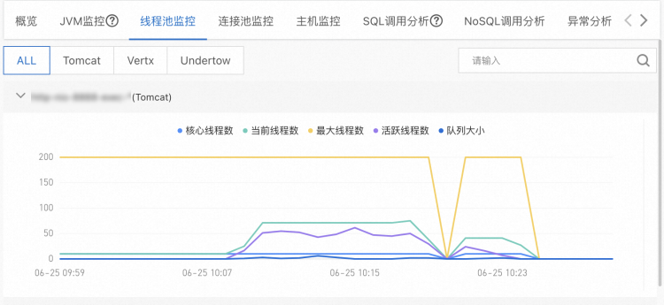
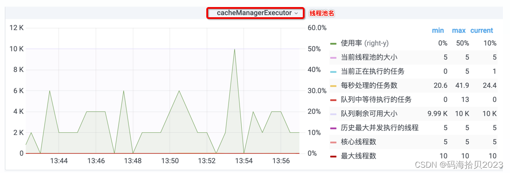

    这是系统稳定性系列的第二篇文章，主要介绍的是通过监控系统的线程池状态来表现“控”。

### 一、线程池监控
团队专门做了稳定性专项，本文通过监控线程池来说明如何做高可用建设中的“控”。
<!-- more -->

常规的线程池监控，监控项过少，无法展示线程池的更多数据，也无法监控独立线程池的状态。

### 二、线程池监控的意义
- 确保系统性能：资源利用优化 & 性能瓶颈检测。
- 提高系统可靠性：故障预警 & 系统稳定性保障。
- 便于系统调试和优化：问题排查 & 性能优化。


### 三、线程池状态监控
#### 3.1 如何监控运行数据
这里提供两种常规思路：
- 线程池运行时埋点，每一次运行任务都进行统计；
- 定时获取线程池的运行数据。

采用方案2：通过定时任务来获取
```java
/**
 * ThreadPoolMonitor 负责线程池与监控方法的管理；
 */
public class ThreadPoolMonitor {
    //线程池集合
    private static final Map<String, FutureWrapper> THREAD_POOL_MAP = new ConcurrentHashMap<>();
    //定时任务线程池
    private static final ScheduledThreadPoolExecutor SCHEDULE_THREAD_POOL = new ScheduledThreadPoolExecutor(8, new NamedThreadFactory("ThreadPoolMonitor"));
    private static final Long DEFAULT_MONITOR_PERIOD_TIME_MILLS = 1000L;
    
    //将线程池纳入监控
    public static void monitor(String name, ThreadPoolExecutor threadPoolExecutor) {
        if (threadPoolExecutor instanceof MonitoredThreadPoolExecutor) {
            throw new IllegalArgumentException("MonitoredThreadPoolExecutor is already monitored.");
        } else {
            monitor0(name, threadPoolExecutor, DEFAULT_MONITOR_PERIOD_TIME_MILLS);
        }
    }
    /**
     * 将线程池纳入监控
     * @param threadPoolExecutor
     */
    static void monitor(MonitoredThreadPoolExecutor threadPoolExecutor) {
        monitor0(threadPoolExecutor.poolName(), threadPoolExecutor, DEFAULT_MONITOR_PERIOD_TIME_MILLS);
    }

    private static void monitor0(String name, ThreadPoolExecutor threadPoolExecutor, long monitorPeriodTimeMills) {
        PoolMonitorTask poolMonitorTask = new PoolMonitorTask(threadPoolExecutor, name);
        THREAD_POOL_MAP.compute(name, (k, v) -> {
            if (v == null) {
                return new ThreadPoolMonitor.FutureWrapper(SCHEDULE_THREAD_POOL.scheduleWithFixedDelay(poolMonitorTask, 0L, monitorPeriodTimeMills, TimeUnit.MILLISECONDS), threadPoolExecutor);
            } else {
                throw new IllegalStateException("duplicate pool name: " + name);
            }
        });
    }

    /**
     * 封装线程池
     */
    static class FutureWrapper {
        private final Future<?> future;
        private final ThreadPoolExecutor threadPoolExecutor;

        public FutureWrapper(Future<?> future, ThreadPoolExecutor threadPoolExecutor) {
            this.future = future;
            this.threadPoolExecutor = threadPoolExecutor;
        }
    }
}
```
为什么不使用第一种方案？

性能差：ThreadPoolExecutor 提供了方法，例如获取当前线程数、活跃线程数、最大出现线程数、线程池任务完成总量 的线程池 API 会先获取到 mainLock，然后才开始计算。

#### 3.2 监控的指标有哪些？
> - **线程池当前负载：** 当前线程数 / 最大线程数
> - **线程池峰值负载：** 当前线程数 / 最大线程数，线程池运行期间最大的负载
> - **核心线程数：** 线程池的核心线程数
> - **最大线程数：** 线程池限制同时存在的线程数
> - **当前线程数：** 当前线程池的线程数
> - **活跃线程数：** 执行任务的线程的大致数目
> - **最大出现线程数：** 线程池中运行以来同时存在的最大线程数
> - **阻塞队列：** 线程池暂存任务的容器
> - **队列容量：** 队列中允许元素的最大数量
> - **队列元素：** 队列中已存放的元素数量
> - **队列剩余容量：** 队列中还可以存放的元素数量
> - **线程池任务完成总量：** 已完成执行的任务的大致总数
> - **拒绝策略执行次数：** 运行时抛出的拒绝次数总数

这些指标可以帮助我们解决大多数因为线程池而导致的问题排查。

#### 3.3 配置监控大盘
配置大盘如下：


参考文章:  
[线程池饱和异常](https://blog.csdn.net/bemavery/article/details/129809483)   
[线程池如何监控，才能帮助开发者快速定位线上错误？](https://mp.weixin.qq.com/s?__biz=MjM5NzMyMjAwMA==&mid=2651509011&idx=1&sn=dec9cd01d0a8d891ea21dc6e05f5c9c0&chksm=bd25bd6c8a52347a5471e7fa4368155648baf694a8c0fc0910488dc7496fa95995712121eb77#rd)    
[Java 线程池监控](https://www.renzhen.online/archives/java%E7%BA%BF%E7%A8%8B%E6%B1%A0%E7%9B%91%E6%8E%A7)       