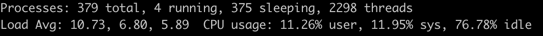

    讲解负载和利用率。

### 一、什么是CPU负载和利用率
#### 1 [CPU负载](https://scoutapm.com/blog/understanding-load-averages)

> **CPU负载：** CPU 负载考虑了正在使用 CPU 的进程以及等待 CPU 资源的进程。即使 CPU 使用率不高，如果有很多进程在等待 CPU，负载也可能较高。
<!-- more -->
- Load averages值在0.00-1的范围内(不包含1)：CPU正常运行这个是比较好的情况，桥上的车没有拥堵，没达到最大承受
- Load averages值在1：表明CPU满负荷运行，桥上的车没有拥堵，达到了最大承受
- Load averages值大于1：标明CPU超负荷运行， 桥上的车已经达到最大的承受，同时开始在桥的入口处开始堵车
> Tips：上面说的是单核单线程的情况下，如果是多核多线程情况Load averages值就不是1了，例如我现在这个CPU8核16线程那么Load averages=16算是满负荷运行。

#### 2 CPU利用率
> **CPU利用率：** 是指在一段时间内 CPU 被占用的时间比例。它直接反映了 CPU 资源的实际使用情况。

#### 3 示例
双核CPU。

> - CPU 负载[Load Avg]: 10.73, 6.80, 5.89
    >   - 分别代表过去 1 分钟、5 分钟和 15 分钟的平均负载。
>   - 分析平均负载：对于双核 CPU，理想状态下平均负载为 2 表示两个核心刚好满负荷。这里的数值明显高于双核满负荷状态，说明系统中有较多的进程在等待 CPU 资源，系统可能面临一定的压力。
> - CPU 使用率[CPU usage]: 11.26% user, 11.95% sys, 76.78% idle
    >   - 用户态 CPU 使用率（user）：表示用户空间的进程所占用的 CPU 时间比例。
>   - 系统态 CPU 使用率（sys）：代表内核空间的进程所占用的 CPU 时间比例。
>   - 空闲 CPU 使用率（idle）：表明 CPU 处于空闲状态的时间比例。
>   - 分析 CPU 使用率：虽然目前 CPU 实际使用的比例不高，但较高的平均负载表明系统可能存在一些进程在排队等待 CPU 处理，或者可能有一些突发的高负载任务在某些时间段出现，导致平均负载升高。

两者关系：
- 一般情况下，当 CPU 使用率高时，负载也可能较高，因为有很多进程在使用 CPU，同时可能还有其他进程在等待 CPU。
- 负载高并不一定意味着 CPU 使用率高。可能有很多进程在等待其他资源（如 I/O、内存等），而不是 CPU，导致负载升高但 CPU 使用率不高。
  - 负载高而 CPU 利用率不高可能有以下原因：
    - I/O 密集型任务：大量等待 I/O 操作
    - 进程频繁切换：
      - 主动切换：指进程无法获取所需资源，导致的上下文切换。比如说， I/O、内存等系统资源不足时，就会发生自愿上下文切换
      - 被动切换：进程由于时间片已到等原因，被系统强制调度，进而发生的上下文切换。
    - 资源竞争和等待

### 二、对线程池容量规划的影响
#### 2.1、CPU 利用率的影响
- 低 CPU 利用率
  - 如果 CPU 利用率较低，说明当前系统的计算资源未得到充分利用。在这种情况下，可以考虑适当增加线程池的容量。
- 高 CPU 利用率
  - 当 CPU 利用率过高时，可能会导致系统响应变慢，甚至出现卡顿或崩溃的情况。此时，不宜再增加线程池的容量，反而可能需要考虑减小线程池的大小或者优化任务的执行效率。

#### 2.2、CPU 负载的影响
- 低平均负载
  - 如果系统的平均负载较低，说明系统中的任务数量相对较少，或者系统有足够的资源来处理当前的任务。在这种情况下，可以根据任务的特点和预期的负载增长来规划线程池的容量。
- 高平均负载
  - 当平均负载较高时，意味着系统中有较多的任务在等待处理，或者系统资源紧张。此时，需要谨慎调整线程池的容量。
> **如果平均负载高但 CPU 利用率不高：** 可能是由于 I/O 等待等原因导致任务堆积。此时，可以考虑增加线程池的容量，以提高系统的并发处理能力，减少任务的等待时间。但要注意不要过度增加线程池的大小，以免导致资源竞争加剧和系统性能下降。
> **如果平均负载高且 CPU 利用率也高：** 说明系统已经处于高负荷状态。此时，增加线程池的容量可能会进一步加重 CPU 负载，导致系统性能恶化。应该首先分析任务的执行情况，优化任务的执行效率，或者考虑增加硬件资源来缓解系统压力。

参考文章：   
[线程池的数量和线程池中线程数量如何设置-理论篇](https://juejin.cn/post/7066675779966337031)     
[线程池的数量和线程池中线程数量如何设置-实践篇](https://juejin.cn/post/7067183465224994852)     
[了解 Linux CPU 负载——什么时候应该担心？](https://scoutapm.com/blog/understanding-load-averages)
