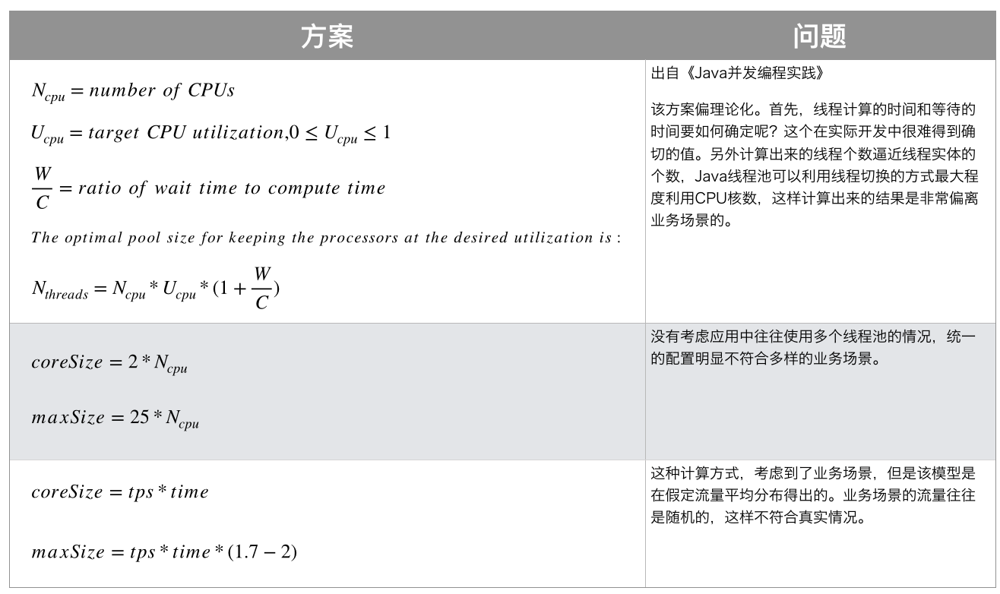

    这是稳定性系列的第四篇文章，主要介绍的是线程池的设置。

### 一、理论分析
**业界的一些线程池参数配置方案：**

<!-- more -->
> 一般思路：会使用第3种计算方式去得到大致的线程池数量。
>  
> 示例如下：假设1秒需要执行1000个任务，每个任务执行耗时40ms，那么需要多少个线程？
> 
> 公式：任务个数/每秒执行个数=线程数量
> - 1000/(1000/40)=40个线程

**和CPU利用率的关系：**
> 示例如下：任务执行耗时40ms，其中计算10ms，数据库IO为30ms。
> 
> CPU利用率=10/40=25%

**线程数量&队列&流量关系：**

> - **线程处理速度 < 流量：** 导致队列堆积，导致影响业务，极端情况下OOM；
> - **线程处理速度 = 流量：** 比较稳定的情况，一般不会出现大问题。
> - **线程处理速度 > 流量：** 有可能是线程数量过多，造成资源浪费。

### 三、实际业务
在实际业务中，为了系统稳定性，每个业务都会有独立的线程池，所以会存在多个线程池。那如果一个新业务来了，我们应该怎么设置线程池数量呢？这篇文章为订单拉单的后序文章。

#### 3.1、线程预估
这一步操作还是需要的，基于新业务的特性，根据理论分析，估算出大致的线程数量。预估出来后，我们应该怎么做呢？

#### 3.2、分析影响
预估出来后，需要分析影响。

增加线程池，有可能会对现有业务造成影响（不管有木有影响，我们还是得去做考虑），应该从哪些方面进行分析呢？

**方面1：业务响应时间 & 吞吐量**        
为什么需要考虑这个？
> 新增线程池后，新任务会去抢占CPU的运行时间，造成进程上下文的切换，导致原有业务的执行时间减少，最终体现到响应时间和吞吐量上。
> - 解决方法：减少线程数量，增大队列，减少上下文切换。实际操作上，无法具体分析出影响范围有多大。
>   - 最佳实践：采用灰度发布的方式，逐步将新线程池引入现有业务系统；同时对现有业务的监控指标进行观察。
****
**方面2：[CPU负载 & CPU利用率：](2024-06-15-稳定性-线程池要设置多大.md)**
> 1. 造成CPU负载的升高：增加线程池，那么会有更多的任务需要处理。例如I/O 密集型任务，这些进程会处于等待 I/O 完成的状态，此时它们并不占用大量的 CPU 资源，但会被计入系统负载中。
>    1. 解决方法：根据不同的造成因素做不同的处理。
>    2. 例如应用程序问题，则优化程序；
>    3. 如果是机器问题，则增加CPU核心数量或升级硬件；
> 2. 进程频繁上下文切换：
>    1. 更多的任务，那么会竞争CPU使用资源，就会造成进程频繁上下文切换，会消耗一定的系统资源。

因此我们需要去查看CPU负载 & CPU利用率，保证增加线程池后，两项指标不会升高到预期之外，并且不对其他现有业务造成过大的影响。
****
**方面3：内存：**
> 每开启一个线程都需要内存空间，并且任务堆积情况下，会造成内存消耗，极端情况下造成oom。

#### 3.3、我们应该怎么做？
> 最佳实践：采用灰度发布的方式，逐步将新线程池引入现有业务系统；同时对现有业务的监控指标进行观察。

参考文章：   
[Java线程池实现原理及其在美团业务中的实践](https://tech.meituan.com/2020/04/02/java-pooling-pratice-in-meituan.html)      
[线程池的数量和线程池中线程数量如何设置-实践篇](https://juejin.cn/post/7067183465224994852#heading-5)

