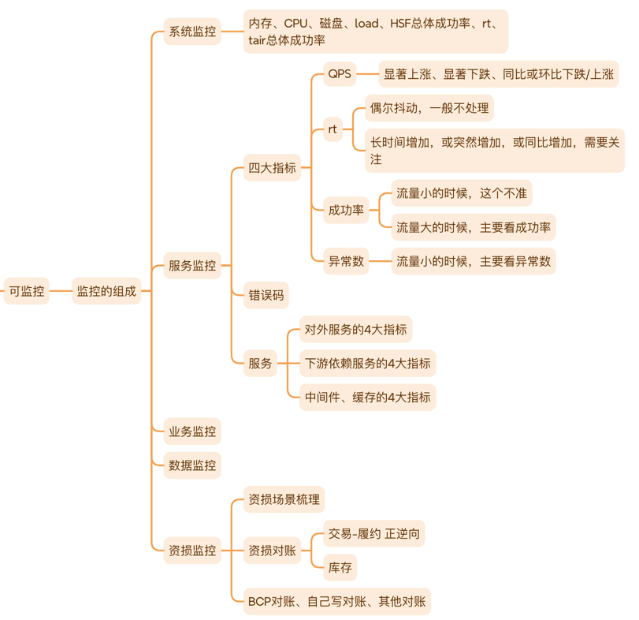

    这是稳定性系列的第五篇文章，主要介绍的是变更三板斧。

### 一、安全生产之变更三板斧
在阿里内部运维体系中，有一个常提的概念是"变更三板斧":
- 可监控
- 可灰度
- 可回滚

<!-- more -->

#### ⭐️可监控
上线的过程中，我们的系统要做到可监控，如果没有监控，上线过程中我们对系统的状态是一无所知，是很可怕的。监控什么东西那，其实监控的就是指标。

#### ⭐️可灰度
上线过程中，我们要做到可灰度，通过灰度执行变更以限制爆炸半径，降低影响范围，同时灰度过程要做好兼容。灰度分为不同维度的灰度：机器维度，机房维度，地域维度，业务维度：用户，商家，仓，承运商等。
> 那具体应该怎么灰度呢？
> 
> 不同场景，灰度的维度是不一样的，例如从用户维度进行说明：
> - 灰度比例：确定用户的量级，影响范围，可以分为 0~1000, 0~10000等多种比例进行控制。影响范围大，缩小每次灰度比例。
>   - 选择初始灰度比例：1/10000，万分之一，开始是一个较为谨慎的选择。
>   - 设定递增策略：可以计划每隔一段时间（如一周）将灰度比例增加 1%，逐步扩大测试范围。这样可以更细致地观察新功能在不同用户规模下的表现。
>     - 固定比例递增：
>       - 每次增加固定百分比；比如每次增加 5%。从 1% 开始，接着是 6%、11%、16% 等
>       - 以特定比例区间递增：例如先从 1% 开始，然后每次增加 3% 到 5% 之间的随机值。
>     - 指数递增：
>       - 缓慢起步后快速增长：开始时以较小的比例递增，比如从 1% 开始，然后按照指数函数的趋势增加比例。例如，接下来是 2%、4%、8%、16% 等。这种方式在初期可以更谨慎地观察新功能的影响，一旦确定相对稳定，就可以快速扩大测试范围，加快上线进度。但需要密切监控，因为后期增长速度较快，可能会带来较大风险。
>     - 基于阶段的递增：
>       - 划分不同阶段，每个阶段设定不同的递增幅度：比如将灰度发布分为三个阶段。在第一阶段，从 1% 开始，每次增加 2%，直到达到 10%；在第二阶段，每次增加 5%，从 10% 增长到 30%；在第三阶段，每次增加 10%，直到接近全面发布。这种方式可以根据不同阶段的目标和风险承受能力来调整递增策略，更加灵活地控制灰度发布过程。
> - 示例：1/10000, 2/10000, 5/10000, 10/10000, 50/10000, 100/10000...

#### ⭐️可回滚
线上出现问题时，我们应该优先止损，其次才是分析根因。
> 止损的最快方式就是回滚，回滚分为代码回滚和数据回滚
> - 代码回滚：有2种方式，开关控制和部署回滚。
>   - 开关回滚：通过开关控制，操作成本最低，止损最快速。
>   - 部署回滚：通过发布平台，例如行云将代码回滚到上个稳定运行的版本，耗时长，止损速度慢。
> - 数据回滚：有时候我们代码回滚完，如果没有做好向前兼容性，系统应用依然有问题，例如上线过程中产生了新数据，回滚完后，代码不能处理新的数据。所以这个时候又涉及到数据的回滚。
>   - 数据的回滚涉及到修数：将产生的新数据无效掉，或者修改为正确的数据等，当数据量比较大时，数据的回滚一般耗时费力，所以建议做好向前兼容性，直接代码回滚。

参考文章：   
[万字长文浅谈系统稳定性建设](https://developer.jdcloud.com/article/3894)      

