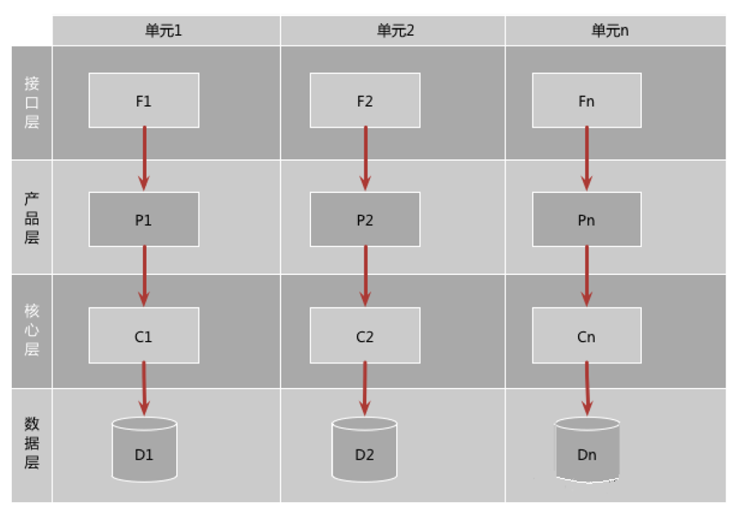
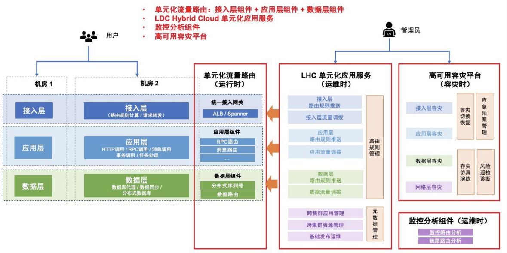
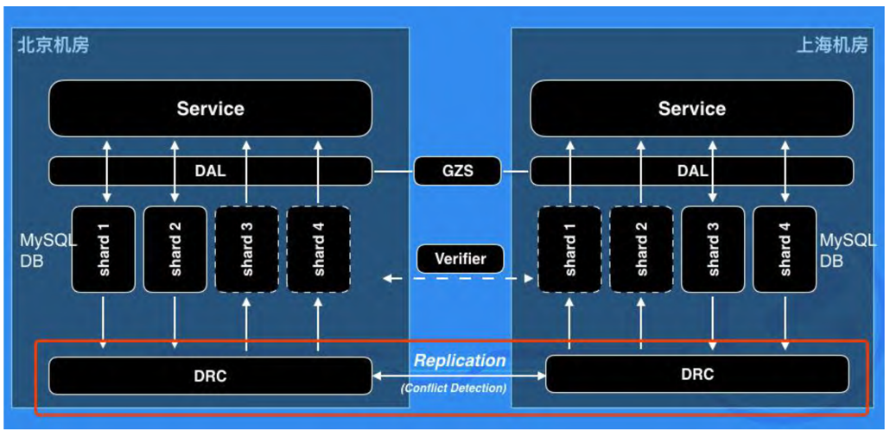

    这是稳定性系列的第六篇文章，主要介绍的是单元化概念。

### 一、什么是单元化？

单元化简单点我们直接就可以认为是一个机房，在这个单元内能够完成业务的闭环。比如说用户进入APP，浏览商品，选择商品确认订单，下单，支付，查看订单信息，这整个流程都在一个单元中能够完成，并且数据也是存储在这个单元里面。
<!-- more -->

#### 1.2 单元化基础术语

| 术语    | 含义                                                                       |
|-------|--------------------------------------------------------------------------|
| gzone | Global Zone，全局区域。部署了不可拆分的数据和服务，这些数据或服务可能会被RZone 依赖。GZone 在全局只有一组，数据仅有一份。 |
| rzone | Region Zone，最符合理论上单元定义的 Zone，每个 RZone 都是自包含的，拥有自己的数据，能完成所有业务。            |
| ezone | eleme zone，饿了么每个机房为一个 ezone，一个 ezone 包含了饿了么需要的各种服务。一笔业务能够内聚在一个 ezone 中   |

### 二、单元化的目的

#### ⭐️ 高可用容灾：

- 1、一个IDC机房挂掉了，能把流量直接切到另一个IDC机房（同一个城市），异地容灾是最终解决方案。

#### ⭐️高并发容量问题：

- 1、提高并发能力，加机器是最直接的答案，但是随之而来的瓶颈是数据库连接瓶颈，机房网卡瓶颈等。
- 2、水平扩展能力，意味着可以按照一定维度来进行分片。
- 3、单元化在做的事情，就是把数据流量，按照一定维度进行拆分。使得一个单元IDC能够闭环提供完整的服务能力。但是这个服务能力面对的是拆分后的部分数据流量，且只服务这部分流量。

### 三、单元化产品组成

单元化产品包含以下三大部分：
- 运行时：单元化流量路由能力，包含统一接入网关、应用层组件和数据层组件。
- 运维时：跨集群资源管理、发布运维和单元化管控能力，包含单元化应用服务（LHC）。 单元化监控分析能力，包含实时监控组件和分布式链路跟踪组件。
- 容灾时：巡检诊断、容灾演练和切换能力，包含高可用容灾平台。

#### 3.1、运行时
##### 1、统一接入网关：
> 统一接入网关，是将访问流量根据转发规则分发到多台后端服务器的流量分发控制服务。
> 
> 在单元化场景下，按单元化路由规则（如用户 ID 到单元的映射关系以及单元间权重占比），将用户的 http 请求路由至目标机房和单元，实现流量动态调拨。
> 
> 统一接入网关的作用如下：
> - 拦截请求，识别目标应用的单元类型（如是 RZone 应用，还是 GZone 应用） 根据目标类型，进行路由转发，支持跨机房异地转发，实现单元化流量调拨。
> - GZone 路由：根据路由规则（单元权重占比），将用户 http 请求转发至目标单元的应用服务器中。
> - RZone 路由：从 cookie 中读取分片字段（如 uid），根据路由规则（用户 ID 到单元的映射关系），将用户 http 请求转发至目标机房的应用服务器中。

##### 2、中间件
在单元化架构下，中间件从应用层到数据层均提供了单元化流量路由能力。

APIRouter ： 路由分发服务
> API Router是一个HTTP反向代理和负载均衡器，部署在公有云中作为HTTP API流量的入口，它能识别出流量的归属 shard ，并根据 shard 将流量转发到对应的 ezone。API Router 支持多种路由键，可以是地理位置，也可以是商户ID，订单ID等等，最终由 API Router 映射为统一的 Sharding ID。

服务通信层：RPC
> 需要支持基于单元化规则的服务路由。需要做到单元的应用可以调用本单元的服务，中心的应用调用中心的服务，从而保证单元的封闭性，减少跨单元的服务（跨单元调用，通常会增加30ms的耗时）。

消息通信层（Notify MQ层）
> 实现原则，尽量保持单元内部消息在内部投递和消费，同时所有消息会路由到中心，保证没有做单元化部署的业务也能接受到消息

数据库层
> 用户在各自映射的单元写对应的数据，数据会和中心做双向同步；如买家数据订单
> - 单元化保护：确保不同单元之间的数据隔离，防止数据泄露和误操作。
> 
> 

### 三、怎么做单元化？
#### 3.1、面临的问题
##### 1. 流量调配
如何进行流量的分配呢？常见的有按buyerId、地理位置。通常会分成交易单元化和导购单元化。
###### 交易单元化
交易单元化是将交易过程划分成多个独立的单元，每个单元负责特定的交易环节或功能。通过这种方式，可以提高交易系统的可扩展性、可靠性和性能。

###### 导购单元化
导购单元化是将导购功能划分成多个独立的单元，每个单元负责特定的导购场景或用户需求。通过这种方式，可以提高导购系统的精准性、个性化和用户体验。可以按照用户行为进行单元划分，例如搜索导购单元、推荐导购单元、品类导购单元等。每个单元根据用户的不同行为和需求，提供相应的导购服务。
##### 2. 数据拆分
- 数据的一致性问题
  - 当数据分布在多个单元中时，确保不同单元之间的数据一致性是一个挑战。例如，在交易单元化中，如果一个用户在多个单元中进行交易，如何保证其账户余额、订单状态等数据的一致性。
- 数据分区和路由
  - 单元化通常需要对数据进行分区，并根据特定的规则将数据路由到不同的单元。如果数据分区不合理或路由规则不清晰，可能会导致数据分布不均衡，影响系统性能。

##### 3. 响应延迟
面临最大的问题就是异地跨机房调用。索引单元化比较核心的点是，一个单元可以提供完整的服务能力，部署完整的应用服务。单元化后，完整的请求链路要求在同一机房内完成。所以单元化也要求整个数据链路层面进行适配，包括rpc请求，MQ消息链路，DAL数据访问层面。

参考文章：   
[阿里技术架构演进及过程中遇到的问题](https://juejin.cn/post/7338422591517310991)   
[饿了么异地多活的数据实施-DRC](https://pic.huodongjia.com/ganhuodocs/2017-08-09/1502263496.67.pdf)    
[看完这篇异地多活的改造，我决定和架构师battle一下](https://tech.dewu.com/article?id=9)   
[蚂蚁单元化解决方案白皮书](https://docs-aliyun.cn-hangzhou.oss.aliyun-inc.com/assets/attach/160617/AntCloud_zh/1585895792638/%E8%9A%82%E8%9A%81%E5%8D%95%E5%85%83%E5%8C%96%E8%A7%A3%E5%86%B3%E6%96%B9%E6%A1%88%E7%99%BD%E7%9A%AE%E4%B9%A6.pdf)    

