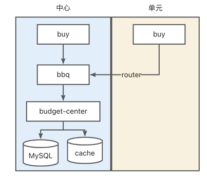
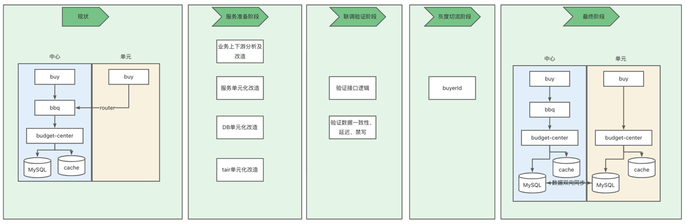
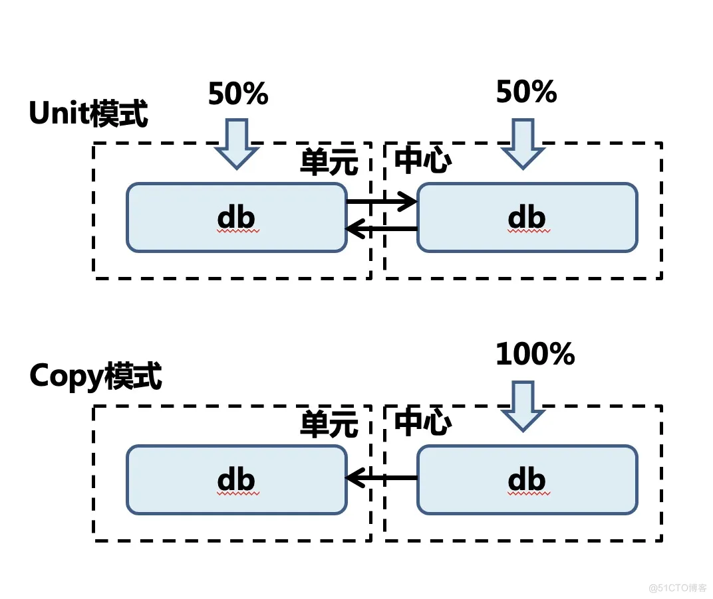
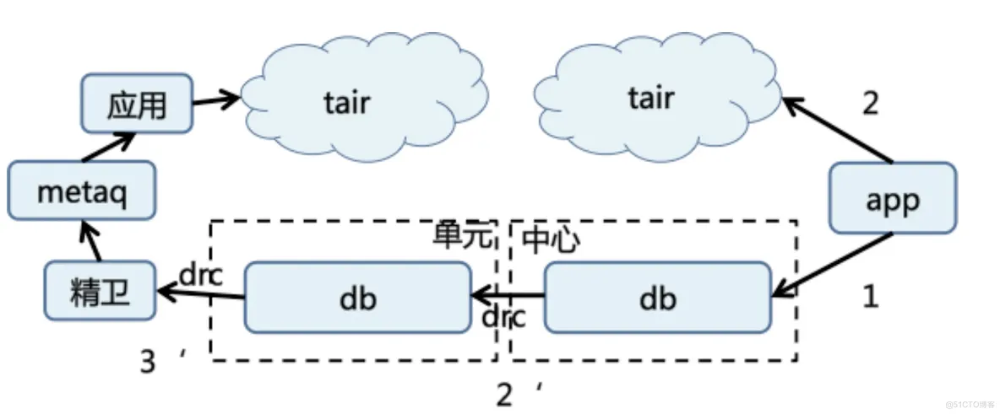
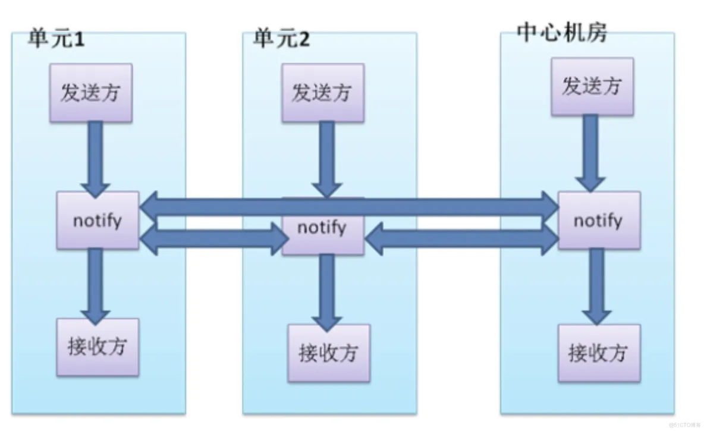
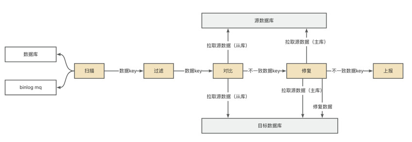
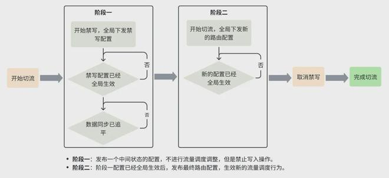

    这是稳定性系列的第七篇文章，主要介绍的是限购的单元化。

### 一、基础术语
<style>
table th:first-of-type {
    width: 12%;
}
table th:nth-of-type(2) {
    width: 70%;
}
</style>


| 术语            | 含义                                                  |
|---------------|-----------------------------------------------------|
| buy           | 下单系统，负责订单生成、资源扣减、支付等。                               |
| ump           | 统一营销平台，做的就是把这些蓝字在整个交易过程中串联起来，对接交易平台，制定规则，计算并整合优惠结果。 |
| BBQ           | 限购系统，限购的角度可以分两种，一种是针对于商品限购，一种是针对于订单限购。              |
| budget-center | 预算系统。                                               |

<!-- more -->
### 二、业务流程及目标
- 现状：
  - buy：已经交易单元化了。
  - BBQ：限购系统，未做单元化，内部接口的逻辑是调用budget-center的提供的接口（是budget-center的封装层），底层数据存储在budget-center内。
  - budget-center：预算系统，未做单元化，只有中心服务。

- 目标：
  - BBQ：去掉封装层，buy直接调用budget-center。
  - budget-center：交易单元化。


### 三、方案

> 分成4个阶段
> - 服务准备阶段
> - 联调测试阶段
> - 灰度切流阶段
> - 最终阶段

#### 3.1、服务准备阶段
服务准备阶段，主要是对业务上下文分析及改造、服务单元化改造、DB单元化改造和tair单元化改造。
##### 3.1.1、服务单元化改造
###### 接口改造：
需要对自己的接口（Java interface）进行标记是什么类型，如果标记为单元路由，目前我们内部的规范是方法的第一个参数为小写的long buyerId，RPC在路由的时候会根据这个值判断用户所在的机房。
```java
@HSFProvider(serviceInterface = OrderService.class, writeMode=center, route=0)
public class OrderServiceImpl implements OrderService {
    @Autowired
    private OrderDAO orderDAO;

    @Override
    public OrderModel queryOrder(Long buyerId, Long orderId) {
        return orderDAO.queryOrder(orderId);
    }
}

writeMode： 属性告知 HSF 某个 服务是中心服务（center）还是单元服务（unit）。
route：用于路由的用户 ID 参数位于方法签名中的位置，如 route=0 表示方法第一个参数。
```


##### 3.1.2、业务上下文分析及改造
推动调用旧接口的业务进行接口切换。

##### 3.1.3、DB单元化改造
单元化应用目前使用的数据层都是TDDL。 数据层的改造点主要有三方面单元化：
1. sequence：TDDL需要提供一个sequence组件,根据当前单元的个数生成全局唯一的sequence,这样当单元流量切换时,sequence总是唯一的,不会产生冲突.
2. 中心化数据源：为了防止数据错写,有些数据源(比如库存)需要保证只在中心单元才能启动.TDDL需要在数据源初始化的时候,判断当前机器的角色与数据源的配置,如果是中心数据源而应用服务器属于单元,则忽略该数据源的启动。
3. 写保护：数据落库之前的最后一层中间件就是数据层,为了防止错写,TDDL雲要提供一种机制,当单元化数据落库时,检查要落库的数据是否符合当前的路由规则,不符合则拒绝写入。
4. 存储层：单元化最核心的问题就是数据问题，有2种数据模式：
   1. unit模式：用户在各自映射的单元写对应的数据，数据会和中心做双向同步;如买家数据
   2. copy模式：数据在中心写，全量同步到各个单元;如卖家数据



> 使用unit模式，申请单元DB，然后通过DRC做数据的同步。

##### 3.1.4、tair单元化改造

在数据发生变更时，也需要对单元的缓存进行失效;通过 invaild-server 来对单元的缓存进行失效。

> 数据的变更信息，通过 DRC 广播到多个机房，实现缓存的刷新，保证各个机房的缓存一致性。

##### 3.1.5、消息通信层改造

实现原则是，尽量保持单元内部消息在内部投递和消费，同时所有消息会路由到中心，保证没有做单元化部署的业务也能接收到消息。把消息投递到准确的单元订阅者。单元1发布的消息，会被单元1的订阅者收到，单元化的应用流量会被均衡分配到每个单元。

#### 3.2、测试联调阶段
##### 3.2.2、数据一致性保障
###### 数据库和缓存的数据一致性核对
通过BCP核对，监听DRC消息后，核对两边的数据一致性。
###### 中心和单元的数据一致性核对

1. 全量数据比对：一般通过离线表核对。
2. 增量数据核对：监听binlog mq异步方式去核对。（中间可能需要延迟核对，因为中心&单元之间会有数据延迟）

> 全增结合

##### 3.2.3、监控
基础监控 & 业务监控的建设。

#### 3.3、灰度切流阶段
##### 3.3.1、切流方案
方案类似如下：


后续用户的请求就会直接被路由到正确的机房。


参考文章：   
[阿里技术架构演进及过程中遇到的问题](https://juejin.cn/post/7338422591517310991)   
[饿了么异地多活的数据实施-DRC](https://pic.huodongjia.com/ganhuodocs/2017-08-09/1502263496.67.pdf)    
[看完这篇异地多活的改造，我决定和架构师battle一下](https://tech.dewu.com/article?id=9)   
[单元化架构在字节跳动的落地实践](https://www.163.com/dy/article/JFDUC45H0511D3QS.html)    
[单元化 理论基础 && 实践方案](https://blog.51cto.com/u_6478076/5109051)


