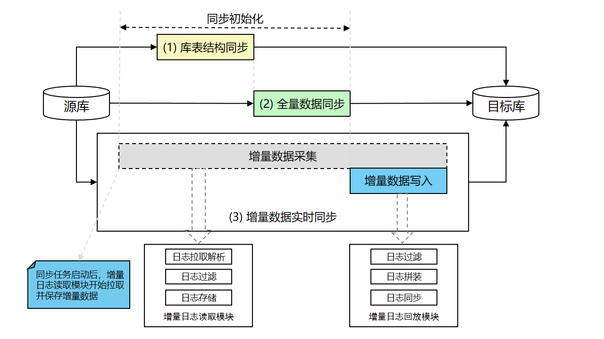
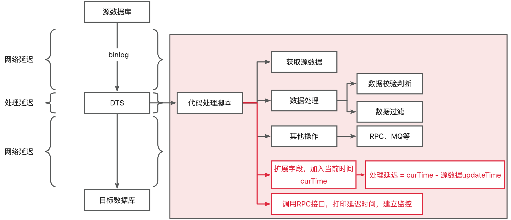

### 一、背景
在做系统重构或者系统迁移时，都会涉及到数据的同步工作，从老库到新库，那如何监控老库到新库的数据延迟呢？
<!-- more -->
### 二、数据同步工作原理
阿里DTS的数据同步工作原理。

DTS可以在两个数据源之间同步正在进行的数据变更。数据同步通常用于OLTP到OLAP的数据传输。数据同步包括以下两个阶段：
1. 同步初始化：DTS先开始收集增量数据，然后将源数据库的结构和存量数据加载到目标数据库。
2. 数据实时同步：DTS同步正在进行的数据变更，并保持源数据库和目标数据库的同步。

为了同步正在进行的数据变更，DTS使用两个处理事务日志的模块：
1. 事务日志读取模块：日志读取模块从源实例读取原始数据，经过解析、过滤及标准格式化，最终将数据在本地持久化。日志读取模块通过数据库协议连接并读取源实例的增量日志。如果源数据库为RDS MySQL，那么数据抓取模块通过Binlog dump协议连接源库。
2. 日志回放模块：日志回放模块从日志读取模块中请求增量数据，并根据用户配置的同步对象进行数据过滤，然后在保证事务时序性及事务一致性的前提下，将日志记录同步到目标实例。
DTS具备日志读取模块、日志回放模块的高可用，DTS容灾系统一旦检测到链路异常，就会在健康服务节点上断点重启链路，从而有效保证同步链路的高可用。

### 三、数据同步延迟
> 同步延迟是指同步到目标数据库的最新数据的时间戳，与源数据库的当前时间戳之间的差值。 如果同步延迟为0，则源数据库与目标数据库的数据完全同步。

DTS监控未做的很好，导致无法监控数据同步的延迟是多少，从稳定性上进行考虑，需要对数据同步延迟进行监控。

> 延迟可以分为3部分组成：
> - 源库 -> dts 网络延迟
> - dts处理延迟
> - dts -> 目标库 网络延迟

#### 解决方案

一般做法是在脚本的最后阶段往扩展字段添加当前时间(curTime)，此时间会保存到目标库中，然后再调用RPC接口，打印延迟时间，然后再配置监控。

> tips：当然这个方案也不是完美的，建议在源数据中添加必要的标识，用于校验数据，便于DTS脚本处理，降低延迟，提高同步性能

参考文档：
[DTS产品架构](https://help.aliyun.com/zh/dts/product-overview/system-architecture-and-design-concepts?spm=a2c4g.11186623.help-menu-26590.d_0_1_3.5f8962efRv5pQE&scm=20140722.H_26598._.OR_help-V_1)