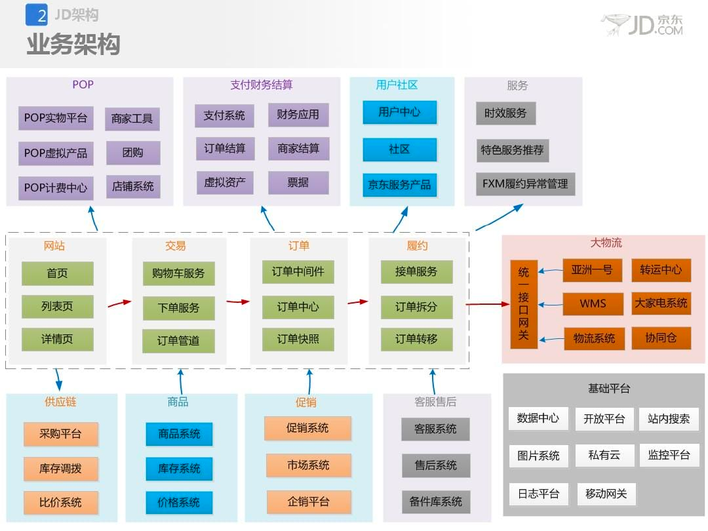
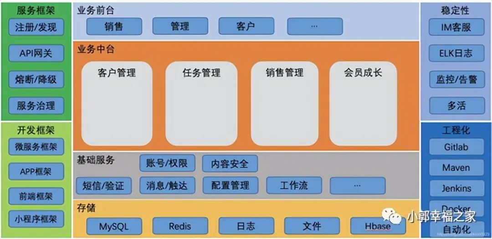
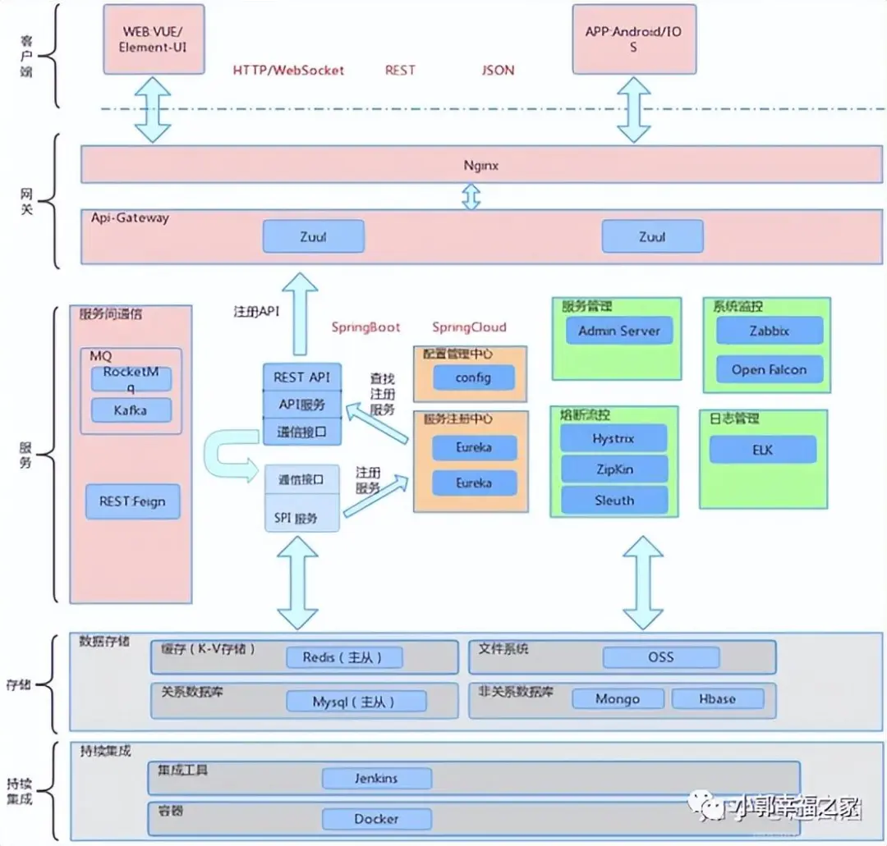

### 一、什么是架构？
在软件开发领域，架构可以从2方面进行总结，结构设计和技术选型：
- 结构设计：模块划分、层次结构和交互方式，能够让人清晰的了解系统的整体架构。例如，一个电商系统可能分为用户界面层、业务逻辑层和数据存储层，各层之间通过明确的接口进行通信。
- 技术选型：根据项目的需求和特点，选择合适的技术栈。比如，对于高并发的系统，可能会选择分布式架构和高性能的数据库。

<!--more-->

上面的这种理解过于理论化，不是很好理解。通常来说，从架构层面大致可以分为：系统架构和应用架构。
- 系统架构：所谓的系统架构，包含硬件架构、软件架构、数据架构、网络架构。
  - 硬件架构：包括服务器、存储设备、网络设备等硬件的选型、配置和连接方式。
  - 软件架构：主要涉及软件系统的分层、模块划分和接口设计。
  - 数据架构：侧重于数据的组织、存储和管理方式。包括数据库的设计
  - 网络架构：描述系统中各个组件之间的网络连接方式，包括网络拓扑结构。例如分布式微服务架构。
- 应用架构：应用架构是系统架构的一个子集，它主要关注软件应用系统本身的架构设计。具体来说，它描述了一个应用程序从用户界面到数据存储的整个软件结构，包括应用程序的各个功能模块如何划分、这些模块之间如何交互以及它们如何与外部系统（如其他应用程序、数据库、服务等）进行协作。
  - 代码架构：三层架构、MVC架构。


### 二、什么是企业架构？
企业架构是对企业的业务流程、信息系统、技术基础架构以及人员组织等多方面进行整体规划和设计的一种方法和理念。

企业架构可以分为两大部分：业务架构和IT架构，大部分企业架构方法都是从IT架构发展而来的。
- 业务架构：是把企业的业务战略转化为日常运作的渠道，业务战略决定业务架构，它包括业务的运营模式、流程体系、组织结构、地域分布等内容
- IT架构：指导IT投资和设计决策的IT框架，是建立企业信息系统的综合蓝图，包括数据架构、应用架构和技术架构三部分。

#### 2.1、业务架构
定义企业的业务战略、业务目标、业务流程和业务组织。它明确了企业的核心业务活动、业务之间的关系以及业务流程的流转。
通过业务架构的设计，可以帮助企业更好地理解自身的业务模式，优化业务流程，提高业务效率和竞争力。

#### 2.2、应用架构
描述企业的应用系统组合，包括各个应用系统的功能、相互之间的集成关系以及与业务流程的对应关系，完成从业务到IT的转换。


#### 2.3、技术架构
涉及企业的技术基础设施，包括硬件、软件、网络、安全等方面。它确定了企业所采用的技术标准、技术平台和技术选型。

#### 2.4、数据架构
规划企业的数据资源，包括数据的存储、管理、使用和共享。它确定了企业的数据模型、数据标准、数据质量要求以及数据治理策略。


#### 2.5、软件架构和企业架构的关系
1. 软件架构需要根据业务需求和性能要求等选择合适的技术，如编程语言、数据库系统、服务器架构等。不同的软件架构可能会采用不同的技术组合。
2. 企业架构中的技术架构同样要进行技术选型，包括选择企业整体的硬件平台、软件平台、网络设备等。软件架构所选用的具体技术是在企业架构的技术架构所设定的基础技术环境下进行的，要符合企业整体技术架构的要求，以确保技术资源在企业内的统一管理和有效利用。

### 三、软件架构的设计原则
设计原则是在软件设计过程中需要遵循的一些基本准则，它们旨在帮助开发者创建出更具可维护性、可扩展性、灵活性和可靠性的软件系统。常见的设计原则如下：
#### 1、开闭原则（Open-Closed Principle，OCP）
1. 含义：软件实体（类、模块、函数等）应该对扩展开放，对修改关闭。即当有新的需求出现时，应通过添加新的代码来实现扩展，而非修改现有的代码。
2. 示例：如在一个图形绘制系统中，有抽象图形类，要添加新图形类型（如椭圆），可创建椭圆子类继承抽象图形类，无需修改抽象图形类代码，以此保证系统稳定性与可扩展性。

#### 2、里氏替换原则（Liskov Substitution Principle，LSP）
1. 含义：所有引用基类的地方必须能透明地使用其子类的对象。也就是子类应该能够替换基类而不影响程序的正确性。
2. 示例：假设有函数接受基类类型参数，当传入子类对象时，函数应能正常工作且无意外结果。例如，动物类是基类，猫类是子类，有个函数是计算动物奔跑速度，当传入猫类对象时，应能正确计算出猫的奔跑速度。

#### 3、依赖倒置原则（Dependence Inversion Principle，DIP）
1. 含义：高层模块不应该依赖低层模块，二者都应该依赖其抽象；抽象不应该依赖细节，细节应该依赖抽象。
2. 示例：在分层架构系统中，业务逻辑层（高层模块）不应直接依赖数据库访问层（低层模块），而是应依赖抽象的数据访问接口。这样当数据库访问方式改变时，只需修改实现接口的具体类，不影响业务逻辑层代码。

#### 4、单一职责原则（Single Responsibility Principle，SRP）
1. 含义：一个类应该只有一个引起它变化的原因。即一个类应该只有一个职责，只负责一项功能。
2. 示例：用户管理类不应既负责用户创建、删除等操作，又负责用户权限管理。应将这两项职责分离到不同类中，以便当其中一个功能变化时，不影响另一个功能的代码。

#### 5、接口隔离原则（Interface Segregation Principle，ISP）
1. 含义：客户端不应该被迫依赖于它不使用的方法。一个类对另一个类的依赖应该建立在最小的接口上。
2. 示例：打印机接口若包含扫描、传真等方法，而只需要打印功能的客户端依赖此接口，就会被迫实现不需要的方法。应将接口细分，让客户端只依赖所需接口。

#### 6、合成复用原则（Composite Reuse Principle，CRP）
1. 含义：尽量使用对象组合，而不是继承来达到复用的目的。继承会导致子类与父类的高度耦合，而对象组合可在运行时动态组合对象，更灵活。
2. 示例：在图形绘制系统中，要一个可同时绘制圆形和矩形的图形类，可通过组合圆形类和矩形类实现，而非创建继承自圆形类和矩形类的新类。这样添加新图形类型时，只需组合新图形类，不影响现有代码。

#### 7、迪米特法则（Law of Demeter，LoD）
1. 含义：也称为最少知识原则，一个对象应该对其他对象有尽可能少的了解。只与直接的朋友通信，避免与陌生人通信。
2. 示例：类 A 的方法若需调用类 B 的方法，应通过类 A 的直接关联对象来调用，而不是直接调用类 B 的方法。这样可降低类之间的耦合度，提高系统可维护性。

### 四、软件开发的设计模式
设计模式是在软件开发过程中，针对反复出现的设计问题所总结出的通用解决方案。它们是经过实践验证的、可复用的软件设计思路和结构，按照其功能和用途可大致分为以下几类：
#### 4.1、创建模式
创建型模式主要用于对象的创建过程，它们将对象的创建和使用分离，使得系统在创建对象时更加灵活和可维护。
##### 单例模式
保证一个类仅有一个实例，并提供一个全局访问点。常用于管理系统资源、配置信息等，如数据库连接池通常采用单例模式，确保只有一个数据库连接池实例存在，避免资源浪费和冲突。
##### 工厂模式
提供了一种创建对象的方式，通过一个工厂类来负责创建对象，而不是在客户端代码中直接实例化对象。这样可以提高代码的灵活性和可维护性。例如，在一个汽车制造工厂里，有不同类型的汽车（如轿车、SUV 等），可以通过一个汽车工厂类来根据需求创建不同类型的汽车对象。
##### 抽象工厂模式
提供了创建一系列相关或相互依赖的对象的方式。与工厂模式相比，它更注重创建一组对象，而不是单个对象。比如在一个游戏开发中，需要创建不同场景下的一系列道具、角色等，就可以采用抽象工厂模式。

#### 4.2、结构模式
##### 代理模式
通过代理对象来控制对真实对象的访问。例如，在网络访问中，当用户访问某些网站时，可能会通过代理服务器来进行访问，代理服务器可以对访问进行过滤、限制等操作。在软件设计中，代理模式可用于权限管理、性能优化等方面。

##### 装饰者模式
- **意图：** 动态地给一个对象添加额外的职责，同时不改变其结构。装饰器模式提供了一种灵活的替代继承方式来扩展功能。
- **主要解决的问题：** 避免通过继承引入静态特征，特别是在子类数量急剧膨胀的情况下。允许在运行时动态地添加或修改对象的功能。
- **使用场景：** 当需要在不增加大量子类的情况下扩展类的功能。当需要动态地添加或撤销对象的功能。

动态地添加新的行为或功能到一个对象上，而不需要修改被装饰对象的原始代码。比如，一杯咖啡本身有价格和口味等属性，通过装饰者模式可以给咖啡添加奶油、糖等装饰，并且每添加一种装饰就会改变咖啡的价格和口味，而不需要修改咖啡本身的代码。

- 抽象组件(Component): 定义装饰方法的规范
- 被装饰者(ConcreteComponent): Component的具体实现，也就是我们要装饰的具体对象。
- 装饰者组件(Decorator): 持有组件(Component)对象的实例引用，该类的职责就是为了装饰具体组件对象，定义的规范。
- 具体装饰(ConcreteDecorator): 负责给构件对象装饰附加的功能。

<style>
.highlight.java {
    height:400px;
}
</style>
```java
// 抽象组件：咖啡
abstract class Coffee {
    String description = "未知咖啡";

    public String getDescription() {
        return description;
    }

    public abstract double cost();
}

// 具体组件：普通咖啡
class SimpleCoffee extends Coffee {
    public SimpleCoffee() {
        description = "普通咖啡";
    }

    @Override
    public double cost() {
        return 5.0;
    }
}

// 抽象装饰者：咖啡装饰者
abstract class CoffeeDecorator extends Coffee {
    protected Coffee coffee;

    public CoffeeDecorator(Coffee coffee) {
        this.coffee = coffee;
    }

    @Override
    public String getDescription() {
        return coffee.getDescription();
    }

    @Override
    public double cost() {
        return coffee.cost();
    }
}

// 具体装饰者：奶油装饰
class CreamDecorator extends CoffeeDecorator {
    public CreamDecorator(Coffee coffee) {
        super(coffee);
    }

    @Override
    public String getDescription() {
        return coffee.getDescription() + ", 加了奶油";
    }

    @Override
    public double cost() {
        return coffee.cost() + 2.0;
    }
}

// 具体装饰者：糖装饰
class SugarDecorator extends CoffeeDecorator {
    public SugarDecorator(Coffee coffee) {
        super(coffee);
    }
    @Override
    public String getDescription() {
        return coffee.getDescription() + ", 加了糖";
    }
    @Override
    public double cost() {
        return coffee.cost() + 1.0;
    }
}
// 测试类
public class CoffeeDecoratorTest {
    public static void main(String[] args) {
        Coffee coffee = new SimpleCoffee();
        System.out.println("原始咖啡：" + coffee.getDescription() + "，价格：" + coffee.cost());
        coffee = new CreamDecorator(coffee);
        System.out.println("加了奶油后的咖啡：" + coffee.getDescription() + "，价格：" + coffee.cost());
        coffee = new SugarDecorator(coffee);
        System.out.println("再加了糖后的咖啡：" + coffee.getDescription() + "，价格：" + coffee.cost());
    }
}
```


##### 桥接模式
- **意图：** 将抽象部分与它的实现部分分离，使得它们可以独立变化。例如，在图形绘制系统中，形状是抽象部分，颜色是实现部分，通过桥接模式可以让形状和颜色独立变化，即可以选择不同的形状搭配不同的颜色，而不会相互影响。
- **主要解决的问题：** 避免使用继承导致的类爆炸问题，提供更灵活的扩展方式。
- **使用场景：** 当系统可能从多个角度进行分类，且每个角度都可能独立变化时，桥接模式是合适的。例如JDBC驱动程序。

```java
// 颜色接口
interface Color {
    void applyColor();
}

// 具体颜色实现类：红色
class RedColor implements Color {
    @Override
    public void applyColor() {
        System.out.println("Applying red color");
    }
}

// 具体颜色实现类：蓝色
class BlueColor implements Color {
    @Override
    public void applyColor() {
        System.out.println("Applying blue color");
    }
}

// 形状抽象类，包含对颜色的引用（桥接部分）
abstract class Shape {
    protected Color color;

    public Shape(Color color) {
        this.color = color;
    }

    abstract void draw();
}

// 具体形状类：圆形
class Circle extends Shape {
    public Circle(Color color) {
        super(color);
    }

    @Override
    void draw() {
        System.out.print("Drawing a circle. ");
        color.applyColor();
    }
}

// 具体形状类：矩形
class Rectangle extends Shape {
    public Rectangle(Color color) {
        super(color);
    }

    @Override
    void draw() {
        System.out.print("Drawing a rectangle. ");
        color.applyColor();
    }
}


public class BridgePatternExample {
    public static void main(String[] args) {
        // 使用红色绘制圆形
        Shape circleWithRed = new Circle(new RedColor());
        circleWithRed.draw();

        // 使用蓝色绘制矩形
        Shape rectangleWithBlue = new Rectangle(new BlueColor());
        rectangleWithBlue.draw();
    }
}
```

##### 装饰模式和桥接模式

###### 不同点
1. 设计意图：
   1. 装饰模式：重点在于动态地添加功能。它是一种 “增强” 对象功能的方式，在运行时可以根据需要灵活地组合装饰器来为对象添加不同的功能。装饰器和被装饰对象通常属于同一个层次结构，**都实现相同的接口或者继承相同的抽象类**。
   2. 桥接模式：更侧重于将抽象和实现解耦，使它们可以独立地演变。抽象部分和实现部分通常**属于不同的层次结构**，它们通过一个抽象的关联（桥）来进行合作。
2. 使用场景：
   1. 装饰模式：适用于在不改变对象基本结构的情况下，动态地添加或修改对象的功能。
   2. 桥接模式：适合用于当一个类存在两个独立变化的维度，且这两个维度需要灵活组合的时候。

#### 4.3、行为模式
##### 观察者模式
- **意图**： 创建了对象间的一种一对多的依赖关系，当一个对象状态改变时，所有依赖于它的对象都会得到通知并自动更新。
- **主要解决的问题**： 观察者模式解决的是一个对象状态改变时，如何自动通知其他依赖对象的问题，同时保持对象间的低耦合和高协作性。
- **使用场景**： 当一个对象的状态变化需要同时更新其他对象时。


观察者模式使用2个类
- Subject：主题，提供了addObserver(), deleteObserver(), notifyObservers()等方法
- Observer：观察者，用于接收主题发送的通知并更新自身状态。

```java
//主题
interface Subject {
    void addObserver(Observer observer);
    void removeObserver(Observer observer);
    void notifyObservers(String message);
}
class NewsAgency implements Subject {
    private List<Observer> observers = new ArrayList<>();
    @Override
    public void addObserver(Observer observer) {
        observers.add(observer);
    }
    @Override
    public void removeObserver(Observer observer) {
        observers.remove(observer);
    }
    @Override
    public void notifyObservers(String message) {
        for (Observer observer : observers) {
            observer.update(message);
        }
    }
    public void publishNews(String news) {
        notifyObservers(news);
    }
}
//观察者
interface Observer {
    void update(String message);
}
class NewsSubscriber implements Observer {
    private String name;
    public NewsSubscriber(String name) {
        this.name = name;
    }
    @Override
    public void update(String message) {
        System.out.println(name + " received news: " + message);
    }
}

public class ObserverPatternExample {
    public static void main(String[] args) {
        //定义主题
        NewsAgency newsAgency = new NewsAgency();
        //创建订阅者
        NewsSubscriber subscriber1 = new NewsSubscriber("Alice");
        NewsSubscriber subscriber2 = new NewsSubscriber("Bob");
        newsAgency.addObserver(subscriber1);
        newsAgency.addObserver(subscriber2);
        newsAgency.publishNews("Breaking news: A new discovery!");
    }
}
```


##### 策略模式
定义了一系列的策略，并且让用户可以根据需要选择不同的策略来执行某项任务。例如，在一个出行应用中，用户可以选择不同的出行策略，如打车、公交、地铁等，每种策略都有不同的费用计算方法和行程安排。

##### 命令模式
将一个请求封装成一个命令对象，这样可以把请求的发出者和执行者分离，便于管理和控制。比如，在一个餐厅里，顾客点菜的请求可以被封装成命令对象，然后由厨师来执行这些命令，这样可以使点菜过程更加有序和可控。


参考文章：
[一文搞懂业务架构、应用架构、技术架构、数据架构！](https://mp.weixin.qq.com/s/YBwEqvo1j0-tYzI6NV58sw)