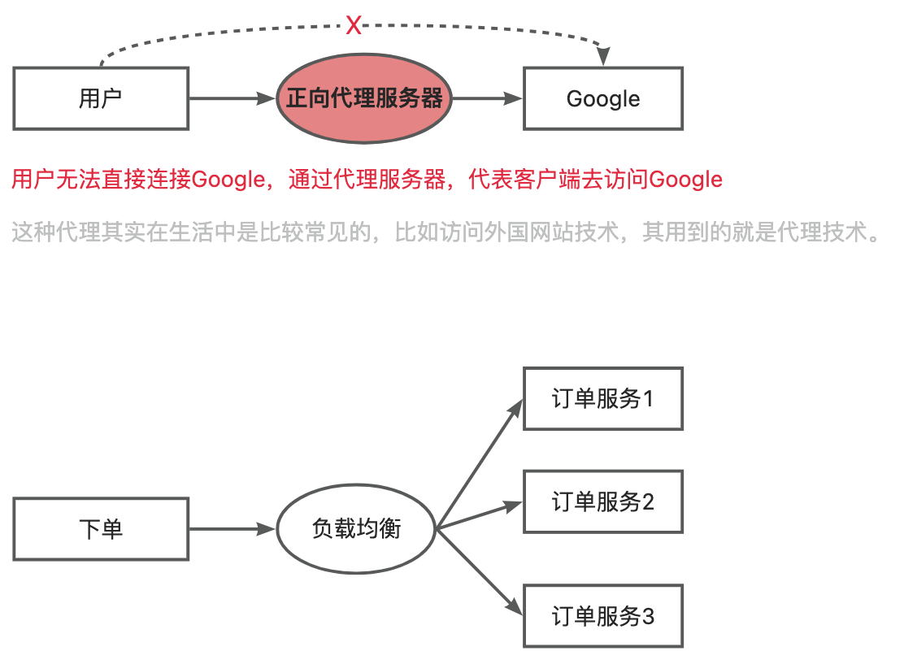

### 一、常见技术框架性能

#### 1.1、Nginx
Nginx 是一款轻量级的高性能 Web 服务器、反向代理服务器以及邮件服务器。它在处理高并发连接和静态资源服务方面表现卓越，被广泛应用于各种互联网架构中。

性能：
- 一般情况下，系统的性能瓶颈基本不会是 Nginx。单机 Nginx 可以达到 30w +。
<!--more-->

▲ 点击查看“代理”相关定义

##### 1.1.1、正向代理 和 反向代理 的区别

相同点
1. **位置和功能**： 正向代理和反向代理都位于客户端和真实服务器之间，它们的主要功能都是将客户端的请求转发给服务器，然后再将服务器的响应转发给客户端。
2. **提高访问速度**： 两者都能通过缓存机制提高访问速度。当客户端请求某个资源时，如果代理服务器已经缓存了该资源，就可以直接从缓存中提供，而无需再次从原始服务器获取，从而节省了时间和带宽。

不同点
1. **代理对象**： 正向代理是为客户端提供代理服务，即服务器不知道真正的客户端是谁。而反向代理则是为服务器提供代理服务，即客户端不知道真正的服务器是谁。
2. **架设位置**： 正向代理通常是由客户端架设的，而反向代理则是由服务器架设的。
3. **用途和目的**： 正向代理的主要用途是为在防火墙内的局域网客户端提供访问Internet的途径，侧重于解决访问限制问题。而反向代理的主要用途是将防火墙后面的服务器提供给Internet用户访问，其目的在于实现负载均衡、安全防护等。
4. **服务对象**： 在正向代理中，服务器不知道真正的用户是谁；而在反向代理中，用户不知道真正的服务器是谁。

#### 1.2、Redis
性能：
- Redis 官方的性能测试报告：https://redis.io/topics/benchmarks 。从报告中，我们可以得出 Redis 的单机 QPS 可以达到 8w+（CPU性能有关系，也和执行的命令也有关系比如执行 SET 命令甚至可以达到10w+QPS）。

#### 1.3、MySQL
MySQL单机的QPS为大概在 4K 左右。
- 写TPS：1000。
- 读QPS：4K，耗时一般在几毫秒。

#### 1.4、Tomcat
单机 Tomcat 的QPS 在 2w左右。这个和你的 Tomcat 配置有很大关系，举个例子Tomcat 支持的连接器有 NIO、NIO.2 和 APR。 AprEndpoint 是通过 JNI 调用 APR 本地库而实现非阻塞 I/O 的，性能更好，Tomcat 配置 APR 为 连接器的话，QPS 可以达到 3w左右。更多相关内容可以自行搜索 Tomcat 性能优化。

#### 1.5、Rocketmq
在1台生产者、1台broker、1台namesrv 、1台消费者的架构中：
- 只生产不消费场景，最大的tps是22235。
- 一边生产一边消费的场景，最大的tps生产是18738，消费最大的tps是18738。
- 只消费不生产，最大的tps是48435。

#### 1.6、kafka
(Kafka资源估算)[https://www.cnblogs.com/jiaxzeng/p/17227706.html]

参考文章：
[终于有人把正向代理和反向代理解释的明明白白了！](https://cloud.tencent.com/developer/article/1418457)