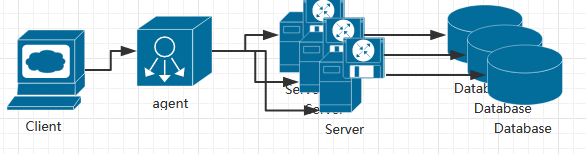
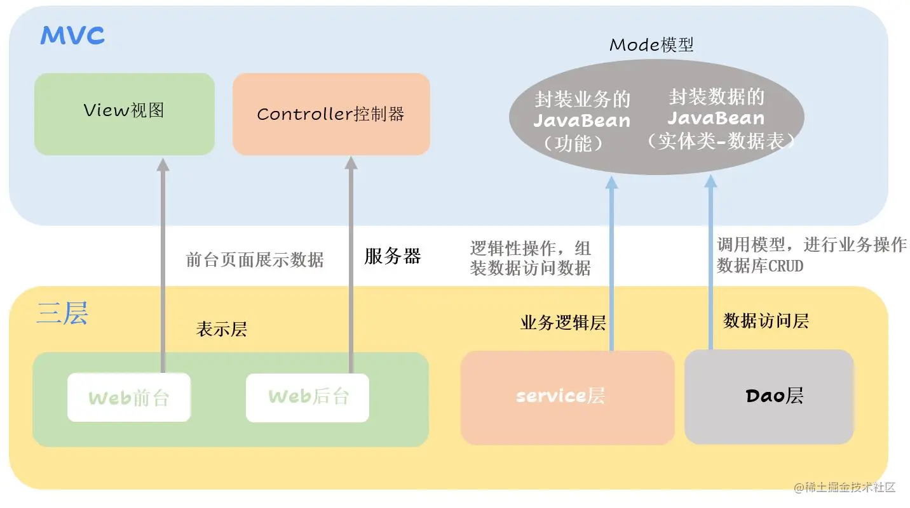

### 一、常见系统架构模式

#### 1.1、单体架构
单体架构比较初级，典型的三级架构，前端+中间业务逻辑层+数据库层。这是一种典型的Java Spring mvc框架的应用。其架构图如下所示：

<!--more-->
#### 1.2、分布式架构
是单体架构的并发扩展，将一个大的系统划分为多个业务模块，业务模块分别部署在不同的服务器上，各个业务模块之间通过接口进行数据交互。

结构特点：
- 服务拆分：系统被分解为多个独立的服务，每个服务专注于特定的业务功能。
- 数据拆分：
- 网络通信：服务之间通过网络进行通信，常见的通信协议包括 RESTful API（基于 HTTP）、RPC（远程过程调用）、消息队列等。

#### 1.3、微服务架构
微服务架构是一种将单块应用程序拆分成一组小型服务的架构风格。

> Tips:分布式架构和微服务架构有什么区别呢？
> - 联系：
>   - 架构理念相似：都强调将系统的功能进行拆分，通过多个组件的协作来完成系统的功能。
>   - 都涉及网络通信
>   - 都注重系统的可扩展性
> - 区别：
>   - 拆分程度和粒度：
>     - 分布式架构：拆分的程度相对较粗，可能是将系统按照功能模块、业务领域或者物理部署环境等方式进行划分。
>     - 微服务架构：拆分的粒度更细，强调每个微服务专注于单一的业务功能。
>   - 服务独立性和自治性：
>     - 分布式架构：虽然各个分布式组件之间是相互独立的，但在某些情况下可能还会共享一些资源或者依赖关系。例如，分布式系统中的多个组件可能共享一个数据库，或者某个组件的运行可能依赖于另一个组件的特定状态。
>     - 微服务架构：微服务具有更高的独立性和自治性。每个微服务有自己独立的业务逻辑、数据存储和开发团队，它们之间的耦合度更低。
>   - 架构复杂度和管理难度：
>     - 分布式架构：复杂度主要体现在分布式系统的基础设施方面，如网络通信、数据分布和一致性、节点故障处理等。
>     - 微服务架构：除了面临分布式系统的一般问题外，还增加了服务治理的复杂性。需要解决微服务之间的服务发现、配置管理、负载均衡等问题。

#### 1.4、Serverless

### 二、常见应用架构模式

#### 2.1、MVC
MVC模式最主要精神之一就是Model与View的分离，这两者之间的分离可使网页设计人员和程序开发人员能够独立工作、互不影响，从而提高了开发效率和维护效率。除此之外，将模型层的数据处理建立成许多组件，增加了程序的可复用性、增进了系统功能的可扩展性；将业务流程集中在控制层，增强了程序流程的清晰度.

##### 2.1.1、View (视图） 层
为用户提供使用界面，与用户直接进行交互。

<!--more-->

##### 2.1.2、Model（模型） 层
代表一个存取数据的对象或 JAVA POJO（Plain Old Java Object，简单java对象）。它也可以带有逻辑，主要用于承载数据，并对用户提交请求进行计算的模块。模型分为两类，一类称为数据承载 Bean，一类称为业务处理Bean。所谓数据承载 Bean 是指实体类（如：User类），专门为用户承载业务数据的；而业务处理 Bean 则是指Service 或 Dao 对象， 专门用于处理用户提交请求的。

##### 2.1.3、Controller（控制器） 层
用于将用户请求转发给相应的 Model 进行处理，并根据 Model 的计算结果向用户提供相应响应。它使视图与模型分离。

常见的前后端分离架构就是采用MVC架构（但是后端应用一般还会和三层架构组合一起）。

### 2.2、三层架构
我们常说的三层架构是由JavaWeb提出的，也就是说这是JavaWeb独有的！ 所谓三层是表现层（WEB层）、业务逻辑层（Business Logic），以及数据访问层（Data Access）。 开发中更多的是用到三层架构。

三层架构就是为了符合“高内聚，低耦合”思想，把各个功能模块划分为表示层（UI）、业务逻辑层（BLL）和数据访问层（DAL）三层架构。

这个就是我们开发过程中常见的架构模式。

### 2.3、MVC和三层架构的联系与区别

三层架构的缺点：
- 业务逻辑分散： 在三层架构中，业务逻辑往往分散在不同的层中，导致业务流程难以理清，影响了代码的可读性和可维护性。
- 领域模型贫血： 三层架构中，领域逻辑和数据存储混合在一起，导致领域模型的业务方法受限，难以表达复杂的业务规则。
- 过度依赖数据存储： 不同层之间对数据存储的依赖紧密，当切换数据存储介质时，需要大量修改代码。

随着业务的不断复杂化，service层变得越来越庞大，服务之间的引用也变得越来越混乱，这为项目带来了风险和不确定性。