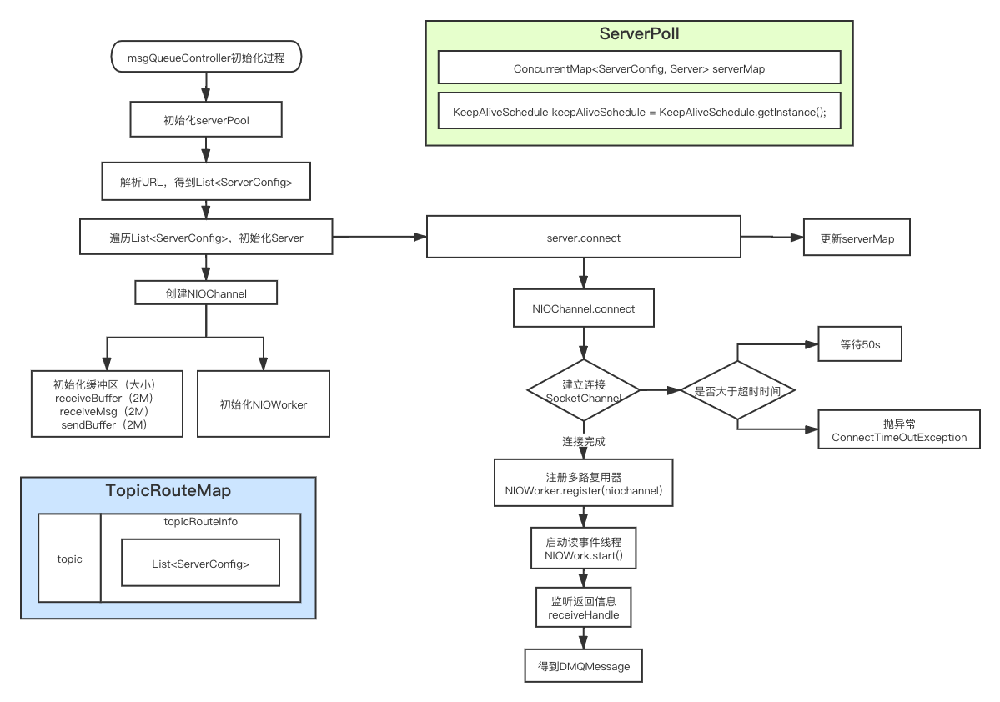
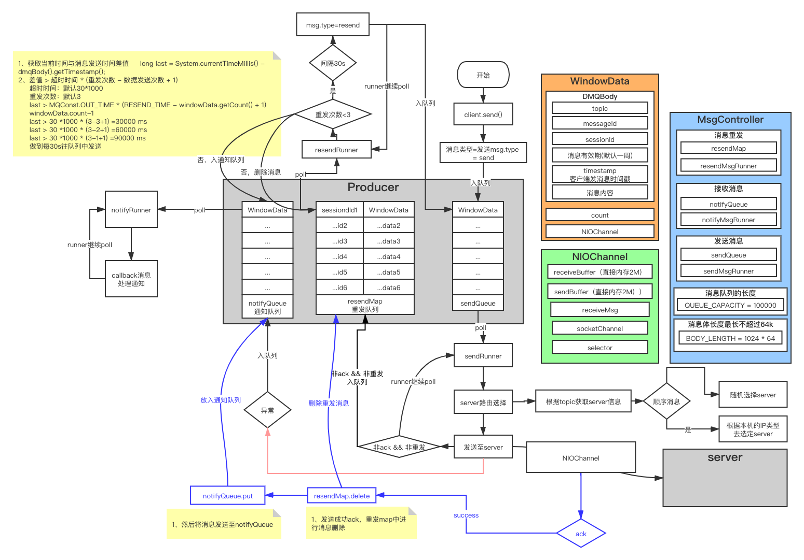

# 一、注册中心
注册中心，基于zookeeper来实现。
/dmq/topic下为主题号，主题号下为客户端。
/dmq/node下为server节点。

``` bash
1、server心跳节点上报到注册中心，节点变化，由注册中心通知client，client每一小时拉取一次全量的配置信息
2、client和一台注册中心保持长连接，定时查询server信息，如果该register server挂掉，消费者会自动连接下一个registerserver，直到有可用连接为止，并能自动重连；
3、心跳保持30s的好处是，可以及时的检测server状态；
```
<!--more-->

# 二、生产者
### 2.0 初始化启动过程


>- 1、初始化serverPoll
>- 2、解析URL服务器地址，生成相应serverConfig，并初始化连接。

### 2.1 生产过程：

- 1、mqClient.send(msg)，客户端API发送消息。
- 2、内部消息队列控制器（MsgQueueController）将消息存入发送消息队列（sendQueue）
    - 2.1、sessionid<0或者消息体超过64kb直接放入通知队列
    - 2.2、队列超长之后进行回调处理

### 2.2 消息处理过程：
***2.2.1 发送消息队列***
- 1、sendRunner循环从sendQueue取数据。
- 2、主题路由获取server，向server发送数据。
    - 2.1、若发送出现异常，则将消息入接收消息队列（notifyQueue）。
- 3、判断消息类型（非ack && 非resend）
    - 3.1、将消息放入消息重发map（resendMap;<Long, value>=<sessionId, WindowData）。

```
while (msgQueueController.isOpen()) {
    DMQBody dmqBody = null;
    try {
        WindowData windowData = msgQueueController.getSendMsg();
  		if (windowData != null && windowData.getDmqBody() != null) {
  		    dmqBody = windowData.getDmqBody();
  		    try {
  			    if (dmqBody.getCommandType() == UP_SUBSCRIBE) {
  				    windowData.getNioChannel().getServer().send(dmqBody);
  			    } else {
  				    topicRoute.send(false, windowData, msgQueueController);
  			    }
  			} catch (Exception e) {
  			    windowData.setStatus(SOCKET_ERROR);
  			    msgQueueController.offerNotifyMsg(windowData);
  			    LOGGER.error("send msg error. body {}", dmqBody, e);
  			    continue;
  			}
  			if (dmqBody.getCommandType() != UP_CONSUMER_ACK && dmqBody.getCommandType() != UP_PRODUCER_RESEND) {
  			    msgQueueController.offerResendMsg(windowData);
  			}
  			LOGGER.debug("send msg sid: {}", dmqBody.getSessionId());
  		}
  	} catch (Exception e) {
  	    if (dmqBody != null) {
  		    LOGGER.error("send msg error. body {}", dmqBody, e);
  		}
  	}
}
```


***2.2.2 消息重发map***
- 1、resendRunner循环从resendMap取数据。
- 2、判断消息的重发次数小于3
    - 2.1、若消息发送时间已经超过30s，则将消息发送至sendQueue
- 3、发送次数>3
    - 3.1、将消息从resendMap中删除。
    - 3.2、将消息发送至notifyQueue中。
    
```
while (msgQueueController.isOpen()) {
    try {
        for (Map.Entry<Long, WindowData> entry : msgQueueController.getResendMap().entrySet()) {
            WindowData windowData = entry.getValue();
            if (windowData == null || windowData.getDmqBody() == null) {
                continue;
            }
            //DMQBody clone = windowData.getDmqBody().clone();
            //防止订阅者重发时在获得channel时出现空指针，将windowdata直接clone放入重发队列
            WindowData clone = windowData.clone();
            long last = System.currentTimeMillis() - clone.getDmqBody().getTimestamp();
            if(windowData.getCount() > 0){
            	if(last > MQConst.OUT_TIME * (RESEND_TIME - windowData.getCount() + 1)){
                    if(clone.getDmqBody().getCommandType().getCode()!=UP_SUBSCRIBE.getCode()){
                        clone.getDmqBody().setCommandType(UP_PRODUCER_RESEND);
                    }
                    windowData.setCount(windowData.getCount() - 1);
                    //msgQueueController.offerSendMsg(clone, windowData.getCount() - 1, windowData.getISendCallback());
                    //将clone出来的windowdata放入发送队列
                    msgQueueController.offerSendWin(clone);
                    LOGGER.debug("did not receive ack from server, resend msg sid {}, last time {}.", clone, last);
            	}
            }else{
            	WindowData remove = msgQueueController.removeResendMsg(clone.getDmqBody().getSessionId());
                remove.setStatus(SendMsgStatusEnum.OUT_OF_RETRY);
                msgQueueController.offerNotifyMsg(remove);
                LOGGER.debug("did not receive ack and resend count > 3, msg sid : {}", clone);
            }
        }
        Thread.sleep(1000);
    } catch (Exception e) {
        LOGGER.error("ack error", e);
    }
}
```
    
消息最多重发3次，每隔30s进行重发，超过以后不进行重发。  

***2.2.3 接收消息队列***
- 1、notifyMsgRunner循环从notifyQueue取数据。
- 2、判断消息类型
    - 2.1、消费者类型消息，调用相应handler进行相应处理。
    - 2.2、ack类型消息，调用callback进行相应处理。


### 2.3 接收server的ack
- 1、通过NIOChannel进行通信，将结果回传。
- 2、根据ack类型，进行相应处理
    - 2.1、下发成功、主题号异常、服务异常：此时会将消息从重发Map中去除、并将消息放入notifyQueue中。
    - 2.2、机器重启：将该主题号下的重启服务去除。
    
```
switch (dmqBody.getCommandType()) {
    case DOWN_SUBSCRIBE_ACK:
    case DOWN_SEND_SUCCESS_ACK:
    case DOWN_SEND_NO_TOPIC_ACK:
    case DOWN_SUBSCRIBE_NO_TOPIC_ACK:
    case DOWN_SUBSCRIBE_NO_CLIENT_ID_ACK:
    case DOWN_SEND_SERVER_ERROR:
    case DOWN_SUBSCRIBE_SERVER_ERROR:
    case DOWN_SEND_EXCEED_LIMIT_ACK:
        windowData = msgQueueController.removeResendMsg(dmqBody.getSessionId());
        if (windowData == null || windowData.getDmqBody() == null) {
            LOGGER.debug("get window data null from {}", dmqBody);
            break;
        }
        windowData.setStatus(SendMsgStatusEnum.getByCommand(dmqBody.getCommandType()));
        //将服务端返回的消息赋值给重发队列中的消息
        DMQBody dmqBodyInClient = windowData.getDmqBody();
        dmqBodyInClient.setMessageId(dmqBody.getMessageId());
        dmqBodyInClient.setCommandType(dmqBody.getCommandType());
        windowData.setDmqBody(dmqBodyInClient);
        msgQueueController.offerNotifyMsg(windowData);
        break;
    case DOWN_CONSUMER_PUSH:
        windowData = new WindowData(dmqBody, -1, null);
        boolean isDistinct = msgQueueController.offerDistinctMsg(dmqBody.getSessionId(),dmqBody.getClientID());
        if (isDistinct) {
            windowData.setNioChannel(this);
            //将推送来的消息放入消息接收队列
            msgQueueController.offerReceiveMsg(windowData);
        } else {
            LOGGER.debug("repeat msg {}", dmqBody);
        }
        break;
    case DOWN_SERVER_REBOOT:
        LOGGER.debug("server is rebooting");
        msgQueueController.removeSubServer(server);
        server.setState(RESTART);
        break;
    case DOWN_SERVER_HEALTH:
        LOGGER.debug("server is health");
        server.setState(HEALTH);
        server.setErrorTime(Long.MAX_VALUE);
        break;
    case DOWN_SERVER__HEARTBEAT:
        LOGGER.debug("receive server heartbeat ");
        break;
    default:
        throw new SerializeException("un know commandType " + dmqBody.getCommandType());
}
``` 
    
### 2.4 生产者问题
``` bash
1、消息存入队列中，若队列数据量大，此时机器挂机，会出现消息丢失，数据丢失时，依赖业务方日志由业务方自己重发消息，未提供持久化支持。可以采用QMQ方式，支持消息的持久化。    
```
# 三、MQ server


# 四、消费者


