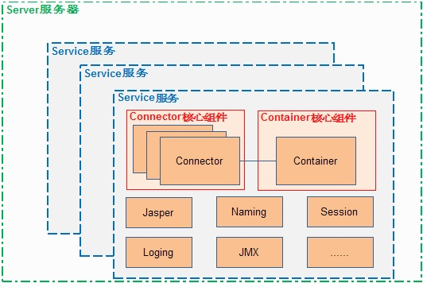

tomcat处理请求，要怎么做呢？
> * 1、监听某个接口，捕获HTTP请求
> * 2、将HTTP请求封装成request对象，同时创建response对象
> * 3、加载servlet对象，将request、response传入，然后再调用servlet的具体service方法。

### 一、Tomcat的一个简单架构图

<!--more-->  



可以看出Tomcat的一个整体架构
> * 一个server服务器，可以包含多个服务；
> * service中包含多个connector(连接器)，一个container(容器)；及其他一些组件


#### 1、Connector架构(连接器架构)

在tomcat中，是coyote组件，负责具体协议的解析及IO的相关操作


IO模型
> * NIO
> * NIO2
> * APR

应用层协议
> * HTTP 1.1
> * AJP
> * HTTP 2

还是可以看见connector中三大块
> * ProtocolHandler
> * Mapper
> * Adapter

##### 1.1、NioEndpoint的主要流程


> * EndPoint：coyote通信端点，是具体的socket的接收和发送器。
> * AbstractEndPoint：tomcat的具体实现，有两个内部类，accepter和SocketProcesser。由accepter接收具体的socket连接；由SocketProcesser去处理，它实现了runnable接口，在run方法中去调用processer。

#### 2、Container架构


> * Engine：没有父容器，一个 Engine代表一个完整的 Servlet 引擎，它接收来自Connector的请求，并决定传给哪个Host来处理，Host处理完请求后，将结果返回给Engine，Engine再将结果返回给Connector。
> * Host：Engine可以包含多个Host，每个Host代表一个虚拟主机，这个虚拟主机的作用就是运行多个应用，它负责安装和展开这些应用，并且标识这个应用以便能够区分它们，每个虚拟主机对应的一个域名，不同Host容器接受处理对应不同域名的请求。
> * Context：Host可以包含多个Context，Context是Servlet规范的实现，它提供了Servlet的基本环境，一个Context代表一个运行在Host上的Web应用
> * Wrapper: Context可以包含多个Wrapper, Wrapper 代表一个 Servlet，它负责管理一个 Servlet，包括的 Servlet 的装载、初始化、执行以及资源回收。Wrapper 是最底层的容器，它没有子容器了，所以调用它的 addChild 将会报错。


要想搞清楚，记得看源码。结合启动过程，更清晰。


Tomcat例子，将组件都组合在一起
```java
package ex05.pyrmont.startup;

import ex05.pyrmont.core.SimpleContext;
import ex05.pyrmont.core.SimpleContextMapper;
import ex05.pyrmont.core.SimpleLoader;
import ex05.pyrmont.core.SimpleWrapper;
import ex05.pyrmont.valves.ClientIPLoggerValve;
import ex05.pyrmont.valves.HeaderLoggerValve;
import org.apache.catalina.Context;
import org.apache.catalina.Loader;
import org.apache.catalina.Mapper;
import org.apache.catalina.Pipeline;
import org.apache.catalina.Valve;
import org.apache.catalina.Wrapper;
import org.apache.catalina.connector.http.HttpConnector;

public final class Bootstrap2 {
  public static void main(String[] args) {
    HttpConnector connector = new HttpConnector();
    //继承了Wrapper，每一个实例里面都是会有一个Servlet的
    Wrapper wrapper1 = new SimpleWrapper();
    //设置Servlet的映射地址
    wrapper1.setName("Primitive");
　  //设置Servlet的名字
    wrapper1.setServletClass("PrimitiveServlet");
    Wrapper wrapper2 = new SimpleWrapper();
    wrapper2.setName("Modern");
    wrapper2.setServletClass("ModernServlet");
　
    //context是一个容器可以包含wrapper这个最底层的容器
    Context context = new SimpleContext();
    context.addChild(wrapper1);
    context.addChild(wrapper2);

    Valve valve1 = new HeaderLoggerValve();
    Valve valve2 = new ClientIPLoggerValve();
    //容器中除了其他容器之外还有Valve
    //另外要注意的是每一个context都是实现了Pipeline和Context接口的
    ((Pipeline) context).addValve(valve1);
    ((Pipeline) context).addValve(valve2);
    //这个mapper是做什么的呢？
    Mapper mapper = new SimpleContextMapper();
    mapper.setProtocol("http");
    context.addMapper(mapper);
    Loader loader = new SimpleLoader();
    //容器中还需要加载器，通过反射加载真正的Servlet对象
     context.setLoader(loader);
    // context.addServletMapping(pattern, name);
　  //context里面初始化了一个HashMap，存储映射和Servlet名字
    context.addServletMapping("/Primitive", "Primitive");
    context.addServletMapping("/Modern", "Modern");
    //因为connector封装好Reqeust之后会调用容器，所以将容器的声明给Connector
    connector.setContainer(context);
    try {
      connector.initialize();
       //connector开始监听端口，要明白底层肯定使用ServerSocket来实现的
      connector.start();

      // make the application wait until we press a key.
      System.in.read();
    }
    catch (Exception e) {
      e.printStackTrace();
    }
  }
}
```


参考
[How Tomcat Works读书笔记](https://www.jianshu.com/p/b21520f4ed69)        
[Tomcat工作原理](https://www.ibm.com/developerworks/cn/java/j-lo-tomcat1/index.html)
[Tomcat整体架构浅析](https://blog.csdn.net/cx520forever/article/details/52743166)
[tomcat架构分析 (connector NIO 实现)](https://blog.51cto.com/2839840/2046166)