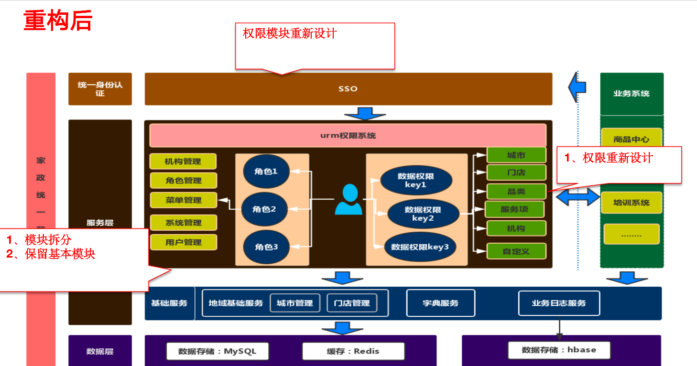
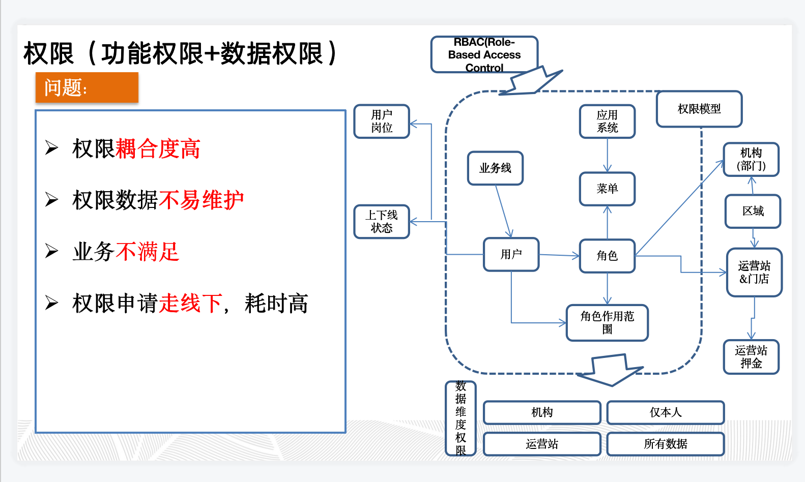

从改造成本、维护性、业务支撑、使用性等多方面进行综合考虑后，决定搭建一套新的单点登录系统。

    1、性能：重新设计登录流程，验证中心只负责记录、验证用户登录信息，用户登录达到毫秒级。
    2、可接入：现有单点登录业务侧接入复杂，需要简化。
    3、业务支撑：菜单权限、数据权限分开控制。
    4、改造成本：原有单点登录已经无法进行改造，所以需要接入业务重新接入。

# 1、架构设计

## 1.1、原有整体架构
<!--more-->

    1、原有权限模型基于RBAC，当接入系统、菜单、角色增多后，不便于管理。
    2、业务侧高耦合，记录了很多业务侧信息。
    3、数据存储方面，大数据量的日志记录，导致MySQL性能的降低。
    

## 1.2、新整体架构

    1、权限模型改造，分成菜单权限+数据权限的隔离控制。
    2、解耦，不再记录业务侧数据，公用服务进行拆分，拆出了地域基础服务、字典服务和业务日志服务。
    3、大数据存储，采用HBASE等大数据库。 
   
## 1.3、 旧单点登录流程

    
    1、登录验证获取用户权限数据多。
    2、客户端缓存权限信息，用户权限不同步。
  

    1、单点退出，通知所有业务方，MQ消息泛滥并且会堆积。
    2、退出会出现用户登录状态不同步问题。

## 1.4、新单点登录流程
  

    1、提供统一的过滤器提供给业务方，接入简单，没有其他配置。
    2、登录信息缓存至Redis，统一管理。
    
    
# 2、权限设计

## 2.1、旧权限设计
  

    1、采用RBAC权限模型，无法很好的管理数据权限、权限设计不易维护。
    2、无法满足现有的所有业务场景。
    3、权限申请走线下，采用传统的邮箱方式，耗时高。

## 2.3、新权限设计
  
    
    1、权限组成：功能权限+数据权限。
    2、权限之间低耦合、可扩展。
    
# 3、具体实现

## 3.1、权限模块

- 功能权限（也是基于RBAC）
    - t_system： 系统表
    - t_menu：菜单表，记录菜单归属系统。
    - t_role：角色表，记录角色归属系统，包含权限标识字段。
    - t_role_menu：角色功能表，记录角色拥有的菜单、功能权限。
    - t_user_role：用户角色表，记录用户拥有的角色。

- 数据权限
    - t_data_dict：数据权限字典，按系统区分（分成城市、门店、机构、品类、服务项等）
    - t_access_city：用户城市数据权限
    - t_access_store：用户门店数据权限
    - .....
    
    
    
    
## 3.2、单点登录模块

    @Path("/check")
    public ActionResult checkUser(UserCheckDto userCheckDto) {
        try {
            CheckUtil.check(userCheckDto.getUsername(), "用户名", StrRuler.notEmpty()).check(userCheckDto.getPassword(), "密码", StrRuler.notEmpty()).check(userCheckDto.getVerifycode(), "验证码", StrRuler.notEmpty());
        } catch (CheckException e) {
            return failHandler(userCheckDto, "用户信息不存在");
        }
        HttpServletRequest request = beat().getRequest();
        HttpServletResponse response = beat().getResponse();
        try {
            LoginEnum checkResult = checkUserLogin(userCheckDto.getUsername());//校验用户信息，账号是否正常等
            if (checkResult != LoginEnum.ALLOW_LOGIN) {
                return failHandler(userCheckDto, checkResult.getDesc());
            }
            LoginResult result = checkUserInfo(userCheckDto);//校验用户用户名密码是否正常
            if (result == null || !result.isSuccess()) {
                return failHandler(userCheckDto, result.getDesc());//登录，用户名密码错误
            } else {
                log.info("用户使用账号登录成功");
                userCheckDto.setLoginType(LoginTypeEnum.ACCOUNT_LOGIN.getKey());
                //以下为用户登录信息存储至Redis
                try {
                    String domain =getDomain(request);
                    //用户名信息加密，将信息存入cookie内
                    String context = DESUtil.encryptV3(context,DESUtil.KEY);
                    Cookie cookie = new Cookie(LoginInfo.COOKIEUSERNAME_V2.getDesc(), string);//（cs_user_login2:CcGG25zcqDsCBL3fj1HLdj001VAYPoXdqCM4dj001yDSYC4aLoLhm6UQf2H0HkuV）
                    cookie.setDomain(domain);
                    cookie.setPath(LoginInfo.COOKIEPATH.getDesc());
                    cookie.setMaxAge(LoginInfo.COOKIEEFFECTIVE.getValue());
                    response.addCookie(cookie);
                    if (StringUtils.isNotBlank(context) && StringUtils.isNotBlank(Constant.PC_LOGIN_TIMEOUT) && StringUtils.isNumeric(Constant.PC_LOGIN_TIMEOUT)) {
                        String userKey = Constant.SSO_USER_LOGIN_INFO + userCheckDto.getUsername();
                        int time = Integer.parseInt(Constant.PC_LOGIN_TIMEOUT);
                        //token（用户登录信息）写入Redis中；(张三, CcGG25zcqDsCBL3fj1HLdj001VAYPoXdqCM4dj001yDSYC4aLoLhm6UQf2H0HkuV)
                        boolean cacheResult = RedisClientUtil.setexString(userKey, time, context);
                    }
                } catch (Exception e) {
                    log.error("用户登录信息写入cookies异常", e);
                }
            }
        } catch (Exception e) {
            return failHandler(userCheckDto, AlertEnum.ERROR_SERVICE.getDesc());
        }
    }
     
说明：     
     
    1、新认证方式是使用cookies信息做为认证依据的，将用户的信息存放至cookie，再将登录状态存入Redis内。
    2、浏览器跨域问题，两个子级域名无法共享信息，通过把登录信息存放至顶级域名实现信息共享。
    3、登录状态信息，通过存放至Redis实现单点登录。
    
## 3.3、登录安全

1、采用DES加密算法，对用户信息进行加密后存入cookie内。

    public static String encrypt(byte[] datasource, String password) { 
        try{
            SecureRandom random = new SecureRandom();
            DESKeySpec desKey = new DESKeySpec(password.getBytes());
            //创建一个密匙工厂，然后用它把DESKeySpec转换成
            SecretKeyFactory keyFactory = SecretKeyFactory.getInstance("DES");
            SecretKey securekey = keyFactory.generateSecret(desKey);
            //Cipher对象实际完成加密操作
            Cipher cipher = Cipher.getInstance("DES");
            //用密匙初始化Cipher对象
            cipher.init(Cipher.ENCRYPT_MODE, securekey, random);
            //现在，获取数据并加密
            //正式执行加密操作
            return byteArr2HexStr(cipher.doFinal(datasource));
        }catch(Throwable e){
            e.printStackTrace();
        }
        return null;
    }

2、添加黑白IP名单控制。

3、所有系统全部使用HTTPS，        
   
[参考文章1](https://segmentfault.com/a/1190000022486395)      
[美团-将军令](https://tech.meituan.com/2019/02/14/data-security-platform-construction-practice-jiangjunling.html)
  